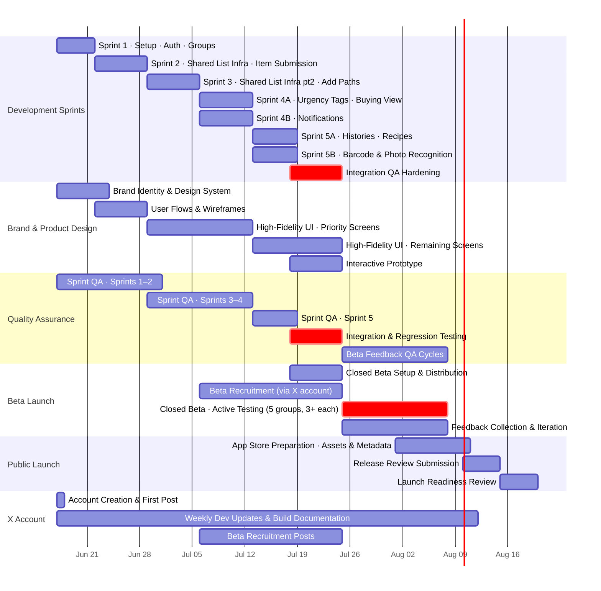

# 🛒 Thalaja | ثلاجة
### Stage 2 Report — Project Charter

> *One household. One list. Everyone heard.*

---

## Table of Contents

- [1. Purpose & Objectives](#1-purpose--objectives)
- [2. Stakeholders & Roles](#2-stakeholders--roles)
- [3. Scope](#3-scope)
- [4. Risks](#4-risks)
- [5. High-Level Plan](#5-high-level-plan)

---

## 1. Purpose & Objectives

**Purpose**

Our purpose is to bring the Saudi family grocery list together as one shared effort — built around how households request, collect, and shop for groceries — while preserving the personal character of family recipes within the experience.

---

**Objective 1 — Adoption**

> Recruit 5 household/group beta testers (3+ members each) and have each complete one full grocery cycle using Thalaja's shared list by end of beta phase.

Achieved through recruitment via our X account documenting the project journey. This confirms the shared-list mechanism works for real households.

---

**Objective 2 — Satisfaction**

> Achieve an average satisfaction rating of 4.0 / 5 or higher across beta groups on "the shared list captured everyone's needs accurately," collected via a short post-trip survey, by end of beta phase.

Achieved by building the core list and submission features in sprint development and distributing the survey alongside the beta. This directly tests the Stage 1 product statement against real household experience.

---

**Objective 3 — Refinement**

> Resolve at least 70% of issues raised in beta feedback before the final presentation.

Achieved through weekly team review of feedback, prioritized by frequency and severity. This shows Thalaja improved through real user input.

---

## 2. Stakeholders & Roles

### Internal Team

| Member | Role |
|---|---|
| Aljawharah Alammar | Project Manager & GitHub Owner — business thinking, pitch presentation, final ownership of repo and project direction |
| Reem Alyamani | Product Manager — defines what gets built and why, owns user research and feature prioritization |
| Mousa Alrizqi | Lead Software Architect (Backend) — system design, data architecture |
| Abdullah Almouraibd | Lead Software Architect (Frontend / Flutter) — UI architecture, component structure |
| Randa Baeshen | Scrum Master & Team Coordinator — sprint logistics, team cohesion |
| Mentors | Guidance, feedback, and tiebreaker for team disagreements |

> Every team member contributes across backend, frontend, design, and research. Sprint leadership rotates each cycle to ensure full-stack experience for all five members.

### External Stakeholders

**End Users** — households and groups (families, friends, roommates) who will submit grocery requests, shop, and provide feedback during beta.

---

## 3. Scope

### ✅ In Scope

| Area | Detail |
|---|---|
| Shared multi-group lists | Family, friends, roommates — item-level detail: brand, size, quantity, notes |
| Multiple item-add paths | Manual entry · browse from item history · add from saved recipes · barcode / photo recognition |
| Urgency tagging | Per-item urgency flag + "shop urgent only" quick filter |
| Buying view | Locked list, checkable items, organized by aisle |
| Dual list histories | Action log (who added / edited) and trip history (past purchases) — both per list |
| Notifications | "Heading to store" button + recurring reminder with optional attached list |
| Recipes | User- and group-created recipes with one-click "add all ingredients to list" |

### ❌ Out of Scope

- Geofence-based automatic triggers
- Event / occasion-specific lists (BBQ, birthday, كشتة)
- Financial transactions, bill splitting, price tracking
- Budgeting / spending tracking
- Store inventory APIs / real-time stock checks
- Custom or algorithmic aisle sorting
- Simultaneous multi-buyer real-time shopping sync

---

## 4. Risks

### Step 1 — Identify Threats

**Technology**
- **Item recognition feasibility** — Barcode / photo recognition worked in a previous Swift/IoT context, but the Flutter path (ML Kit, TFLite, etc.) is new. Prior experience may not transfer directly.
- **Real-time sync & duplicate prevention** — Item-level visibility depends on reliable sync. If two members add the same item near-simultaneously, the app needs to surface this rather than silently create a duplicate.

**Timeline**
- **Underestimating build time** — Past teams in this program have consistently needed more time than planned for MVP development.

**User Adoption / UX**
- **Flutter learning curve** — This is the team's first Flutter project. Though mitigated by prior training, real build velocity is still untested.
- **Household adoption** — The app only delivers value once multiple household members create accounts and actively use it.
- **Form fatigue** — Requiring brand / size / quantity for every item could cause users to default to vague, quick additions if entry isn't fast enough.
- **Urgency tag inconsistency** — Since the urgency tag is requester-set, members may over-mark items as "urgent," making the filter less useful.

**Team Dynamics**
- **Rotating sprint leadership** — Rotation builds full-stack skills but can create inconsistent ownership when a feature changes hands mid-development.

---

### Step 2 — Estimate Risk

| Threat | Likelihood (1–5) | Impact (1–5) | Risk Score | Priority |
|---|---|---|---|---|
| Underestimating build time | 5 | 5 | 25 | 🔴 High |
| Household adoption | 3 | 5 | 15 | 🔴 High |
| Item recognition feasibility | 3 | 3 | 9 | 🟡 Medium |
| Urgency tag inconsistency | 3 | 3 | 9 | 🟡 Medium |
| Sync / duplicate detection | 2 | 4 | 8 | 🟡 Medium |
| Flutter learning curve | 2 | 4 | 8 | 🟡 Medium |
| Form fatigue | 2 | 4 | 8 | 🟡 Medium |
| Rotating leadership context loss | 3 | 2 | 6 | 🟢 Low |

---

### Step 3 — Mitigate

| Risk | Mitigation |
|---|---|
| Build time (High) | Self-paced timeline, ahead of official deadlines, with a buffer week built in based on prior teams' experience |
| Household adoption (High) | Account creation required for all members — this also enables item-level attribution, serving two purposes at once |
| Item recognition (Medium) | Treated as final-sprint feature — core list / submission flow built first, recognition layered on once that loop works |
| Urgency tag inconsistency (Medium) | Monitored during beta — if overuse appears, a soft visual nudge may be added in v1.1 rather than a hard rule |
| Sync / duplicate detection (Medium) | "This item may already be on the list" surfaced as a non-blocking prompt rather than preventing the add |
| Flutter learning curve (Medium) | Pre-build training completed via camp coursework and the Satr course before development begins |
| Form fatigue (Medium) | Multiple add paths: browse from history, scan barcode / photo, add from recipes, or manual entry |
| Rotating leadership (Low) | Decision log maintained from Stage 1 — context transfers between sprint leads |

---

### Step 4 — Monitor

- Track sprint velocity weekly — address slippage immediately, not at stage-end
- During beta: monitor average item-detail completeness (form fatigue signal), % of items tagged urgent (urgency signal), and the Objective 2 satisfaction score directly

---

## 5. High-Level Plan

### Sprints strategy

1. Sprint duration is one week. Two feature streams run in parallel each sprint (Team A + Team B).
3. Sprint Leader (rotating) handles Jira management, blocker resolution, sprint QA, and retrospective — not feature development that sprint.
---

### Mermaid Gantt Chart

---

### Sprint Breakdown

| Sprint | Dates | Team A | Team B | Sprint Leader Focus | Key Deliverables |
|---|---|---|---|---|---|
| **Sprint 1** | Jun 17–21 | Flutter env setup · Backend architecture · Data models | Authentication (account creation, login, session) | Environment unblocked for all devs · Auth spec reviewed | Working login flow · Group model in DB · Dev environments confirmed |
| **Sprint 2** | Jun 22–28 | Shared list infrastructure pt 1 (create list, real-time sync foundation, member permissions) | Item submission UI (brand, size, qty, notes fields) | Sync design validated · Submission form reviewed against form-fatigue risk | Items can be added to a shared list by any group member |
| **Sprint 3** | Jun 29–Jul 5 | Shared list infrastructure pt 2 (multi-group support, group management, member invitation flow) | Additional item-add paths (browse from item history, browse from grocery catalog) | Group invitation flow end-to-end tested · History browsing UX checked | Multi-group lists working · Members can browse and re-add past items |
| **Sprint 4** | Jul 6–12 | Urgency tagging + "shop urgent only" filter · Buying view (list lock, checkable items, aisle grouping) | Notifications ("heading to store" button + recurring reminder with optional attached list) | Urgency filter tested with over-tagging scenario · Buying view lock/unlock verified | Buyer can execute a full shop using the buying view · Notifications fire correctly |
| **Sprint 5** | Jul 13–18 | Trip history + action log (both per list) · Group recipe creation + "add all to list" | Barcode scanning + photo item recognition (ML Kit / TFLite integration) | Recipe-to-list flow tested end-to-end · Barcode scanning tested on physical devices | Full MVP feature loop complete · Barcode recognition functional or scoped for post-beta |
| **Hardening** | Jul 18–25 | Integration QA · Regression testing · Bug fixes | Integration QA · Regression testing · Bug fixes | Final milestone sign-off | **Working app — July 25 milestone** |

---

*Thalaja Team · Stage 2 Report · Holberton / Tuwaiq Academy*