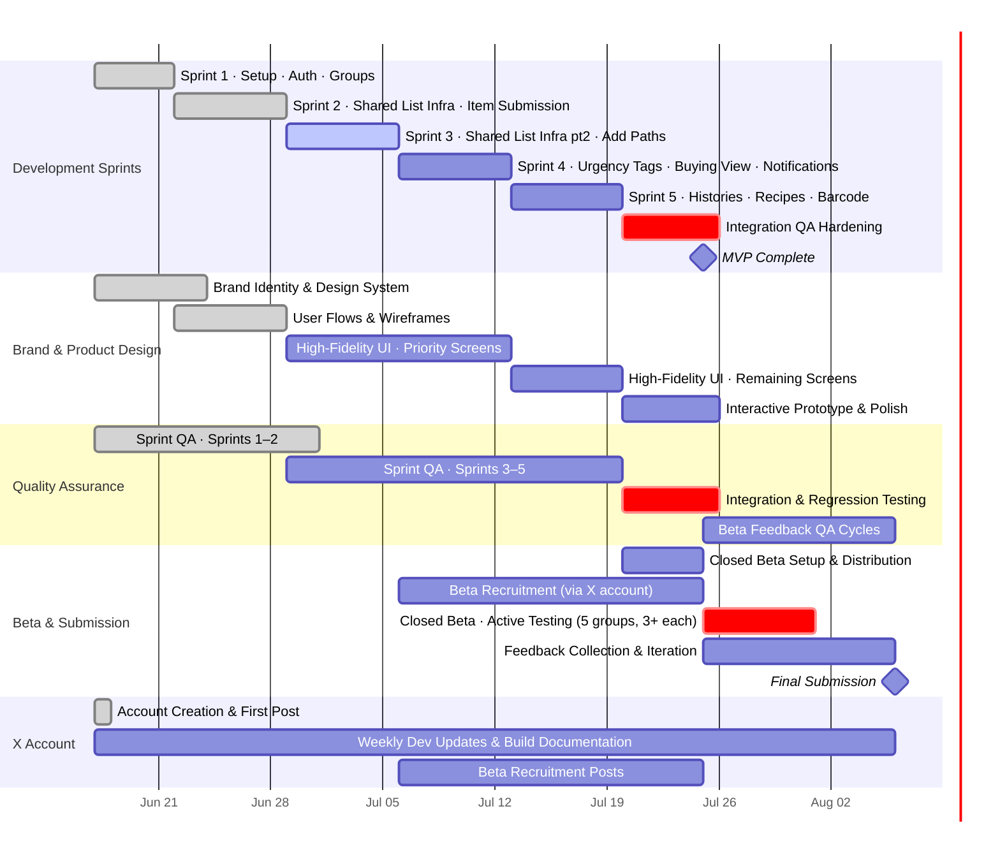

# 🛒 Thalaja | ثلاجة

### Stage 2 Report — Project Charter

> *One household. One list. Everyone heard.*

---

## Table of Contents

- [1. Purpose & Objectives](#1-purpose--objectives)
- [2. Stakeholders & Roles](#2-stakeholders--roles)
- [3. Scope](#3-scope)
- [4. Risks](#4-risks)
- [5. High-Level Plan](#5-high-level-plan)

---

## 1. Purpose & Objectives

**Purpose**

Our purpose is to bring the Saudi family grocery list together as one shared effort — built around how households request, collect, and shop for groceries — while preserving the personal character of family recipes within the experience.

---

**Objective 1 — Adoption**

> Recruit 5 household/group beta testers (3+ members each) and have each complete one full grocery cycle using Thalaja's shared list by end of beta phase.

Achieved through recruitment via our X account documenting the project journey. This confirms the shared-list mechanism works for real households.

---

**Objective 2 — Satisfaction**

> Achieve an average satisfaction rating of 4.0 / 5 or higher across beta groups on "the shared list captured everyone's needs accurately," collected via a short post-trip survey, by end of beta phase.

Achieved by building the core list and submission features in sprint development and distributing the survey alongside the beta. This directly tests the Stage 1 product statement against real household experience.

---

**Objective 3 — Refinement**

> Resolve at least 70% of issues raised in beta feedback before the final presentation.

Achieved through weekly team review of feedback, prioritized by frequency and severity. This shows Thalaja improved through real user input.

---

## 2. Stakeholders & Roles

### Internal Team

| Member | Role |
|---|---|
| Aljawharah Alammar | Project Manager & Frontend Lead |
| Reem Alyamani | Frontend Developer |
| Randa Baeshen | Frontend Developer |
| Mousa Alrizqi | Backend Developer |
| Abdullah Almouraibd | Backend Lead |
| Mentors | Guidance, feedback, and tiebreaker for team disagreements |

> Two backend developers (Mousa and Abdullah) and three frontend developers (Aljawharah, Reem, and Randa) work in parallel streams with a lead on each side. The team holds a daily standup meeting to sync progress, blockers, and plans.

### External Stakeholders

**End Users** — households and groups (families, friends, roommates) who will submit grocery requests, shop, and provide feedback during beta.

---

## 3. Scope

### ✅ In Scope

| Area | Detail |
|---|---|
| Shared multi-group lists | Family, friends, roommates — item-level detail: brand, size, quantity, notes |
| Multiple item-add paths | Manual entry · browse from item history · add from saved recipes · barcode / photo recognition |
| Urgency tagging | Per-item urgency flag + "shop urgent only" quick filter |
| Buying view | Locked list, checkable items, organized by aisle |
| Dual list histories | Action log (who added / edited) and trip history (past purchases) — both per list |
| Notifications | "Heading to store" button + recurring reminder with optional attached list |
| Recipes | User- and group-created recipes with one-click "add all ingredients to list" |

### ❌ Out of Scope

- Geofence-based automatic triggers
- Event / occasion-specific lists (BBQ, birthday,...)
- Financial transactions, bill splitting, price tracking
- Budgeting / spending tracking
- Store inventory APIs / real-time stock checks
- Custom or algorithmic aisle sorting

---

## 4. Risks

### Step 1 — Identify Threats

**Technology**

- **Item recognition feasibility** — Barcode / photo recognition worked in a previous Swift/IoT context, but the Flutter path (ML Kit, TFLite, etc.) is new. Prior experience may not transfer directly.
- **Real-time sync & duplicate prevention** — Item-level visibility depends on reliable sync. If two members add the same item near-simultaneously, the app needs to surface this rather than silently create a duplicate.

**Timeline**

- **Underestimating build time** — Past teams in this program have consistently needed more time than planned for MVP development.

**User Adoption / UX**

- **Flutter learning curve** — This is the team's first Flutter project. Though mitigated by prior training, real build velocity is still untested.
- **Household adoption** — The app only delivers value once multiple household members create accounts and actively use it.
- **Form fatigue** — Requiring brand / size / quantity for every item could cause users to default to vague, quick additions if entry isn't fast enough.
- **Urgency tag inconsistency** — Since the urgency tag is requester-set, members may over-mark items as "urgent," making the filter less useful.

**Team Dynamics**

- **Cross-stream communication** — Frontend and backend streams work in parallel; misaligned assumptions on API contracts can cause integration delays.

---

### Step 2 — Estimate Risk

| Threat | Likelihood (1–5) | Impact (1–5) | Risk Score | Priority |
|---|---|---|---|---|
| Underestimating build time | 5 | 5 | 25 | 🔴 High |
| Household adoption | 3 | 5 | 15 | 🔴 High |
| Item recognition feasibility | 3 | 3 | 9 | 🟡 Medium |
| Urgency tag inconsistency | 3 | 3 | 9 | 🟡 Medium |
| Sync / duplicate detection | 2 | 4 | 8 | 🟡 Medium |
| Flutter learning curve | 2 | 4 | 8 | 🟡 Medium |
| Form fatigue | 2 | 4 | 8 | 🟡 Medium |
| Cross-stream communication gaps | 2 | 2 | 4 | 🟢 Low |

---

### Step 3 — Mitigate

| Risk | Mitigation |
|---|---|
| Build time (High) | Self-paced timeline, ahead of official deadlines, with a buffer week built in based on prior teams' experience |
| Household adoption (High) | Account creation required for all members — this also enables item-level attribution, serving two purposes at once |
| Item recognition (Medium) | Treated as final-sprint feature — core list / submission flow built first, recognition layered on once that loop works |
| Urgency tag inconsistency (Medium) | Monitored during beta — if overuse appears, a soft visual nudge may be added in v1.1 rather than a hard rule |
| Sync / duplicate detection (Medium) | WebSocket broadcast from Flask, scoped per list, triggered off the same write that logs History.  |
| Flutter learning curve (Medium) | Pre-build training completed via camp coursework and the Satr course before development begins |
| Form fatigue (Medium) | Multiple add paths: browse from history, scan barcode / photo, add from recipes, or manual entry |
| Cross-stream gaps (Low) | Daily standup surfaces contract mismatches early; leads align on API specs before each sprint begins |

---

### Step 4 — Monitor

- Track sprint velocity weekly — address slippage immediately, not at stage-end
- During beta: monitor average item-detail completeness (form fatigue signal), % of items tagged urgent (urgency signal), and the Objective 2 satisfaction score directly

---

## 5. High-Level Plan

### Sprints strategy

1. Sprint duration is one week. Frontend and backend streams run in parallel each sprint under their respective leads.
2. Each sprint opens with a standup alignment session where leads agree on API contracts before feature work begins.

---

### Mermaid Gantt Chart

---

### Sprint Breakdown

Each row is one Jira card. User story IDs reference the stories in Stage 3 documentation.

**Sprint 1 — Jun 17–21 · Setup, Auth, Groups** ✓ Done

| Card Title | User Story | Stream | Priority |
| --- | --- | --- | --- |
| Project setup: Flutter clean arch scaffold + CI | — | Frontend | High |
| Project setup: Flask API scaffold + DB schema | — | Backend | High |
| Register: OTP flow (send + verify via Authentica) | US-01, US-36 | Backend | High |
| Register: Registration screen + OTP entry UI | US-01 | Frontend | High |
| Login: OTP flow (send + verify) + JWT issue | US-02 | Backend | High |
| Login: Login screen + OTP entry UI | US-02 | Frontend | High |
| Groups: Create group + invite code generation | US-04 | Backend | High |
| Groups: Create group screen + invite code share | US-04 | Frontend | High |
| Groups: Join group via invite code | US-05 | Backend | High |
| Groups: Join group screen | US-05 | Frontend | High |

---

**Sprint 2 — Jun 22–28 · Shared List Infra + Item Submission** ✓ Done

| Card Title | User Story | Stream | Priority |
| --- | --- | --- | --- |
| Lists: Create list endpoint + membership check | US-13 | Backend | High |
| Lists: Create list screen + group list view | US-13 | Frontend | High |
| Items: Add item endpoint (manual) + LIST_ACTION log | US-16 | Backend | High |
| Items: Item add sheet — manual tab UI | US-16 | Frontend | High |
| Real-time: Flask-SocketIO room setup per list | US-24 | Backend | High |
| Real-time: Flutter SocketIO datasource + BLoC wiring | US-24 | Frontend | High |
| Duplicate check: Fuzzy match on item add | US-25 | Backend | Medium |
| Duplicate warning: Non-blocking banner in list UI | US-25 | Frontend | Medium |

---

**Sprint 3 — Jun 29–Jul 5 · Multi-Group + Add Paths** (Current)

| Card Title | User Story | Stream | Priority |
| --- | --- | --- | --- |
| Groups: Multi-group membership + list-by-group endpoint | US-06 | Backend | High |
| Groups: Groups home screen showing all groups | US-06 | Frontend | High |
| Groups: Share invite code (deep link / copy) | US-07 | Backend | High |
| Groups: Share invite code UI | US-07 | Frontend | High |
| Items: Item history endpoint (past items per user) | US-17 | Backend | High |
| Items: History tab in item add sheet | US-17 | Frontend | High |
| Catalog: Seed Altamimi grocery catalog + barcode lookup endpoint | US-18, US-19 | Backend | Medium |
| Catalog: Catalog tab in item add sheet | US-18 | Frontend | Medium |
| Groups: Group admin settings (edit name, icon) | US-09 | Backend | Medium |
| Groups: Group admin settings screen | US-09 | Frontend | Medium |

---

**Sprint 4 — Jul 6–12 · Urgency, Buying View, Notifications**

| Card Title | User Story | Stream | Priority |
| --- | --- | --- | --- |
| Items: Urgency flag endpoint (mark/unmark urgent) | US-22 | Backend | High |
| Items: Urgency toggle in list item UI | US-22 | Frontend | High |
| Trip: Create trip endpoint (lock list into shopping session) | US-38 | Backend | High |
| Buying View: Locked buying mode screen + aisle grouping | US-26 | Frontend | High |
| Buying View: Check off item endpoint (mark purchased) | US-26 | Backend | High |
| Buying View: Urgent-only filter | US-27 | Frontend | Medium |
| Trip: Complete trip endpoint (unbought items back to list) | US-38, US-15 | Backend | High |
| Notifications: Heading to store — FCM batch push | US-30 | Backend | High |
| Notifications: Heading to store button in UI | US-30 | Frontend | High |
| Notifications: Assign buyer — FCM push | US-31 | Backend | Medium |
| Notifications: Assign buyer UI | US-31 | Frontend | Medium |

---

**Sprint 5 — Jul 13–19 · Histories, Recipes, Barcode**

| Card Title | User Story | Stream | Priority |
| --- | --- | --- | --- |
| History: Action log endpoint (LIST_ACTION query) | US-28 | Backend | High |
| History: Action log tab UI | US-28 | Frontend | High |
| History: Trip history endpoint | US-29 | Backend | Should |
| History: Trip history tab UI | US-29 | Frontend | Should |
| Recipes: Create recipe endpoint (with INSTRUCTION steps) | US-33 | Backend | Should |
| Recipes: Create/view recipe screen | US-33 | Frontend | Should |
| Recipes: Import all ingredients to list endpoint | US-34 | Backend | Should |
| Recipes: Import button on recipe detail screen | US-34 | Frontend | Should |
| Recipes: Recipe owner edit/delete permissions | US-37 | Backend | High |
| Items: Upload item image (Supabase Storage) | US-21 | Backend | Should |
| Items: Image attach option in add sheet | US-21 | Frontend | Should |
| Items: Barcode scan tab (ML Kit / TFLite) | US-19 | Frontend | Could |

---

**Hardening — Jul 20–25 · Integration QA**

| Card Title | User Story | Stream | Priority |
| --- | --- | --- | --- |
| Integration test: Full list lifecycle (add → buy → complete trip) | All | Both | High |
| Regression: Real-time sync under multi-user load | US-24 | Both | High |
| Bug bash: Fix critical bugs from QA | — | Both | High |
| Polish: Loading states, empty states, error banners | — | Frontend | Medium |
| Postman: Run full API collection, document failures | — | Backend | High |

---

*Thalaja Team · Stage 2 Report · Holberton / Tuwaiq Academy*
