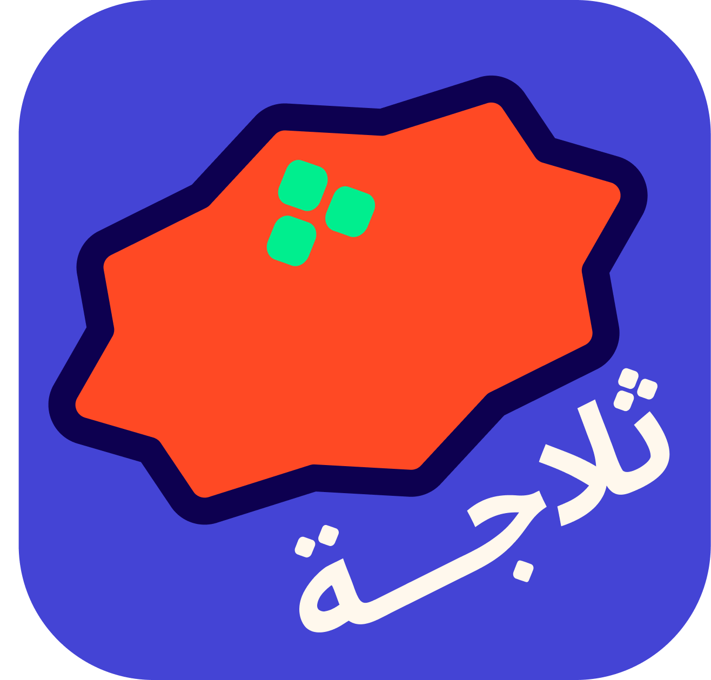
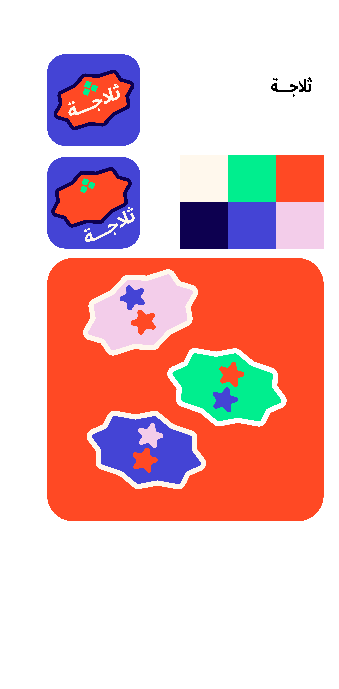
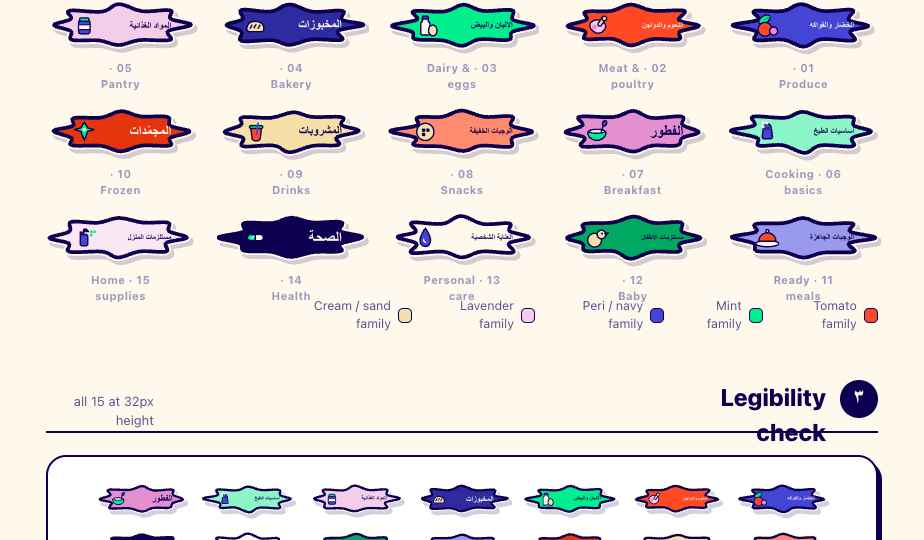
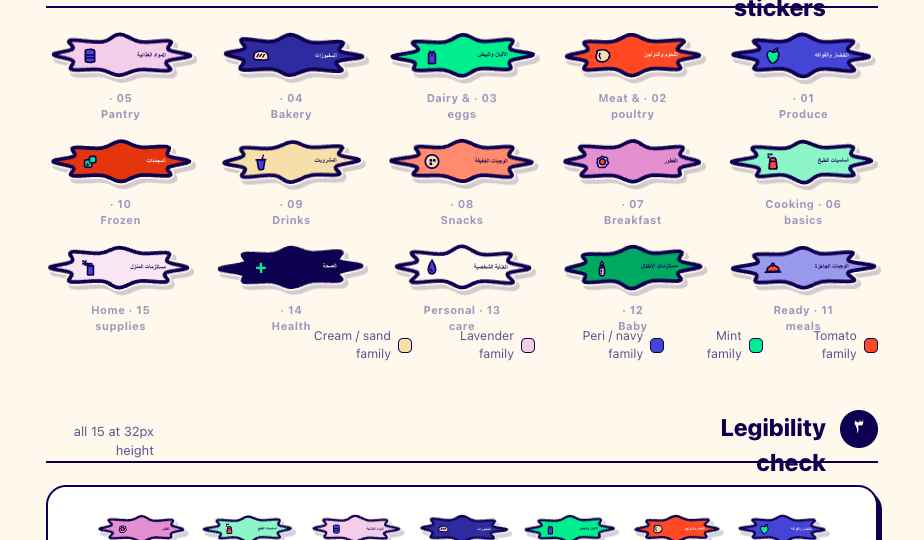

  
  <h1 style="color:#FFF8ED;font-size:40px;font-weight:800;margin:0 0 10px;letter-spacing:-0.01em;">Thalaja — Design Reference</h1>
  
ثلاجة &nbsp;·&nbsp; Shared grocery lists for Saudi families

  

    
    
    
    
  

---

> Layout, component specs, token reference, and interaction states for every screen. Open the interactive prototype below to explore the full flow, then use the screen specs to build in Figma.

---

## Table of Contents

- [Interactive Prototype](#interactive-prototype)
- [Brand System](#brand-system)
  - [Color Tokens](#color-tokens)
  - [Typography](#typography)
  - [Logo System](#logo-system)
  - [Category Sticker System](#category-sticker-system)
  - [Aesthetic Direction](#aesthetic-direction)
- [Token Reference](#token-reference)
  - [Type Scale](#type-scale)
  - [Spacing](#spacing)
  - [Radii](#radii)
  - [Elevation](#elevation)
- [Component Patterns](#component-patterns)
  - [Core](#core)
  - [Forms](#forms)
  - [Patterns](#patterns)
- [Screen Inventory](#screen-inventory)
  - [Screen 1 — Register](#screen-1--register)
  - [Screen 2 — Login](#screen-2--login)
  - [Screen 3 — Groups Home](#screen-3--groups-home)
  - [Screen 4 — Group Detail](#screen-4--group-detail)
  - [Screen 5 — List Detail](#screen-5--list-detail)
  - [Screen 6 — Item Add Sheet](#screen-6--item-add-sheet-bottom-sheet)
  - [Screen 7 — Buying View](#screen-7--buying-view)
  - [Screen 8 — History Screen](#screen-8--history-screen)
  - [Screen 9 — Recipe Detail / Create](#screen-9--recipe-detail--create)
  - [Screen 10 — Notifications & Buyer Assignment](#screen-10--notifications--buyer-assignment)
  - [Screen 11 — Group Admin Settings](#screen-11--group-admin-settings)

---

## Interactive Prototype

<!-- Phone shell -->

<!-- Status bar -->

  9:41
  
  
    <svg width="17" height="11" viewBox="0 0 18 12" fill="#0D0050"><rect x="0" y="7" width="3" height="5" rx="1"/><rect x="5" y="4" width="3" height="8" rx="1"/><rect x="10" y="1.5" width="3" height="10.5" rx="1"/><rect x="15" y="0" width="3" height="12" rx="1" opacity="0.3"/></svg>
    <svg width="22" height="11" viewBox="0 0 24 12" fill="none"><rect x="1" y="1" width="20" height="10" rx="3" stroke="#0D0050" stroke-width="1.5"/><rect x="3" y="3" width="14" height="6" rx="1.5" fill="#0D0050"/><rect x="22" y="4" width="1.5" height="4" rx="1" fill="#0D0050"/></svg>
  

<!-- App iframe -->
<iframe
  src="assets/Thalaja_Design_System/ui_kits/thalaja-app/standalone.html"
  width="390"
  height="756"
  style="border:none;display:block;background:#FFF8ED;"
  title="Thalaja Interactive Prototype">
</iframe>

<!-- Home bar -->

  

 

**↑ Fully interactive — click through all screens**

Lists · List Detail · Shop · Household &nbsp;|&nbsp; Viewport: 390 × 844 (iPhone 14)

 

If the prototype doesn't load above, <a href="assets/Thalaja_Design_System/ui_kits/thalaja-app/standalone.html">open it directly in a browser →</a>

---

## Brand System

### Color Tokens

<table>
<tr>
  <td align="center" width="116" style="background:#FF4924;padding:22px 8px 14px;border-radius:12px 12px 0 0;border:2.5px solid #0D0050;border-bottom:none;"><strong style="color:#FFF8ED;font-size:14px;display:block;">Tomato</strong></td>
  <td align="center" width="116" style="background:#0D0050;padding:22px 8px 14px;border-radius:12px 12px 0 0;border:2.5px solid #0D0050;border-bottom:none;"><strong style="color:#FFF8ED;font-size:14px;display:block;">Night</strong></td>
  <td align="center" width="116" style="background:#FFF8ED;padding:22px 8px 14px;border-radius:12px 12px 0 0;border:2.5px solid #0D0050;border-bottom:none;"><strong style="color:#0D0050;font-size:14px;display:block;">Cream</strong></td>
  <td align="center" width="116" style="background:#00EE8E;padding:22px 8px 14px;border-radius:12px 12px 0 0;border:2.5px solid #0D0050;border-bottom:none;"><strong style="color:#0D0050;font-size:14px;display:block;">Mint</strong></td>
  <td align="center" width="116" style="background:#4444D5;padding:22px 8px 14px;border-radius:12px 12px 0 0;border:2.5px solid #0D0050;border-bottom:none;"><strong style="color:#FFF8ED;font-size:14px;display:block;">Peri</strong></td>
  <td align="center" width="116" style="background:#F3CDEA;padding:22px 8px 14px;border-radius:12px 12px 0 0;border:2.5px solid #0D0050;border-bottom:none;"><strong style="color:#0D0050;font-size:14px;display:block;">Lavender</strong></td>
</tr>
<tr>
  <td align="center" style="padding:10px 4px;border:2.5px solid #0D0050;border-top:none;border-radius:0 0 12px 12px;"><code>#FF4924</code> <code>--red</code></td>
  <td align="center" style="padding:10px 4px;border:2.5px solid #0D0050;border-top:none;border-radius:0 0 12px 12px;"><code>#0D0050</code> <code>--navy</code></td>
  <td align="center" style="padding:10px 4px;border:2.5px solid #0D0050;border-top:none;border-radius:0 0 12px 12px;"><code>#FFF8ED</code> <code>--cream</code></td>
  <td align="center" style="padding:10px 4px;border:2.5px solid #0D0050;border-top:none;border-radius:0 0 12px 12px;"><code>#00EE8E</code> <code>--mint</code></td>
  <td align="center" style="padding:10px 4px;border:2.5px solid #0D0050;border-top:none;border-radius:0 0 12px 12px;"><code>#4444D5</code> <code>--indigo</code></td>
  <td align="center" style="padding:10px 4px;border:2.5px solid #0D0050;border-top:none;border-radius:0 0 12px 12px;"><code>#F3CDEA</code> <code>--lilac</code></td>
</tr>
</table>

Each action color has a `-tint` (soft fill) and `-press` (darker pressed) step — e.g. `--red-tint: #FFE3DC`, `--red-press: #E5350F`. See `tokens/colors.css` for the full ink scale (`--ink-900` → `--ink-100`) and semantic aliases (`--bg-app`, `--surface-card`, `--text-strong`, etc.).

> Tomato `--red` / `#FF4924` is primary. Night `--navy` / `#0D0050` is text and dark backgrounds.
> These are the most frequently confused pair — do not swap them.

---

### Typography

- **Display:** CooperArabic (Arabic glyphs) + Baloo 2 (Latin fallback) · `--font-display`
- **Body / UI:** Tajawal · `--font-body`
- **Direction:** RTL-first. Arabic is the primary language, not a translation layer over an LTR design.
- **Weights:** 300 light · 400 regular · 500 medium · 700 bold · 800 black
- All UI strings default to Arabic. Latin text is secondary.

> CooperArabic covers Arabic glyphs only — Latin cascades to Baloo 2. Display is set tight (−0.01em, line-height 1.05–1.2) and heavy (700–800). Body is 16px · 400–500 weight · line-height 1.45.

---

### Logo System

  
   
  Brand sheet: app icon lockups · six-colour palette · starburst blob motif

 

| Element | Spec |
|---|---|
| Shape | Organic 8-point rounded star |
| Fill | Tomato `#FF4924` |
| Stroke | Night `#0D0050`, thick |
| Dot motif | Three Mint `#00EE8E` rounded squares — form the ث dots; also read as fruit dots on the star (intentional dual meaning) |
| App icon | Star on Peri `#4444D5` background |

---

### Category Sticker System

| Element | Spec |
|---|---|
| Shape | Horizontally stretched 8-point star, ~3:1 width-to-height ratio |
| Fill | Unique palette color per category — not fixed to one token |
| Left zone | Category illustration |
| Right zone | Arabic category name, RTL-aligned |
| ث dot motif | Integrated only where it emerges naturally from the illustration — never forced |

  
   
  All 15 category sticker tags — unique colour per aisle, Arabic name RTL-aligned, ث dot motif where natural

---

### Aesthetic Direction

Retro fruit sticker: octagonal badges, scalloped outlines, expressive flat illustration.
Apply this vocabulary to components before defaulting to flat-minimal system defaults.
The visual system should feel like a physical sticker collection, not a productivity app.

  

---

## Token Reference

All tokens live in `documentation/assets/Thalaja_Design_System/tokens/`. Consuming files link `styles.css` as the single entry point — it imports all token sheets in order.

### Type Scale

| Token | Value | Use |
|---|---|---|
| `--fs-display-xl` | 64px | Hero / splash |
| `--fs-display-lg` | 48px | Screen titles |
| `--fs-display-md` | 36px | Large section heads |
| `--fs-display-sm` | 28px | Section headers |
| `--fs-title` | 22px | Card titles |
| `--fs-body-lg` | 18px | Large body |
| `--fs-body` | 16px | Default UI text |
| `--fs-body-sm` | 14px | Secondary text |
| `--fs-caption` | 13px | Captions, muted notes |
| `--fs-micro` | 11px | Labels, overlines |

### Spacing

4px base grid. `--gutter: 20px` for screen padding. `--container-max: 480px` for the phone canvas.

| Token | Value |
|---|---|
| `--space-1` | 4px |
| `--space-2` | 8px |
| `--space-3` | 12px |
| `--space-4` | 16px |
| `--space-5` | 20px |
| `--space-6` | 24px |
| `--space-7` | 32px |
| `--space-8` | 40px |
| `--space-9` | 48px |
| `--space-10` | 64px |

Control heights: `--control-h-sm: 36px` · `--control-h-md: 48px` · `--control-h-lg: 56px` · minimum tap target `--tap-min: 44px`.

### Radii

The brand is emphatically rounded. When in doubt, use `--radius-pill` for interactive controls.

| Token | Value | Use |
|---|---|---|
| `--radius-xs` | 8px | |
| `--radius-sm` | 12px | |
| `--radius-md` | 16px | Inputs, small cards |
| `--radius-lg` | 24px | Cards |
| `--radius-xl` | 32px | Sheets, large cards |
| `--radius-2xl` | 40px | App-icon-style tiles |
| `--radius-pill` | 999px | Buttons, chips, avatars |

### Elevation

The signature elevation is a **hard, blur-less offset shadow in navy** — not a soft drop shadow. Buttons and pop-cards visibly depress into their shadow on press (translate 2px/3px, shadow → none). Soft blurry shadows are reserved for floating sheets and menus only.

| Token | Value | Use |
|---|---|---|
| `--shadow-pop` | `4px 5px 0 var(--navy)` | Primary buttons, featured cards |
| `--shadow-pop-sm` | `2px 3px 0 var(--navy)` | Chips, secondary actions |
| `--shadow-pop-lg` | `6px 7px 0 var(--navy)` | Large cards, modals |
| `--shadow-sm` | `0 2px 6px rgba(13,0,80,.08)` | Soft lift |
| `--shadow-md` | `0 8px 20px rgba(13,0,80,.12)` | Sheets, menus, toasts |

---

## Component Patterns

Components live in `documentation/assets/Thalaja_Design_System/components/`. All are token-driven React components exported via `_ds_bundle.js`.

### Core

| Component | DS Name | Visual | Variants / States |
|---|---|---|---|
| Button | `Button` | `--red` fill · `--cream` label · `--radius-pill` · 2.5px navy stroke · `--shadow-pop` | variant: primary / secondary / mint / outline / ghost · size: sm / md / lg · disabled (opacity 0.45) · press (translates into shadow) |
| Icon Button | `IconButton` | Circle or rounded-square · tone-matched fill | variant: soft / solid / outline / ghost · tone: indigo / red / mint / navy · size: sm / md / lg |
| Badge | `Badge` | Pill label · `--radius-pill` | tone: neutral / red / mint / indigo / lilac · variant: soft / solid / outline · size: sm / md · optional dot |
| Avatar | `Avatar` | Circle with initials or image · 2px navy border · color auto-assigned from name hash | shape: circle / blob |
| Avatar Group | `AvatarGroup` | Overlapping Avatars · `+N` navy overflow chip | `max` prop controls cutoff |
| Card | `Card` | Rounded white surface | variant: plain · pop (hard-pop shadow) · sunken · brand (Tomato fill) · tone tint: red / mint / indigo / lilac |

### Forms

| Component | DS Name | Visual | Variants / States |
|---|---|---|---|
| Text Input | `Input` | `--cream` bg · 2px navy border · `--radius-md` | default · focused (`--indigo` border + 4px ring) · error (`--red` border + message below) · disabled |
| Checkbox | `Checkbox` | Square · `--mint` fill on check · navy stroke · chunky checkmark | unchecked · checked (Mint fill) · disabled |
| Quantity Stepper | `QtyStepper` | − / + buttons around a number · `--radius-pill` pill container | size: sm / md · min / max props |
| Segmented Control | `SegmentedControl` | Pill container · active segment fills `--navy` · `--cream` text · optional badge counts | size: sm / md |

### Patterns

| Component | DS Name | Visual | Variants / States |
|---|---|---|---|
| Starburst Blob | `Blob` | Wavy 9-point sticker seal · `--cream` halo stroke | tone: red / mint / indigo / lilac / navy / cream · `size` + `rotate` props · content auto-counter-rotated |
| Category Chip | `CategoryChip` | Pill · emoji icon + label · `--shadow-pop-sm` when selected | tone: indigo / red / mint / lilac · selected / unselected |
| Grocery Item | `GroceryItem` | Checkbox · category emoji token · name + note · requester avatar · trailing slot | default · checked (strikethrough + dimmed to 0.72) |
| List Summary Card | `ListSummaryCard` | Title · household name · progress bar · member avatars · hard-pop card | accent: red / indigo / mint · press depresses into shadow |

---

## Screen Inventory

<strong>Screen 1 — Register</strong>

**Layout:** Single-column form, centered vertically. Thalaja logo at top.

**Components:**

- First and Last Name field (text input)
- Phone field (phone keyboard type)
- Email field (email keyboard type)
- "Create Account" primary button → disabled until all fields pass validation
- "Already have an account? Sign in" text link at bottom

**Interactions:**

- Inline field validation on blur — red border + error message below field
- On submit: navigate to OTP Entry
- On OTP success: navigate to Groups Home

**States to design:** default · field validation error · loading (button spinner) · OTP entry

**OTP Entry (sub-state of Register):**

- 6-digit code input (numeric keyboard, auto-advance per digit)
- Resend countdown timer (60 seconds)
- "Resend code" link — active only after timer expires
- States: awaiting input · invalid code · expired · loading

---

<strong>Screen 2 — Login</strong>

**Layout:** Single-column form, centered vertically. Thalaja logo at top.

**Components:**

- Phone or email field (auto-detects input type)
- "Sign In" primary button
- "Don't have an account? Register" text link at bottom

**Interactions:**

- On submit: navigate to OTP Entry (reuses the OTP Entry sub-state from Screen 1)
- On OTP success: navigate to Groups Home
- On failure: inline error banner — "Phone or email not found"

**States to design:** default · error banner ("Phone or email not found") · loading · OTP entry

---

<strong>Screen 3 — Groups Home</strong>

**Layout:** Scrollable list view. Top app bar with app name and profile avatar (tapping avatar opens profile settings). FAB bottom-right for creating a group.

**Components:**

- Group cards — group icon, group name, member count, most recent list name
- FAB: "Create Group" → opens bottom sheet
- Bottom sheet — Create Group: group name field + group icon picker + confirm button → displays generated invite code on success
- "Join a Group" text link or secondary button beneath the FAB

**Interactions:**

- Tap group card → Group Detail
- Long-press group card → context menu: "Leave Group" (non-admins), "Delete Group" (admin)

**States to design:** empty (no groups) · populated · create group sheet · invite code reveal screen

---

<strong>Screen 4 — Group Detail</strong>

**Layout:** Top section shows group icon, group name, and a member avatar strip (max 5 visible, +N overflow). Below: two tabbed sections — **Lists** and **Recipes** — organised within the same screen.

**Components:**

**Lists tab:**

- List cards — list icon, list name, item count, urgent item count (badge), last updated timestamp, status chip (Active / Completed)
- FAB: "New List" (visible on Lists tab)
- Long-press list card → admin context menu: rename, remove

**Recipes tab:**

- Recipe cards — recipe image thumbnail, recipe name, ingredient count, created by (member name)
- FAB: "New Recipe" (visible on Recipes tab)
- Long-press recipe card → admin context menu: delete
- Tap recipe card → Recipe Detail

**Persistent controls:**

- All members: share invite code button accessible from top bar
- Admin only: kebab menu (⋮) in top bar → Group Admin Settings screen

**Interactions:**

- Tap list card → List Detail
- Tap member avatar strip → member list overlay showing name and role

**States to design:** Lists tab populated · Lists tab empty · Recipes tab populated · Recipes tab empty · admin view vs. member view distinction

---

<strong>Screen 5 — List Detail</strong>

**Layout:** Top app bar with list name, History icon button, and Buying Mode icon button. Scrollable item list grouped by aisle category. FAB bottom-right: "Add Item."

**Components:**

- Item cards — name, brand (if set), quantity + unit, notes snippet, image thumbnail (if set), urgency badge (if `is_urgent` is true), requester avatar + name
- Real-time sync active while screen is open via WebSocket — additions, edits, and removals from other members appear without pull-to-refresh (US-24)
- "Possible duplicate" inline warning banner on add when item name closely matches an existing list entry (US-25)
- Bulk delete: accessible via list options menu (⋮ top bar) — requires confirmation dialog showing item count; most recent bulk delete entry in the action log includes an "Undo" button (US-23)

**Interactions:**

- Tap item card → item edit sheet
- Long-press item card → context menu: edit, delete
- FAB → Item Add Sheet (Screen 6)
- History button → History Screen (Screen 8)
- Buying Mode button → Buying View (Screen 7)

**States to design:** populated list · empty list · real-time item arrival animation · duplicate warning banner · bulk delete confirmation dialog · post-bulk-delete undo state

---

<strong>Screen 6 — Item Add Sheet (Bottom Sheet)</strong>

**Layout:** Modal bottom sheet, scrollable. Segmented tab row at top for add paths.

**Add path tabs:**

| Tab | Description | Sprint Target |
|---|---|---|
| Manual | Full item detail form | Sprint 2 |
| History | Searchable list of items this member has previously added | Sprint 3 |
| Catalog | Browsable grocery catalog | Sprint 3 |
| Barcode | Camera scanning overlay | Sprint 5 — shown disabled until built |
| Photo | Camera shutter for item recognition | Sprint 5 — shown disabled until built |
| Recipe | List of saved recipes; tap to preview ingredients then import | Sprint 5 |

**Manual tab components:**

- Name (text, required)
- Brand (text, optional)
- Quantity (numeric) + Unit (dropdown or text: kg / g / L / ml / pcs / box / etc.)
- Notes (multiline, optional)
- Urgency toggle — off by default, labeled "Mark as Urgent"
- Image attach button — opens camera or photo library

**States to design:** each tab default · barcode and photo disabled states · manual tab validation errors · catalog loading state

---

<strong>Screen 7 — Buying View</strong>

**Layout:** Full-screen. Top bar with list name and "Exit Buying Mode" button. Urgency filter toggle below top bar. Items grouped under aisle section headers, ordered by a standard grocery store aisle sequence.

**Components:**

- Aisle section headers (e.g., Produce, Dairy, Meat, Frozen, Bakery, Pantry, Beverages, Household)
- Checklist item rows — name, brand, quantity, image thumbnail (if set), requester name
- Urgency filter toggle: "Show All" / "Urgent Only" — filters without leaving the view
- Tap item → marks as bought (strikethrough + dimmed); checked items sink to bottom of their aisle section. Tap again → unmarks.
- "Complete Trip" button fixed at bottom — visible once at least one item is checked

**Locked behavior:**

- "Add Item" FAB is hidden
- Item edit is disabled
- Only check and uncheck interactions are active

**Interactions:**

- "Complete Trip" → confirmation dialog → list closes → saved to group trip history → navigate back to Group Detail with list status updated to Completed

**States to design:** in-progress shop · urgent-only filtered view · all items checked · complete trip confirmation dialog

---

<strong>Screen 8 — History Screen</strong>

**Layout:** Accessed via the History icon button on List Detail. Two tabs: **Action Log** and **Trip History**.

**Action Log tab:**

- Chronological feed, newest first
- Each entry: actor avatar + name · human-readable action description · relative timestamp
- Action types: item added · item edited · item removed · bulk delete (with "Undo" button on the most recent entry, time-limited) · item checked as bought · item unchecked · list created · list completed · recipe imported · member joined group

**Trip History tab:**

- Past completed shopping trips for this list, newest first
- Trip card: date · buyer name · item count · expandable to show the full item list from that trip

---

<strong>Screen 9 — Recipe Detail / Create</strong>

**Layout:** Recipes are surfaced in two places: the **Recipes tab on Group Detail** (browse and manage) and the **Item Add Sheet Recipe tab** (browse and import only). This screen covers the Recipe Detail view and the Create/Edit form, reached by tapping a recipe card or the "New Recipe" FAB on Group Detail.

**Components:**

- Recipe cards — recipe image thumbnail, recipe name, ingredient count, created by (member name)
- FAB: "New Recipe"
- Recipe create/edit form:
  - Name (text, required)
  - Image (optional — camera or photo library)
  - Instructions (multiline, step-by-step text)
  - Ingredients section — rows of: ingredient name + quantity + unit; "Add Ingredient" button to append a row
  - "Save Recipe" confirm button
- Recipe detail view — full ingredients list · instructions · "Add All to List" button (prompts list selector if member belongs to multiple active groups)
- Admin only: "Delete Recipe" option visible on recipe detail

**States to design:** recipe list populated · empty recipe list · recipe detail · create form · edit form

---

<strong>Screen 10 — Notifications & Buyer Assignment</strong>

**Layout:** Accessible from List Detail via a dedicated button or top bar action. Contains three notification actions as distinct UI sections.

**Heading to Store** (US-30)

- Button: "I'm Heading to the Store"
- On tap: confirmation dialog ("This will notify all group members to add their last items. Continue?") → sends FCM push notification to all group members → confirmation feedback to buyer

**Assign Buyer** (US-31)

- Label: "Assign a Buyer for This Trip"
- Member picker showing current group members
- On confirm: sends FCM push notification to selected member ("You've been assigned as buyer for [list name]. Head to the store when ready.")
- Confirmation feedback shown inline

**Remind Member** (US-32, Could Have)

- Label: "Remind Someone to Add Their Items"
- Member picker showing current group members
- On confirm: sends FCM push notification to selected member ("Don't forget to add your items to [list name] before the next trip.")
- Confirmation feedback shown inline

**States to design:** default · confirmation dialogs · sent feedback state

---

<strong>Screen 11 — Group Admin Settings</strong>

**Layout:** Settings-style screen. Accessible via the kebab menu (⋮) on Group Detail. Visible only to the group admin.

**Group Identity**

- Group name — editable inline field, save on tap confirm
- Group icon — tap to change (image picker or icon/emoji selector)

**Members**

- Member list rows: avatar · name · role chip (Admin / Member) · kebab menu per row
- Member kebab options: "Remove from Group" · "Transfer Admin Role" (removes current admin's role, assigns to this member — requires confirmation dialog)
- Invite Code display with copy button and "Regenerate" option

**Danger Zone**

- "Delete Group" — destructive action, confirmation dialog required, clearly separated visually

> *Note: List removal is triggered from the list card long-press on Group Detail (admin only). Recipe removal is triggered from Recipe detail (admin only). Both are admin-gated actions but do not live on this settings screen.*

---

  Thalaja Team · Design Reference · Stage 3 · Built at Holberton / Tuwaiq Academy · Saudi Arabia · 2026

