# Thalaja — Stage 3 Technical Documentation
## Section 1: User Stories and Mockups

---

## Table of Contents

- [1.1 Actors](#11-actors)
- [1.2 User Stories](#12-user-stories)
- [1.3 MoSCoW Summary](#13-moscow-summary)
- [1.4 Mockups](#14-mockups)

---

## 1.1 Actors

| Actor | Description |
|---|---|
| **Guest** | Unauthenticated user who has installed the app |
| **Member** | Authenticated user belonging to one or more groups |
| **Admin** | Member with the admin role in a specific group — can manage group membership, names, icons, and remove lists and recipes. Admin role is singular per group; transferring it removes the current admin's privileges. |
| **Buyer** | Member who has been assigned or has volunteered for the current shopping trip — not a permanent role |

---

## 1.2 User Stories

### Authentication & Onboarding

| ID | Story | Priority |
|---|---|---|
| US-01 | As a guest, I want to create an account with my name, email, and password, so that I can join or create a household group. | **Must Have** |
| US-02 | As a guest, I want to log in with my email and password, so that I can access my groups and lists. | **Must Have** |
| US-03 | As a member, I want to update my display name and avatar, so that my identity is recognizable to other group members. | Should Have |

---

### Group Management

| ID | Story | Priority |
|---|---|---|
| US-04 | As a member, I want to create a group and receive a shareable invite code, so that I can bring my household or friends into one shared space. | **Must Have** |
| US-05 | As a member, I want to join a group using an invite code, so that I can access its shared lists. | **Must Have** |
| US-06 | As a member, I want to belong to multiple groups at the same time, so that I can coordinate groceries across different households. | **Must Have** |
| US-07 | As a member, I want to share the group invite code with others, so that I can bring new people in without requiring admin action. | **Must Have** |
| US-08 | As an admin, I want to remove a member from the group, so that I control who has access to our lists. | Should Have |
| US-09 | As an admin, I want to edit the group name and icon, so that the group is clearly identifiable across multiple groups. | Should Have |
| US-10 | As an admin, I want to transfer my admin role to another member — losing my own admin status in the process — so that group ownership can be handed over cleanly. | Should Have |
| US-11 | As an admin, I want to remove a list from the group, so that the group's list view stays relevant and organized. | Should Have |
| US-12 | As an admin, I want to remove a recipe from the group, so that outdated or unused recipes don't clutter the recipe library. | Should Have |

---

### List Management

| ID | Story | Priority |
|---|---|---|
| US-13 | As a member, I want to create and name a shared grocery list within a group, so that everyone can add their items before the shopping trip. | **Must Have** |
| US-14 | As an admin, I want to edit the list name and icon after creation, so that lists can be renamed or visually distinguished without recreating them. | Should Have |
| US-15 | As a buyer, I want to close the active list when the shopping trip is done, so that it moves to the group's trip history and the active view stays clean. | **Must Have** |

---

### Item Submission

| ID | Story | Priority |
|---|---|---|
| US-16 | As a member, I want to add an item manually with name, brand, quantity, unit, and notes, so that the buyer has the detail they need to find exactly what I want. | **Must Have** |
| US-17 | As a member, I want to browse my item history and re-add a past item, so that I don't have to re-enter its details from scratch. | **Must Have** |
| US-18 | As a member, I want to browse a grocery catalog and select items from it, so that I can add common products without typing. | Should Have |
| US-19 | As a member, I want to scan an item's barcode, so that its name and details are filled in automatically. | Could Have |
| US-20 | As a member, I want to take a photo of an item and have it identified automatically, so that I can add it quickly without knowing the exact product name. | Could Have |
| US-21 | As a member, I want to attach an image to an item I'm adding, so that the buyer can visually confirm the exact product on the shelf. | Should Have |
| US-22 | As a member, I want to mark an item as urgent when adding it, so that the buyer knows it cannot wait for the next full trip. | Should Have |
| US-23 | As a member, I want to bulk-delete all items from the list after a confirmation step, so that I can reset the list when needed — with the option to undo the action via the list's action log. | Should Have |

---

### Real-Time Collaboration

| ID | Story | Priority |
|---|---|---|
| US-24 | As a member viewing a list, I want to see other members' additions, edits, and removals appear in real time without refreshing, so that the list stays synchronized during active collaboration. | **Must Have** |

---

### Duplicate Prevention

| ID | Story | Priority |
|---|---|---|
| US-25 | As a member, I want to see a non-blocking warning when the item I'm adding may already be on the list, so that I can decide whether to add it anyway or update the existing entry instead. | **Must Have** |

---

### Buying View

| ID | Story | Priority |
|---|---|---|
| US-26 | As a buyer, I want a dedicated buying view that locks the list from edits, organizes items by grocery aisle category in a standard store aisle sequence, and lets me check off items as I shop, so that I can move through the store efficiently without accidental changes. | **Must Have** |
| US-27 | As a buyer, I want to filter the buying view to show only urgent items, so that I can complete a quick trip when I don't have time for a full shop. | Should Have |

---

### History

| ID | Story | Priority |
|---|---|---|
| US-28 | As a member, I want to browse the action log for a list — showing who added, edited, removed, or bulk-deleted items and when — so that I stay informed of all updates made by other members. | **Must Have** |
| US-29 | As a member, I want to see a trip history showing past completed shopping trips, so that I can reference what was bought in previous trips. | Should Have |

---

### Notifications

| ID | Story | Priority |
|---|---|---|
| US-30 | As a buyer, I want to tap a "heading to store" button that sends a push notification to all group members, so that they have a final window to add any last-minute items before I leave. | **Must Have** |
| US-31 | As a member, I want to assign a buyer for the upcoming trip and send them a push notification, so that the designated person knows they are expected to shop. | Should Have |
| US-32 | As a member, I want to send a reminder notification to a specific group member to add their items to the list, so that no one's needs are missed before the trip. | Could Have |

---

### Recipes

| ID | Story | Priority |
|---|---|---|
| US-33 | As a member, I want to create and save a recipe with a name, image, step-by-step instructions, and an ingredients list (name, quantity, and unit per ingredient), so that I can reuse it across multiple shopping trips. | Should Have |
| US-34 | As a member, I want to import all ingredients from a saved recipe to the active list in one tap, so that I don't have to add each ingredient individually. | Should Have |
| US-35 | As a group, I want to share saved recipes within our group, so that any member can view and import a group recipe to the list. | Could Have |

---

## 1.3 MoSCoW Summary

| Priority | Story IDs | Count |
|---|---|---|
| **Must Have** | US-01, 02, 04, 05, 06, 07, 13, 15, 16, 17, 24, 25, 26, 28, 30 | 15 |
| **Should Have** | US-03, 08, 09, 10, 11, 12, 14, 18, 21, 22, 23, 27, 29, 31, 33, 34 | 16 |
| **Could Have** | US-19, 20, 32, 35 | 4 |
| **Won't Have (this phase)** | Geofence triggers · Occasion/event lists · Financial tracking · Store inventory APIs · Aisle sorting algorithms · Simultaneous multi-buyer sync · AI recommendations · Voice input · In-app chat | — |

---

## 1.4 Mockups

Eleven screens. Wireframe specifications are in [`thalaja-stage3-wireframes.md`](./thalaja-stage3-wireframes.md). Figma designs will be embedded below as they are completed.

| Screen |
|---|
| Screen 1 — Register | 
| Screen 2 — Login |    
| Screen 3 — Groups Home | 
| Screen 4 — Group Detail |
| Screen 5 — List Detail | 
| Screen 6 — Item Add Sheet | 
| Screen 7 — Buying View | 
| Screen 8 — History Screen | 
| Screen 9 — Recipe Detail / Create | 
| Screen 10 — Notifications & Buyer Assignment | 
| Screen 11 — Group Admin Settings | 

Figma Mockup

  
  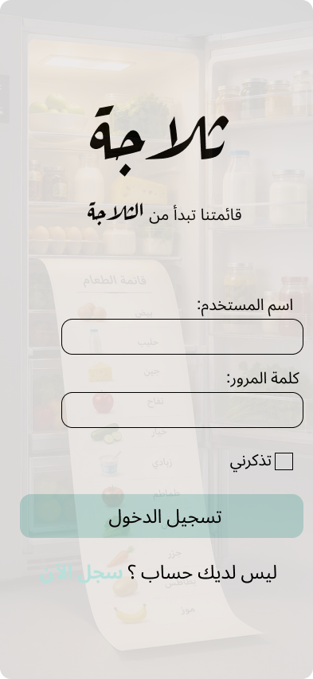
  
  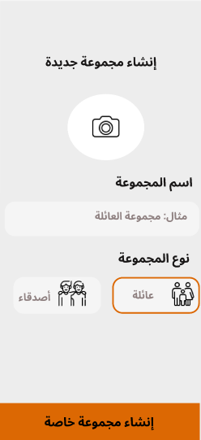

  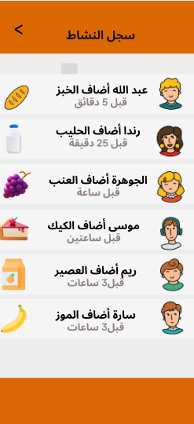
  
  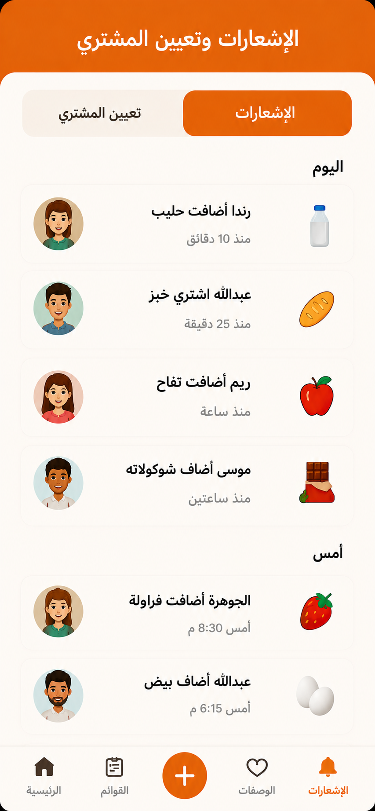
  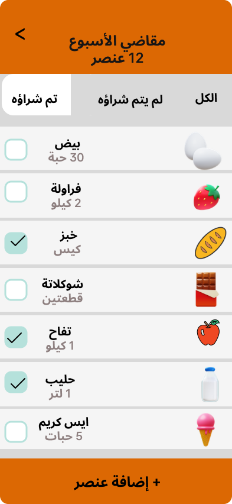

---
# Thalaja — Technical Diagrams

## 1. Package Diagram

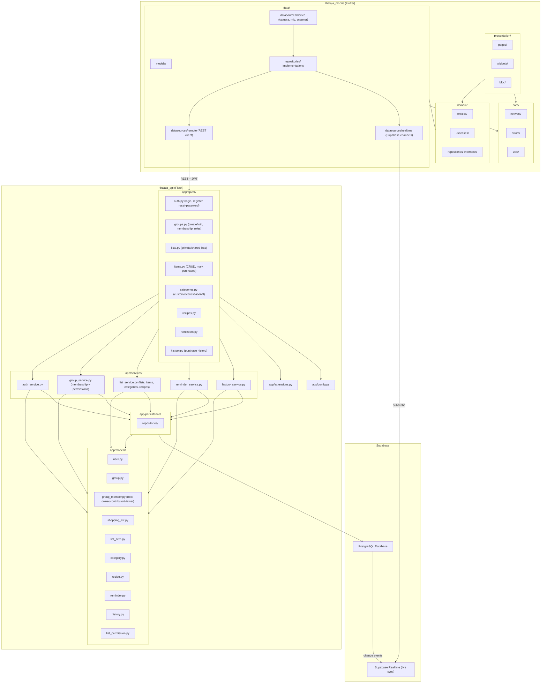

---

## 2. Entity-Relationship Diagram

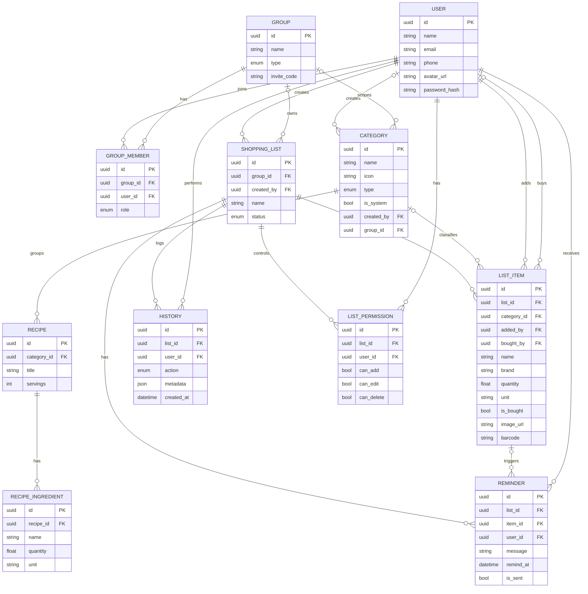

---

## 3. Use Case Diagram

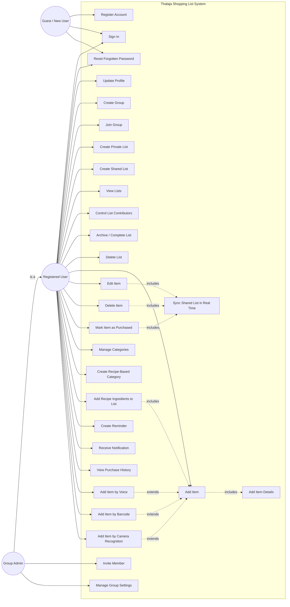

---

## 4. Sequence Diagrams

### 4.1 Register Account

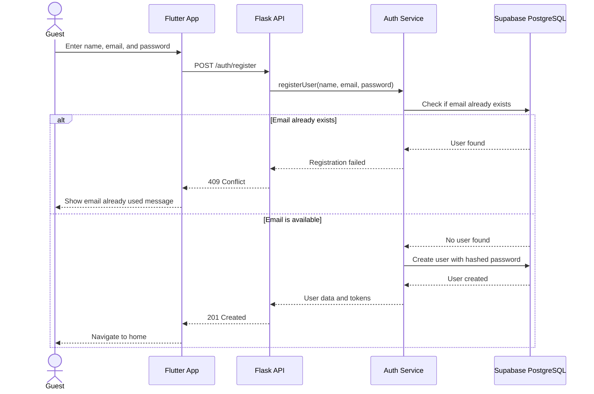

### 4.2 Sign In

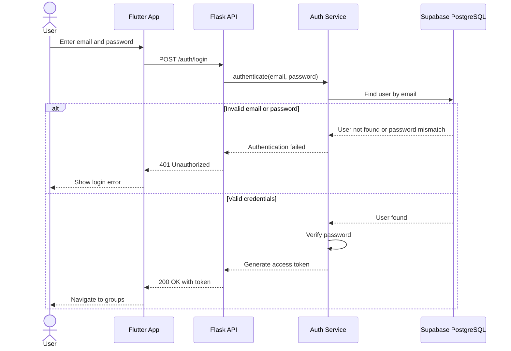

### 4.3 Reset Forgotten Password

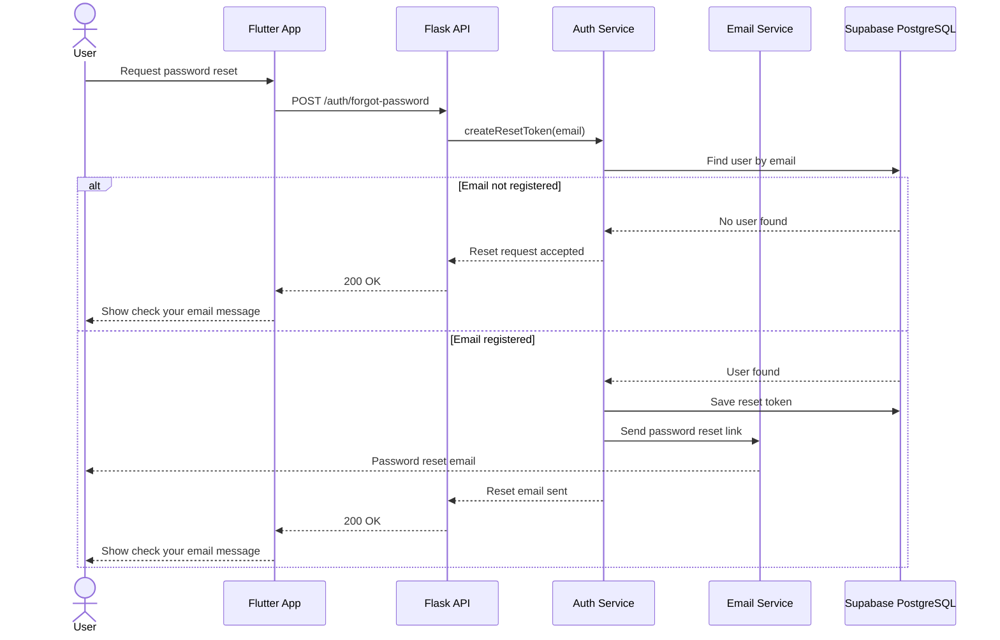

### 4.4 Create Group

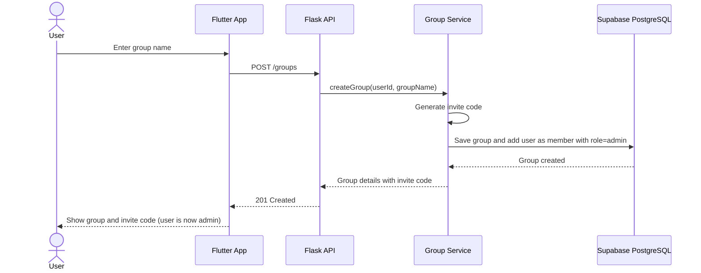

### 4.5 Join Group

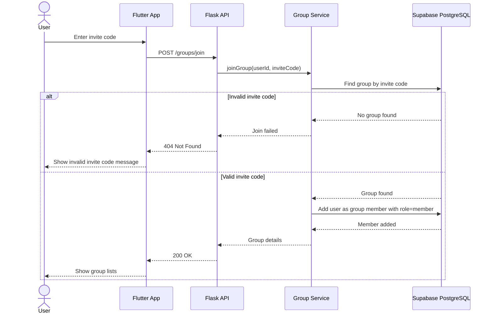

### 4.6 Create Shopping List

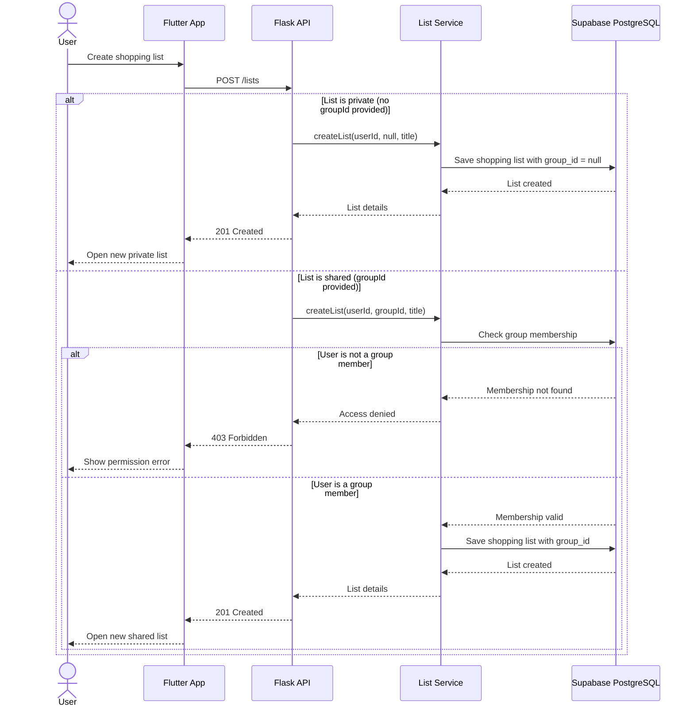

### 4.7 Add Item to List

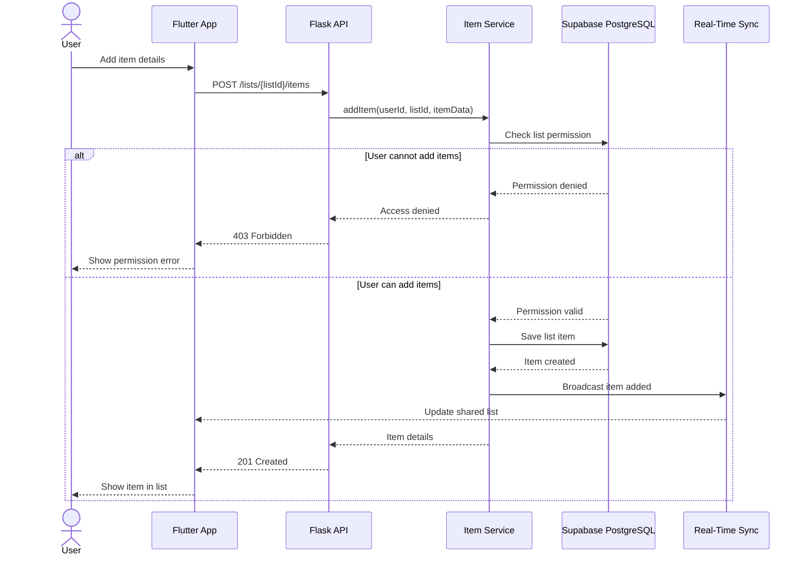

### 4.8 Mark Item as Purchased

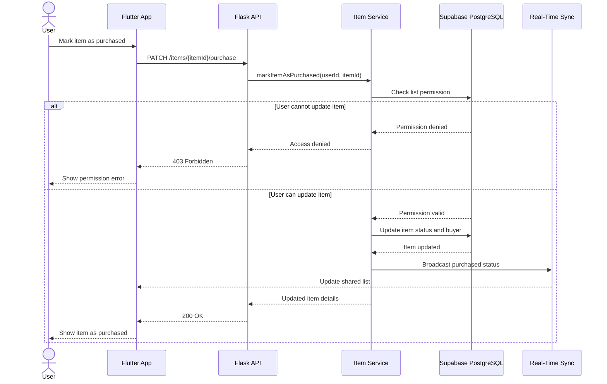

### 4.9 View List History

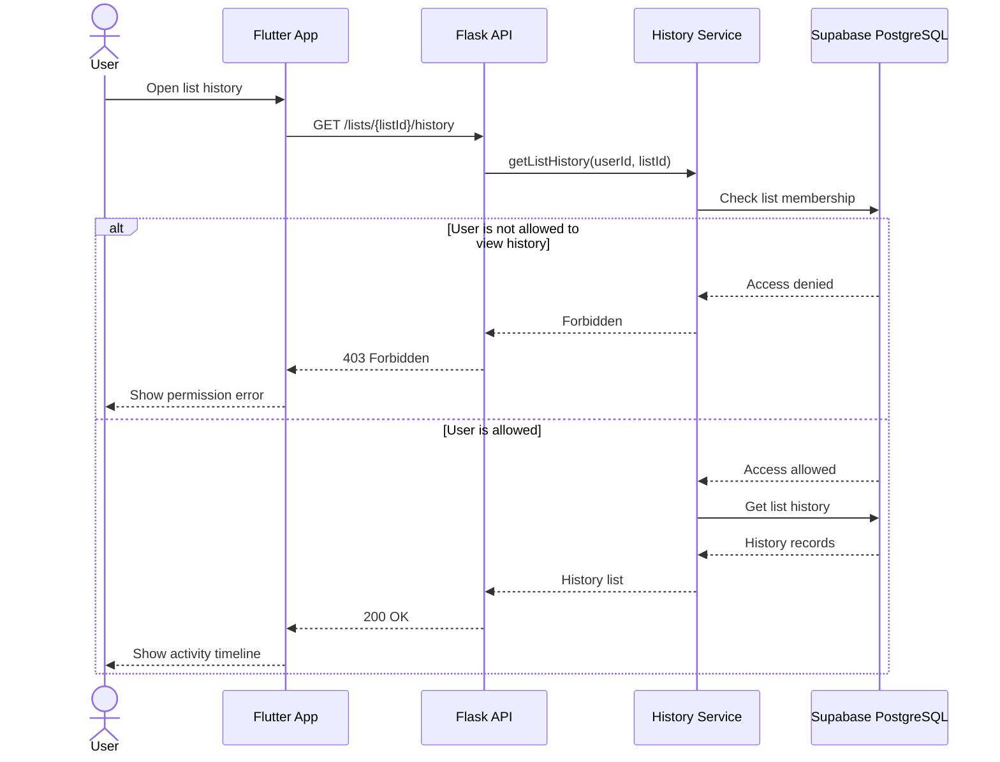
## External API Table

| Module | API Name | Method | Endpoint | Auth | Related Story |
|---|---|---|---|---|---|
| Auth | Register | POST | /auth/register | No | assumed |
| Auth | Login | POST | /auth/login | No | High #1 |
| Auth | Forgot Password | POST | /auth/forgot-password | No | High #2 |
| Auth | Reset Password | POST | /auth/reset-password | No | High #2 |
| User | Get Profile | GET | /users/me | Yes | assumed |
| User | Update Profile | PATCH | /users/me | Yes | assumed |
| Group | Create Group | POST | /groups | Yes | High #3 |
| Group | Join Group | POST | /groups/join | Yes | High #4 |
| Group | List My Groups | GET | /groups | Yes | High #4 |
| Group | Update Group Settings | PATCH | /groups/{groupId} | Yes (admin) | assumed |
| List | Create List | POST | /lists | Yes | High #3 |
| List | Get My Lists | GET | /lists | Yes | High |
| List | Get List Detail | GET | /lists/{listId} | Yes | High |
| List | Delete List | DELETE | /lists/{listId} | Yes (owner) | assumed |
| List | Get Permissions | GET | /lists/{listId}/permissions | Yes (owner) | High #8 |
| List | Set Permission | PUT | /lists/{listId}/permissions/{userId} | Yes (owner) | High #8 |
| List | Get History | GET | /lists/{listId}/history | Yes | assumed |
| Item | Add Item | POST | /lists/{listId}/items | Yes | High #4 |
| Item | Update Item | PATCH | /lists/{listId}/items/{itemId} | Yes | High #5 |
| Item | Delete Item | DELETE | /lists/{listId}/items/{itemId} | Yes | High #5 |
| Item | Mark Purchased | PATCH | /lists/{listId}/items/{itemId}/purchase | Yes | High #7 |
| Item | Upload Item Photo | POST | /lists/{listId}/items/{itemId}/photo | Yes | Low #3 |
| Category | List Categories | GET | /categories | Yes | Medium #2 |
| Category | Create Category | POST | /categories | Yes | Medium #3, #5, #6 |
| Recipe | Create Recipe | POST | /recipes | Yes | Medium #4 |
| Recipe | Add Recipe to List | POST | /lists/{listId}/items/from-recipe/{recipeId} | Yes | Medium #4 |
| Reminder | Create Reminder | POST | /reminders | Yes | Medium #7 |
| Reminder | List Reminders | GET | /reminders | Yes | Medium #7 |
| Reminder | Delete Reminder | DELETE | /reminders/{id} | Yes | Medium #7 |

## Internal API / Backend Operations Table

| Layer | Internal Operation | Purpose | Used By External API | Related Story |
|---|---|---|---|---|
| Service | create_user() | Hash password, insert USER row | /auth/register | assumed |
| Service | authenticate_user() | Verify credentials, issue JWT | /auth/login | High #1 |
| Service | generate_reset_token() | Create + store reset token, send email | /auth/forgot-password | High #2 |
| Service | reset_password() | Validate token, update password hash | /auth/reset-password | High #2 |
| Service | create_group() | Insert GROUP, add creator as admin member | /groups | High #3 |
| Service | join_group_by_code() | Validate invite code, insert GROUP_MEMBER | /groups/join | High #4 |
| Service | update_group_settings() | Update name/invite code | /groups/{groupId} | assumed |
| Service | create_list() | Insert SHOPPING_LIST (nullable group_id) | /lists | High #3 |
| Service | validate_group_membership() | Check user belongs to group before list creation | /lists | High |
| Service | add_item_to_list() | Check permission, insert LIST_ITEM, broadcast via Sync | /lists/{listId}/items | High #4 |
| Service | update_item() | Edit item fields | /lists/{listId}/items/{itemId} | High #5 |
| Service | delete_item() | Remove item, log history | /lists/{listId}/items/{itemId} | High #5 |
| Service | mark_item_as_purchased() | Toggle is_bought, set bought_by, log history | /lists/{listId}/items/{itemId}/purchase | High #7 |
| Service | validate_list_permission() | Check can_add/can_edit/can_delete for user | item endpoints | High #8 |
| Service | set_list_permission() | Upsert LIST_PERMISSION row | /lists/{listId}/permissions/{userId} | High #8 |
| Service | create_category() | Insert CATEGORY (scoped to user/group or system) | /categories | Medium #2, #3, #5, #6 |
| Service | create_recipe() | Insert RECIPE + RECIPE_INGREDIENT rows | /recipes | Medium #4 |
| Service | add_recipe_ingredients_to_list() | Bulk-insert LIST_ITEM rows from recipe | /lists/{listId}/items/from-recipe/{recipeId} | Medium #4 |
| Service | create_reminder() | Insert REMINDER row | /reminders | Medium #7 |
| Service | get_due_reminders() | Query reminders due and not yet sent | scheduled job (not REST) | Medium #7 |
| Service | log_history_event() | Insert HISTORY row on item/list actions | called internally by item/list services | assumed |
| Service | get_list_history() | Query HISTORY by list_id | /lists/{listId}/history | assumed |
| Service | upload_item_image() | Store file in Supabase Storage, return URL | /lists/{listId}/items/{itemId}/photo | Low #3 |
| Repository | UserRepository.find_by_email() | Lookup for login/register | auth_service | High #1, #2 |
| Repository | GroupRepository.find_by_invite_code() | Lookup for join flow | group_service | High #4 |
| Repository | GroupMemberRepository.add_member() / get_role() | Membership + role checks | group_service, list_service | High #3, #4, #8 |
| Repository | ListRepository.get_user_lists() / get_group_lists() | Aggregate private + shared lists | list_service | High |
| Repository | ItemRepository.save() / delete() | CRUD for LIST_ITEM | list_service | High #4, #5, #7 |
| Repository | ListPermissionRepository.get_permission() | Permission lookup | list_service | High #8 |
| Repository | CategoryRepository.list_for_user() | System + scoped categories | list_service | Medium #2, #3, #5, #6 |
| Repository | RecipeRepository.save_with_ingredients() | Recipe + ingredients in one transaction | list_service | Medium #4 |
| Repository | ReminderRepository.find_due() | Scheduled job query | reminder_service | Medium #7 |
| Repository | HistoryRepository.save_event() / find_by_list() | History CRUD | history_service | assumed |
| Helper | hash_password() / verify_password() | bcrypt wrapper | auth_service | High #1 |
| Helper | generate_jwt() / decode_jwt() | Token issuing/verification | auth_service, require_auth | High #1 |
| Helper | require_auth() | Decorator checking JWT on protected routes | all protected routes | — |
| Helper | require_list_owner() | Decorator for permission-management endpoints | permissions endpoint | High #8 |

*Thalaja Team · Stage 3 Technical Documentation*
