# Thalaja — Stage 3 Technical Documentation
## Section 1: User Stories and Mockups

---

## Table of Contents

- [1.1 Actors](#11-actors)
- [1.2 User Stories](#12-user-stories)
- [1.3 MoSCoW Summary](#13-moscow-summary)
- [1.4 Mockups](#14-mockups)

---

## 1.1 Actors

| Actor | Description |
|---|---|
| **Guest** | Unauthenticated user who has installed the app |
| **Member** | Authenticated user belonging to one or more groups |
| **Admin** | Member with the admin role in a specific group — can manage group membership, names, icons, and remove lists and recipes. Admin role is singular per group; transferring it removes the current admin's privileges. |
| **Buyer** | Member who has been assigned or has volunteered for the current shopping trip — not a permanent role |

---

## 1.2 User Stories

### Authentication & Onboarding

| ID | Story | Priority |
|---|---|---|
| US-01 | As a guest, I want to create an account with my name, email, and password, so that I can join or create a household group. | **Must Have** |
| US-02 | As a guest, I want to log in with my email and password, so that I can access my groups and lists. | **Must Have** |
| US-03 | As a member, I want to update my display name and avatar, so that my identity is recognizable to other group members. | Should Have |

---

### Group Management

| ID | Story | Priority |
|---|---|---|
| US-04 | As a member, I want to create a group and receive a shareable invite code, so that I can bring my household or friends into one shared space. | **Must Have** |
| US-05 | As a member, I want to join a group using an invite code, so that I can access its shared lists. | **Must Have** |
| US-06 | As a member, I want to belong to multiple groups at the same time, so that I can coordinate groceries across different households. | **Must Have** |
| US-07 | As a member, I want to share the group invite code with others, so that I can bring new people in without requiring admin action. | **Must Have** |
| US-08 | As an admin, I want to remove a member from the group, so that I control who has access to our lists. | Should Have |
| US-09 | As an admin, I want to edit the group name and icon, so that the group is clearly identifiable across multiple groups. | Should Have |
| US-10 | As an admin, I want to transfer my admin role to another member — losing my own admin status in the process — so that group ownership can be handed over cleanly. | Should Have |
| US-11 | As an admin, I want to remove a list from the group, so that the group's list view stays relevant and organized. | Should Have |
| US-12 | As an admin, I want to remove a recipe from the group, so that outdated or unused recipes don't clutter the recipe library. | Should Have |

---

### List Management

| ID | Story | Priority |
|---|---|---|
| US-13 | As a member, I want to create and name a shared grocery list within a group, so that everyone can add their items before the shopping trip. | **Must Have** |
| US-14 | As an admin, I want to edit the list name and icon after creation, so that lists can be renamed or visually distinguished without recreating them. | Should Have |
| US-15 | As a buyer, I want to close the active list when the shopping trip is done, so that it moves to the group's trip history and the active view stays clean. | **Must Have** |

---

### Item Submission

| ID | Story | Priority |
|---|---|---|
| US-16 | As a member, I want to add an item manually with name, brand, quantity, unit, and notes, so that the buyer has the detail they need to find exactly what I want. | **Must Have** |
| US-17 | As a member, I want to browse my item history and re-add a past item, so that I don't have to re-enter its details from scratch. | **Must Have** |
| US-18 | As a member, I want to browse a grocery catalog and select items from it, so that I can add common products without typing. | Should Have |
| US-19 | As a member, I want to scan an item's barcode, so that its name and details are filled in automatically. | Could Have |
| US-20 | As a member, I want to take a photo of an item and have it identified automatically, so that I can add it quickly without knowing the exact product name. | Could Have |
| US-21 | As a member, I want to attach an image to an item I'm adding, so that the buyer can visually confirm the exact product on the shelf. | Should Have |
| US-22 | As a member, I want to mark an item as urgent when adding it, so that the buyer knows it cannot wait for the next full trip. | Should Have |
| US-23 | As a member, I want to bulk-delete all items from the list after a confirmation step, so that I can reset the list when needed — with the option to undo the action via the list's action log. | Should Have |

---

### Real-Time Collaboration

| ID | Story | Priority |
|---|---|---|
| US-24 | As a member viewing a list, I want to see other members' additions, edits, and removals appear in real time without refreshing, so that the list stays synchronized during active collaboration. | **Must Have** |

---

### Duplicate Prevention

| ID | Story | Priority |
|---|---|---|
| US-25 | As a member, I want to see a non-blocking warning when the item I'm adding may already be on the list, so that I can decide whether to add it anyway or update the existing entry instead. | **Must Have** |

---

### Buying View

| ID | Story | Priority |
|---|---|---|
| US-26 | As a buyer, I want a dedicated buying view that locks the list from edits, organizes items by grocery aisle category in a standard store aisle sequence, and lets me check off items as I shop, so that I can move through the store efficiently without accidental changes. | **Must Have** |
| US-27 | As a buyer, I want to filter the buying view to show only urgent items, so that I can complete a quick trip when I don't have time for a full shop. | Should Have |

---

### History

| ID | Story | Priority |
|---|---|---|
| US-28 | As a member, I want to browse the action log for a list — showing who added, edited, removed, or bulk-deleted items and when — so that I stay informed of all updates made by other members. | **Must Have** |
| US-29 | As a member, I want to see a trip history showing past completed shopping trips, so that I can reference what was bought in previous trips. | Should Have |

---

### Notifications

| ID | Story | Priority |
|---|---|---|
| US-30 | As a buyer, I want to tap a "heading to store" button that sends a push notification to all group members, so that they have a final window to add any last-minute items before I leave. | **Must Have** |
| US-31 | As a member, I want to assign a buyer for the upcoming trip and send them a push notification, so that the designated person knows they are expected to shop. | Should Have |
| US-32 | As a member, I want to send a reminder notification to a specific group member to add their items to the list, so that no one's needs are missed before the trip. | Could Have |

---

### Recipes

| ID | Story | Priority |
|---|---|---|
| US-33 | As a member, I want to create and save a recipe with a name, image, step-by-step instructions, and an ingredients list (name, quantity, and unit per ingredient), so that I can reuse it across multiple shopping trips. | Should Have |
| US-34 | As a member, I want to import all ingredients from a saved recipe to the active list in one tap, so that I don't have to add each ingredient individually. | Should Have |
| US-35 | As a group, I want to share saved recipes within our group, so that any member can view and import a group recipe to the list. | Could Have |

---

## 1.3 MoSCoW Summary

| Priority | Story IDs | Count |
|---|---|---|
| **Must Have** | US-01, 02, 04, 05, 06, 07, 13, 15, 16, 17, 24, 25, 26, 28, 30 | 15 |
| **Should Have** | US-03, 08, 09, 10, 11, 12, 14, 18, 21, 22, 23, 27, 29, 31, 33, 34 | 16 |
| **Could Have** | US-19, 20, 32, 35 | 4 |
| **Won't Have (this phase)** | Geofence triggers · Occasion/event lists · Financial tracking · Store inventory APIs · Aisle sorting algorithms · Simultaneous multi-buyer sync · AI recommendations · Voice input · In-app chat | — |

---

## 1.4 Mockups

Eleven screens. Wireframe specifications are in [`thalaja-stage3-wireframes.md`](./thalaja-stage3-wireframes.md). Figma designs will be embedded below as they are completed.

| Screen |
|---|
| Screen 1 — Register | 
| Screen 2 — Login |    
| Screen 3 — Groups Home | 
| Screen 4 — Group Detail |
| Screen 5 — List Detail | 
| Screen 6 — Item Add Sheet | 
| Screen 7 — Buying View | 
| Screen 8 — History Screen | 
| Screen 9 — Recipe Detail / Create | 
| Screen 10 — Notifications & Buyer Assignment | 
| Screen 11 — Group Admin Settings | 

Figma Mockup

  
  
  
  

  
  
  
  
  

---
# Thalaja — Technical Diagrams

## 1. Package Diagram

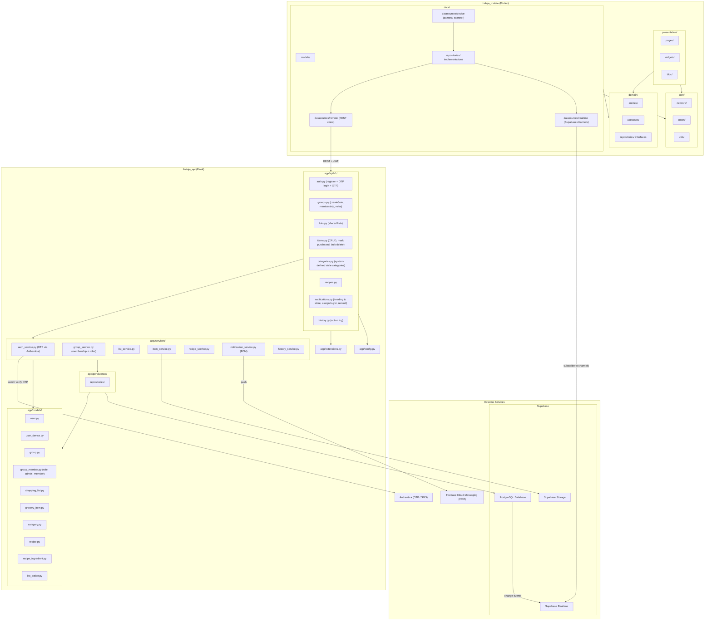

---

## 2. Entity-Relationship Diagram

> **Subject Areas:** Entities are grouped by domain in the source below (Group · Grocery List · Recipe). For a color-coded presentation version, export to dbdiagram.io or Figma where visual subject areas can be applied without altering the schema.

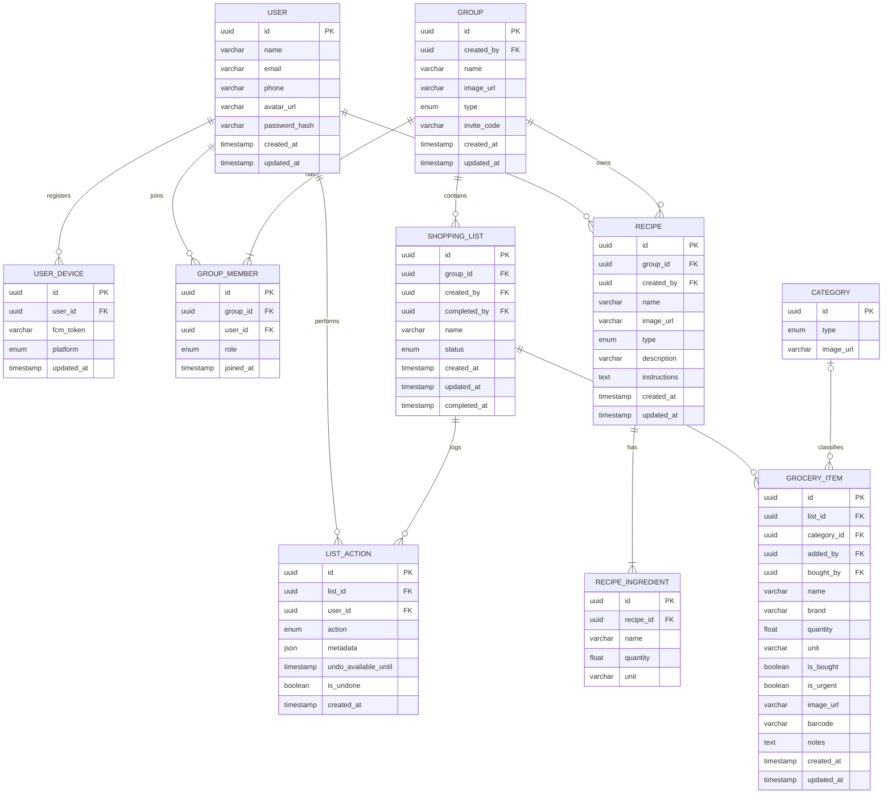

---

## 3. Use Case Diagram

```mermaid
flowchart LR
    Guest((Guest))
    Member((Member))
    Buyer((Buyer))
    Admin((Admin))

    Buyer -->|is a| Member
    Admin -->|is a| Member

    subgraph System["Thalaja — Grocery Coordination System"]

        Register["Register Account"]
        SignIn["Sign In"]
        ResetPassword["Reset Password"]
        UpdateProfile["Update Profile"]

        CreateGroup["Create Group"]
        JoinGroup["Join Group via Invite Code"]
        ShareInviteCode["Share Invite Code"]
        EditGroupInfo["Edit Group Name & Icon"]
        RemoveMember["Remove Member"]
        TransferAdmin["Transfer Admin Role"]

        CreateList["Create Shopping List"]
        ViewLists["View Lists"]
        RemoveList["Remove List from Group"]

        AddItem["Add Item"]
        AddItemDetails["Fill Item Details"]
        BrowseItemHistory["Browse Item History"]
        BrowseCatalog["Browse Grocery Catalog"]
        AddByBarcode["Add by Barcode"]
        AddByPhoto["Add by Photo Recognition"]
        ImportRecipeIngredients["Import Recipe Ingredients"]
        EditItem["Edit Item"]
        DeleteItem["Delete Item"]
        MarkUrgent["Mark Item as Urgent"]
        BulkDelete["Bulk Delete Items"]
        SyncList["Sync Shared List in Real Time"]

        EnterBuyingMode["Enter Buying Mode"]
        CheckOffItem["Check Off Item"]
        FilterUrgentItems["Filter Urgent Items"]
        CompleteTrip["Complete Trip"]

        ViewActionLog["View Action Log"]
        ViewTripHistory["View Trip History"]
        ReAddUnpurchased["Re-add Unpurchased Items"]

        HeadingToStore["Announce Heading to Store"]
        AssignBuyer["Assign Buyer"]
        RemindMember["Remind Member to Add Items"]

        CreateRecipe["Create Recipe"]
        ViewRecipes["Browse Recipes"]
        ImportAllIngredients["Import All Ingredients to List"]
        ShareRecipe["Share Recipe in Group"]
        DeleteRecipe["Delete Recipe"]
    end

    %% Guest
    Guest --> Register
    Guest --> SignIn
    Guest --> ResetPassword

    %% Member
    Member --> SignIn
    Member --> ResetPassword
    Member --> UpdateProfile
    Member --> CreateGroup
    Member --> JoinGroup
    Member --> ShareInviteCode
    Member --> CreateList
    Member --> ViewLists
    Member --> AddItem
    Member --> EditItem
    Member --> DeleteItem
    Member --> MarkUrgent
    Member --> BulkDelete
    Member --> ViewActionLog
    Member --> ViewTripHistory
    Member --> AssignBuyer
    Member --> RemindMember
    Member --> CreateRecipe
    Member --> ViewRecipes
    Member --> ImportAllIngredients
    Member --> ShareRecipe

    %% Buyer
    Buyer --> HeadingToStore
    Buyer --> EnterBuyingMode
    Buyer --> CheckOffItem
    Buyer --> FilterUrgentItems
    Buyer --> CompleteTrip

    %% Admin
    Admin --> EditGroupInfo
    Admin --> RemoveMember
    Admin --> TransferAdmin
    Admin --> RemoveList
    Admin --> DeleteRecipe

    %% includes
    AddItem -.->|includes| AddItemDetails
    AddItem -.->|includes| SyncList
    EditItem -.->|includes| SyncList
    DeleteItem -.->|includes| SyncList
    CheckOffItem -.->|includes| SyncList
    ViewTripHistory -.->|includes| ReAddUnpurchased

    %% extends
    BrowseItemHistory -.->|extends| AddItem
    BrowseCatalog -.->|extends| AddItem
    ImportRecipeIngredients -.->|extends| AddItem
    AddByBarcode -.->|extends| AddItem
    AddByPhoto -.->|extends| AddItem
```

---

## 4. Sequence Diagrams

### 4.1 Register Account

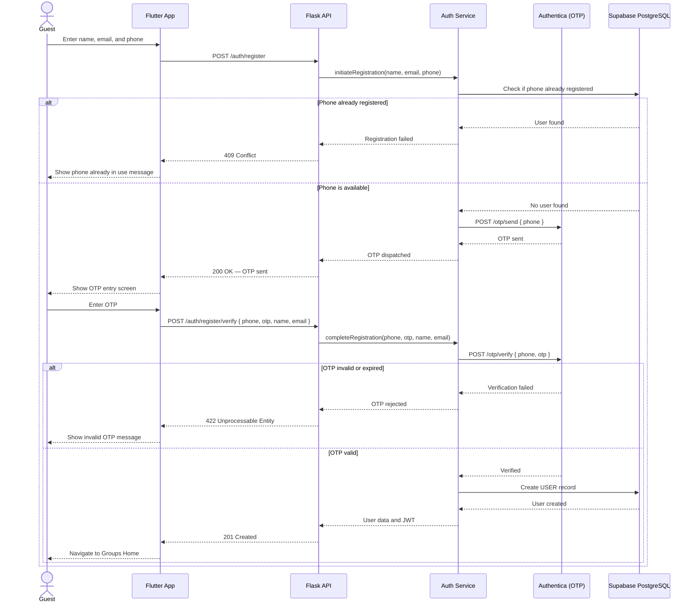

### 4.2 Sign In

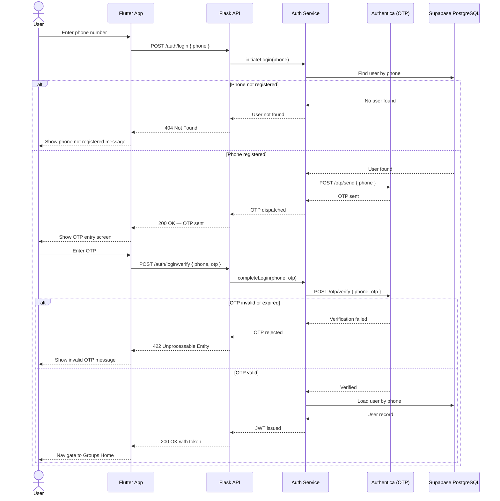

### 4.3 Account Recovery

> **Note:** With Authentica OTP authentication, account recovery is handled by re-verifying ownership of the registered phone number. There is no email-based password reset flow. If a user loses access to their phone, account recovery is handled via Authentica support procedures. This sequence diagram is deferred pending final confirmation of the Authentica account recovery flow.

### 4.4 Create Group

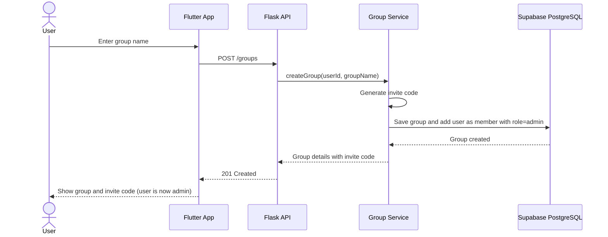

### 4.5 Join Group

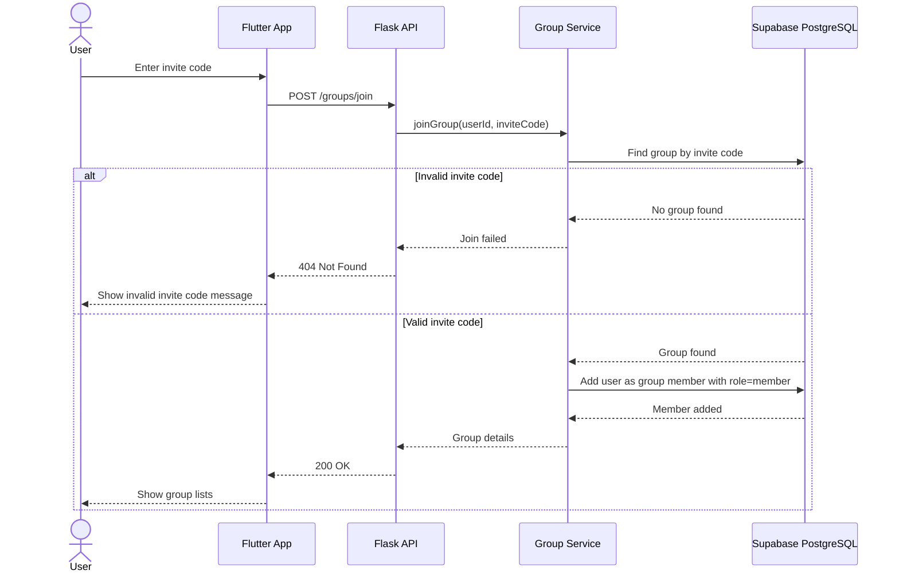

### 4.6 Create Shopping List

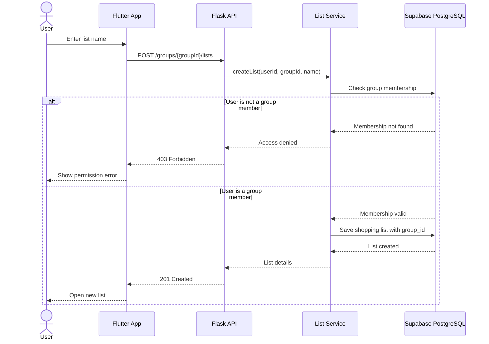

### 4.7 Add Item to List

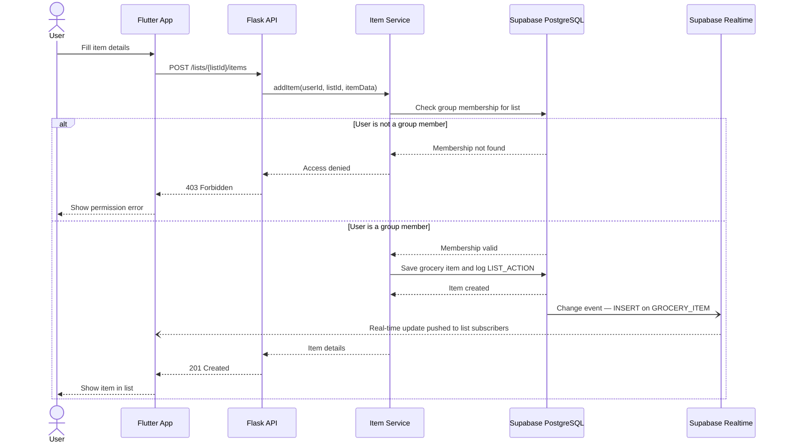

### 4.8 Mark Item as Purchased

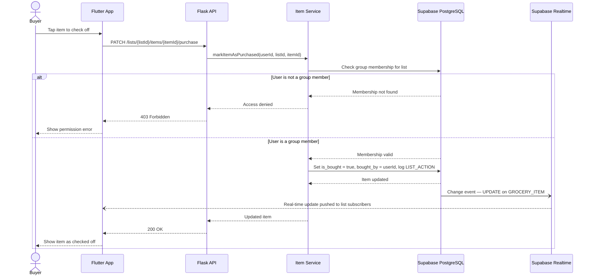

### 4.9 View Action Log

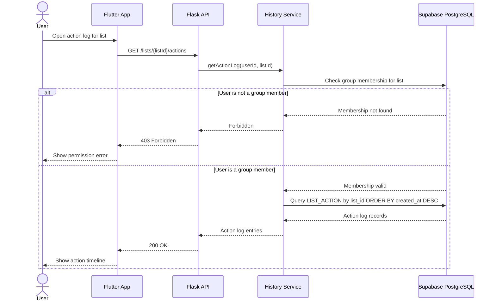
## External API Table

| Module | API Name | Method | Endpoint | Auth | Related Story |
|---|---|---|---|---|---|
| Auth | Register — Send OTP | POST | /auth/register | No | US-01 |
| Auth | Register — Verify OTP | POST | /auth/register/verify | No | US-01 |
| Auth | Login — Send OTP | POST | /auth/login | No | US-02 |
| Auth | Login — Verify OTP | POST | /auth/login/verify | No | US-02 |
| User | Get Profile | GET | /users/me | Yes | US-03 |
| User | Update Profile | PATCH | /users/me | Yes | US-03 |
| User | Register Device Token | POST | /users/me/devices | Yes | US-30, US-31, US-32 |
| Group | Create Group | POST | /groups | Yes | US-04 |
| Group | Join Group | POST | /groups/join | Yes | US-05 |
| Group | List My Groups | GET | /groups | Yes | US-06 |
| Group | Get Group Members | GET | /groups/{groupId}/members | Yes | US-08, US-10 |
| Group | Update Group | PATCH | /groups/{groupId} | Yes (admin) | US-09 |
| Group | Remove Member | DELETE | /groups/{groupId}/members/{userId} | Yes (admin) | US-08 |
| Group | Transfer Admin | PATCH | /groups/{groupId}/admin | Yes (admin) | US-10 |
| List | Create List | POST | /groups/{groupId}/lists | Yes | US-13 |
| List | Get Group Lists | GET | /groups/{groupId}/lists | Yes | US-13 |
| List | Get List Detail | GET | /lists/{listId} | Yes | US-13 |
| List | Update List | PATCH | /lists/{listId} | Yes (admin) | US-14 |
| List | Remove List | DELETE | /lists/{listId} | Yes (admin) | US-11 |
| List | Complete Trip | PATCH | /lists/{listId}/complete | Yes | US-15 |
| List | Get Action Log | GET | /lists/{listId}/actions | Yes | US-28 |
| Item | Add Item | POST | /lists/{listId}/items | Yes | US-16 |
| Item | Update Item | PATCH | /lists/{listId}/items/{itemId} | Yes | US-16 |
| Item | Delete Item | DELETE | /lists/{listId}/items/{itemId} | Yes | US-16 |
| Item | Bulk Delete Items | DELETE | /lists/{listId}/items | Yes | US-23 |
| Item | Undo Bulk Delete | POST | /lists/{listId}/actions/{actionId}/undo | Yes | US-23 |
| Item | Mark Purchased | PATCH | /lists/{listId}/items/{itemId}/purchase | Yes | US-26 |
| Item | Upload Item Image | POST | /lists/{listId}/items/{itemId}/image | Yes | US-21 |
| Item | Lookup by Barcode | GET | /items/barcode/{code} | Yes | US-19 |
| Category | List Categories | GET | /categories | Yes | US-26 |
| Recipe | Create Recipe | POST | /groups/{groupId}/recipes | Yes | US-33 |
| Recipe | Get Group Recipes | GET | /groups/{groupId}/recipes | Yes | US-33, US-35 |
| Recipe | Get Recipe | GET | /recipes/{recipeId} | Yes | US-34 |
| Recipe | Update Recipe | PATCH | /recipes/{recipeId} | Yes | US-33 |
| Recipe | Delete Recipe | DELETE | /recipes/{recipeId} | Yes (admin) | US-12 |
| Recipe | Import to List | POST | /lists/{listId}/items/from-recipe/{recipeId} | Yes | US-34 |
| Notification | Heading to Store | POST | /lists/{listId}/notifications/heading-to-store | Yes | US-30 |
| Notification | Assign Buyer | POST | /lists/{listId}/notifications/assign-buyer | Yes | US-31 — sends FCM only, does not modify list |
| Notification | Remind Member | POST | /lists/{listId}/notifications/remind-member | Yes | US-32 |

## Internal API / Backend Operations Table

| Layer | Internal Operation | Purpose | Used By External API | Related Story |
|---|---|---|---|---|
| Service | send_registration_otp() | Call Authentica POST /otp/send with phone; reject if phone already registered | /auth/register | US-01 |
| Service | complete_registration() | Call Authentica POST /otp/verify; on success insert USER row | /auth/register/verify | US-01 |
| Service | send_login_otp() | Verify phone exists in USER, then call Authentica POST /otp/send | /auth/login | US-02 |
| Service | complete_login() | Call Authentica POST /otp/verify; on success load USER by phone, issue JWT | /auth/login/verify | US-02 |
| Service | register_device_token() | Upsert USER_DEVICE row with FCM token | /users/me/devices | US-30, US-31, US-32 |
| Service | create_group() | Insert GROUP, add creator as admin GROUP_MEMBER | /groups | US-04 |
| Service | join_group_by_code() | Validate invite code, insert GROUP_MEMBER with role=member | /groups/join | US-05 |
| Service | update_group() | Update name or image_url | /groups/{groupId} | US-09 |
| Service | remove_member() | Delete GROUP_MEMBER row, verify caller is admin | /groups/{groupId}/members/{userId} | US-08 |
| Service | transfer_admin() | Set target member role=admin, set caller role=member | /groups/{groupId}/admin | US-10 |
| Service | validate_group_membership() | Check USER is a GROUP_MEMBER before list or item operations | all list + item endpoints | US-13, US-16 |
| Service | create_list() | Insert SHOPPING_LIST with group_id (always required) | /groups/{groupId}/lists | US-13 |
| Service | complete_trip() | Set status=completed, completed_by, completed_at on SHOPPING_LIST | /lists/{listId}/complete | US-15 |
| Service | assign_buyer() | Query USER_DEVICE for target member, fire FCM push — does not modify SHOPPING_LIST | /lists/{listId}/notifications/assign-buyer | US-31 |
| Service | add_item_to_list() | Check membership, insert GROCERY_ITEM, write LIST_ACTION (Supabase CDC fires real-time event) | /lists/{listId}/items | US-16 |
| Service | update_item() | Edit GROCERY_ITEM fields, write LIST_ACTION | /lists/{listId}/items/{itemId} | US-16 |
| Service | delete_item() | Delete GROCERY_ITEM, write LIST_ACTION | /lists/{listId}/items/{itemId} | US-16 |
| Service | bulk_delete_items() | Delete all GROCERY_ITEM rows for list, write LIST_ACTION with full item snapshot in metadata, set undo_available_until | /lists/{listId}/items | US-23 |
| Service | undo_bulk_delete() | Read LIST_ACTION.metadata, re-insert GROCERY_ITEM rows, set is_undone=true | /lists/{listId}/actions/{actionId}/undo | US-23 |
| Service | mark_item_as_purchased() | Set is_bought=true, bought_by=userId on GROCERY_ITEM, write LIST_ACTION (Supabase CDC fires real-time event) | /lists/{listId}/items/{itemId}/purchase | US-26 |
| Service | check_duplicate_item() | Fuzzy-match item name against active GROCERY_ITEM rows on same list; returns match candidates | called by add_item_to_list() before insert | US-25 |
| Service | upload_item_image() | Store file in Supabase Storage, update GROCERY_ITEM.image_url | /lists/{listId}/items/{itemId}/image | US-21 |
| Service | get_action_log() | Query LIST_ACTION by list_id ORDER BY created_at DESC | /lists/{listId}/actions | US-28 |
| Service | create_recipe() | Insert RECIPE + RECIPE_INGREDIENT rows in one transaction | /groups/{groupId}/recipes | US-33 |
| Service | add_recipe_ingredients_to_list() | Bulk-insert GROCERY_ITEM rows from RECIPE_INGREDIENT | /lists/{listId}/items/from-recipe/{recipeId} | US-34 |
| Service | send_heading_to_store() | Query USER_DEVICE for all group members, fire FCM batch push | /lists/{listId}/notifications/heading-to-store | US-30 |
| Service | send_remind_member() | Query USER_DEVICE for target member, fire FCM push | /lists/{listId}/notifications/remind-member | US-32 |
| Repository | UserRepository.find_by_phone() | Lookup for OTP login flow | auth_service | US-01, US-02 |
| Repository | UserDeviceRepository.upsert() | Save or update FCM token per user+platform | auth_service | US-30, US-31, US-32 |
| Repository | GroupRepository.find_by_invite_code() | Lookup for join flow | group_service | US-05 |
| Repository | GroupMemberRepository.add_member() / get_role() | Membership inserts and role checks | group_service, list_service | US-04, US-05, US-08 |
| Repository | ListRepository.get_group_lists() | Fetch all SHOPPING_LIST rows for a group | list_service | US-13 |
| Repository | ItemRepository.save() / delete() / bulk_delete() | CRUD for GROCERY_ITEM | item_service | US-16, US-23, US-26 |
| Repository | ActionRepository.save_event() / find_by_list() | LIST_ACTION insert and query | history_service, item_service | US-23, US-28 |
| Repository | CategoryRepository.list_all() | Return all system-defined CATEGORY rows | item_service | US-26 |
| Repository | RecipeRepository.save_with_ingredients() | Recipe + ingredients in one transaction | recipe_service | US-33 |
| Helper | generate_jwt() / decode_jwt() | Token issuing/verification | auth_service, require_auth | US-01, US-02 |
| Helper | require_auth() | Decorator validating JWT on protected routes | all protected routes | — |
| Helper | require_admin() | Decorator verifying caller has role=admin in the target group | group + list admin endpoints | US-08, US-09, US-10, US-11, US-12 |

*Thalaja Team · Stage 3 Technical Documentation*
