# Thalaja — Stage 3 Technical Documentation

---

## Table of Contents

### User Stories

- [1.1 Actors](#11-actors)
- [1.2 User Stories](#12-user-stories)
  - [1. Authentication & Onboarding](#1-authentication--onboarding)
  - [2. Group Management](#2-group-management)
  - [3. List Management](#3-list-management)
  - [4. Item Submission](#4-item-submission)
  - [5. Real-Time Collaboration](#5-real-time-collaboration)
  - [6. Duplicate Prevention](#6-duplicate-prevention)
  - [7. Buying Trip View](#7-buying-trip-view)
  - [8. History](#8-history)
  - [9. Notifications](#9-notifications)
  - [10. Recipes](#10-recipes)
- [1.3 MoSCoW Priority Summary](#13-moscow-priority-summary)

### Technical Diagrams

- [1. Use Case Diagram](#1-use-case-diagram)
- [2. Entity-Relationship Diagram](#2-entity-relationship-diagram)
  - [Entity Descriptions](#entity-descriptions)
  - [Entity Relationships](#entity-relationships)
- [3. Package Diagram](#3-package-diagram)
- [4. Sequence Diagrams](#4-sequence-diagrams)
- [5. User Flow Diagrams](#5-user-flow-diagrams)
- [6. Backend Class Diagram](#6-backend-class-diagram)

### API Reference

- [External API Table](#external-api-table)
- [Internal API Table](#internal-api-table)
- [Backend Operations Table](#backend-operations-table)

### Engineering

- [7. Project Repository Structure](#7-project-repository-structure)
- [8. SCM Plan](#8-scm-plan)
- [9. QA Plan](#9-qa-plan)
- [10. Technical Justifications](#10-technical-justifications)

---

## 1.1 Actors

| Actor | Description |
|---|---|
| **Guest** | Unauthenticated user who has installed the app |
| **Member** | Authenticated user belonging to one or more groups |
| **Admin** | Member with the admin role in a specific group — can manage group membership, names, icons, and remove lists and recipes. Admin role is singular per group; transferring it removes the current admin's privileges. |
| **Buyer** | Member who has been assigned or has volunteered for the current shopping trip — not a permanent role |
| **Recipe Owner** | The member who created a specific recipe. This is a per-recipe designation, not a group-level role. |

---

## 1.2 User Stories

### 1. Authentication & Onboarding

| ID | Story | Priority |
|---|---|---|
| US-01 | As a guest, I want to create an account with my name, phone, and email, so that I can join or create a household group. | **Must Have** |
| US-02 | As a guest, I want to log in with my email or phone, so that I can access my groups and lists. | **Must Have** |
| US-36 | As a guest, I want to verify my phone number via OTP during registration — delivered by SMS, WhatsApp, or email — so that my account is tied to a real identity. If one channel fails, the app automatically falls back to an available alternative. | **Must Have** |
| US-03 | As a member, I want to update my display name and avatar, so that my identity is recognizable to other group members. | Should Have |

---

### 2. Group Management

| ID | Story | Priority |
|---|---|---|
| US-04 | As a member, I want to create a group and receive a shareable invite code, so that I can bring my household or friends into one shared space. | **Must Have** |
| US-05 | As a member, I want to join a group using an invite code, so that I can access its shared lists. | **Must Have** |
| US-06 | As a member, I want to belong to multiple groups at the same time, so that I can coordinate groceries across different households. | **Must Have** |
| US-07 | As a member, I want to share the group invite code with others, so that I can bring new people in without requiring admin action. | **Must Have** |
| US-08 | As an admin, I want to remove a member from the group, so that I control who has access to our lists. | Should Have |
| US-09 | As an admin, I want to edit the group name and icon, so that the group is clearly identifiable across multiple groups. | Should Have |
| US-10 | As an admin, I want to transfer my admin role to another member — losing my own admin status in the process — so that group ownership can be handed over cleanly. | Should Have |
| US-11 | As an admin, I want to remove a list from the group, so that the group's list view stays relevant and organized. | Should Have |
| US-12 | As an admin, I want to remove a recipe from the group, so that outdated or unused recipes don't clutter the recipe library. | Should Have |

---

### 3. List Management

| ID | Story | Priority |
|---|---|---|
| US-13 | As a member, I want to create and name a shared grocery list within a group, so that everyone can add their items before the shopping trip. | **Must Have** |
| US-15 | As a buyer, I want to close the active list when the shopping trip is done, so that it moves to the group's trip history and the active view stays clean. | **Must Have** |
| US-14 | As an admin, I want to edit the list name and icon after creation, so that lists can be renamed or visually distinguished without recreating them. | Should Have |

---

### 4. Item Submission

| ID | Story | Priority |
|---|---|---|
| US-16 | As a member, I want to add an item manually with name, brand, quantity, unit, and notes, so that the buyer has the detail they need to find exactly what I want. | **Must Have** |
| US-17 | As a member, I want to browse my item history and re-add a past item, so that I don't have to re-enter its details from scratch. | **Must Have** |
| US-21 | As a member, I want to attach an image to an item I'm adding, so that the buyer can visually confirm the exact product on the shelf. | Should Have |
| US-22 | As a member, I want to mark an item as urgent when adding it, so that the buyer knows it cannot wait for the next full trip. | Should Have |
| US-23 | As a member, I want to bulk-delete all items from the list after a confirmation step, so that I can reset the list when needed — with the option to undo the action via the list's action log. | Should Have |
| US-18 | As a member, I want to browse a grocery catalog and select items from it, so that I can add common products without typing. | Should Have |
| US-19 | As a member, I want to scan an item's barcode, so that its name and details are filled in automatically. | Could Have |
| US-20 | As a member, I want to take a photo of an item and have it identified automatically, so that I can add it quickly without knowing the exact product name. | Could Have |

---

### 5. Real-Time Collaboration

| ID | Story | Priority |
|---|---|---|
| US-24 | As a member viewing a list, I want to see other members' additions, edits, and removals appear in real time without refreshing, so that the list stays synchronized during active collaboration. | **Must Have** |

---

### 6. Duplicate Prevention

| ID | Story | Priority |
|---|---|---|
| US-25 | As a member, I want to see a non-blocking warning when the item I'm adding may already be on the list, so that I can decide whether to add it anyway or update the existing entry instead. | **Must Have** |

---

### 7. Buying Trip View

| ID | Story | Priority |
|---|---|---|
| US-26 | As a buyer, I want a dedicated buying view that locks the list from edits, organizes items by grocery aisle category in a standard store aisle sequence, and lets me check off items as I shop, so that I can move through the store efficiently without accidental changes. | **Must Have** |
| US-38 | As a buyer, I want to lock the active list into a trip so no one can edit it while I shop, check off items as I pick them up, and finish the trip so that any items I did not buy are automatically returned to the active list for the next shopping run. | **Must Have** |
| US-27 | As a buyer, I want to filter the buying view to show only urgent items, so that I can complete a quick trip when I don't have time for a full shop. | Should Have |

---

### 8. History

| ID | Story | Priority |
|---|---|---|
| US-28 | As a member, I want to browse the action log for a list — showing who added, edited, removed, or bulk-deleted items and when — so that I stay informed of all updates made by other members. | **Must Have** |
| US-29 | As a member, I want to see a trip history showing past completed shopping trips, so that I can reference what was bought in previous trips. | Should Have |

---

### 9. Notifications

| ID | Story | Priority |
|---|---|---|
| US-30 | As a buyer, I want to tap a "heading to store" button that sends a push notification to all group members, so that they have a final window to add any last-minute items before I leave. | **Must Have** |
| US-31 | As a member, I want to assign a buyer for the upcoming trip and send them a push notification, so that the designated person knows they are expected to shop. | Should Have |
| US-32 | As a member, I want to send a reminder notification to a specific group member to add their items to the list, so that no one's needs are missed before the trip. | Could Have |

---

### 10. Recipes

| ID | Story | Priority |
|---|---|---|
| US-37 | As a recipe owner, I want to be able to edit or delete a recipe I created, so that I have control over my own content in the group. | **Must Have** |
| US-33 | As a member, I want to create and save a recipe with a name, image, step-by-step instructions, and an ingredients list (name, quantity, and unit per ingredient), so that I can reuse it across multiple shopping trips. | Should Have |
| US-34 | As a member, I want to import all ingredients from a saved recipe to any list I have access to in one tap, so that I don't have to add each ingredient individually. | Should Have |
| US-35 | As a group, I want to share saved recipes within our group, so that any member can view and import a group recipe to the list. | Could Have |

---

## 1.3 MoSCoW Priority Summary

| Priority | Story IDs | Count |
|---|---|---|
| **Must Have** | US-01, 02, 04, 05, 06, 07, 13, 15, 16, 17, 24, 25, 26, 28, 30, 36, 37, 38 | 18 |
| **Should Have** | US-03, 08, 09, 10, 11, 12, 14, 18, 21, 22, 23, 27, 29, 31, 33, 34 | 16 |
| **Could Have** | US-19, 20, 32, 35 | 4 |
| **Won't Have (this phase)** | Geofence triggers · Occasion/event lists · Financial tracking · Store inventory APIs · Aisle sorting algorithms · Simultaneous multi-buyer sync · AI recommendations · Voice input · In-app chat | — |

---


## Mockups

| Screen |
|---|
| Screen 1 — Register | 
| Screen 2 — Login |    
| Screen 3 — Groups Home | 
| Screen 4 — Group Detail |
| Screen 5 — List Detail | 
| Screen 6 — Item Add Sheet | 
| Screen 7 — Buying View | 
| Screen 8 — History Screen | 
| Screen 9 — Recipe Detail / Create | 
| Screen 10 — Notifications & Buyer Assignment | 
| Screen 11 — Group Admin Settings | 

Figma Mockup

<p align="center">
  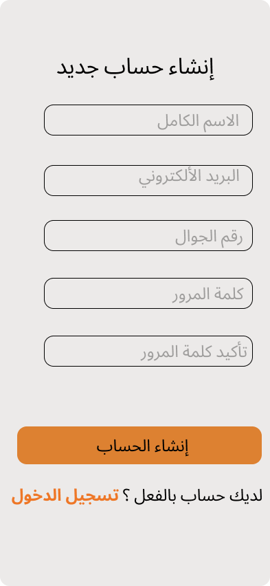
  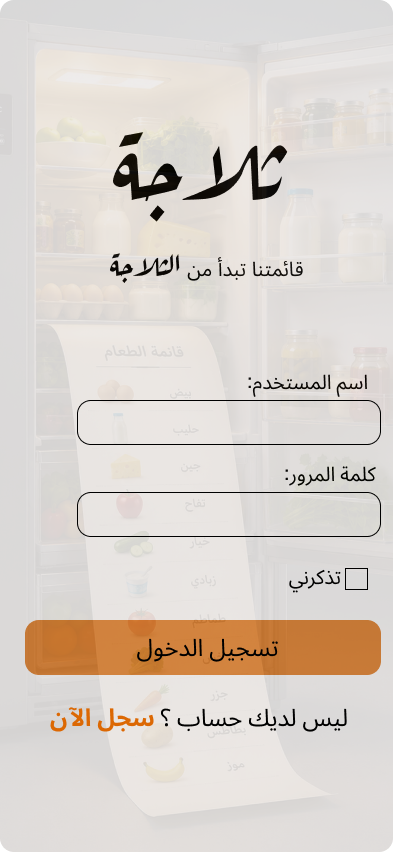
  
  
</p>

<p align="center">
  
  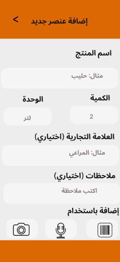
  
  
  

</p>


=======
---

## 1. Use Case Diagram

```mermaid
flowchart LR
    Guest(["👤 Guest"])
    Member(["👤 Member"])
    Buyer(["👤 Buyer"])
    Admin(["👤 Admin"])
    RecipeOwner(["👤 Recipe Owner"])

    Buyer -->|is a| Member
    Admin -->|is a| Member
    RecipeOwner -->|is a| Member

    subgraph System["Thalaja — Grocery Coordination System"]

        Register["Register Account"]
        VerifyPhone["Verify Phone via OTP"]
        SignIn["Sign In"]
        UpdateProfile["Update Profile"]

        CreateGroup["Create Group"]
        JoinGroup["Join Group via Invite Code"]
        ShareInviteCode["Share Invite Code"]
        EditGroupInfo["Edit Group Name & Icon"]
        RemoveMember["Remove Member"]
        TransferAdmin["Transfer Admin Role"]

        CreateList["Create Shopping List"]
        ViewLists["View Lists"]
        RemoveList["Remove List from Group"]

        AddItem["Add Item"]
        AddItemDetails["Fill Item Details"]
        BrowseItemHistory["Browse Item History"]
        BrowseCatalog["Browse Grocery Catalog"]
        AddByBarcode["Add by Barcode"]
        AddByPhoto["Add by Photo Recognition"]
        ImportRecipeIngredients["Import Recipe Ingredients"]
        EditItem["Edit Item"]
        DeleteItem["Delete Item"]
        MarkUrgent["Mark Item as Urgent"]
        BulkDelete["Bulk Delete Items"]
        SyncList["Sync Shared List in Real Time"]

        LockListIntoTrip["Lock List into Trip"]
        CheckOffItem["Check Off Item"]
        FilterUrgentItems["Filter Urgent Items"]
        CompleteTrip["Complete Trip — Return Unbought Items"]

        ViewActionLog["View Action Log"]
        ViewTripHistory["View Trip History"]

        HeadingToStore["Announce Heading to Store"]
        AssignBuyer["Assign Buyer"]
        RemindMember["Remind Member to Add Items"]

        CreateRecipe["Create Recipe"]
        ViewRecipes["Browse Recipes"]
        ImportAllIngredients["Import All Ingredients to Any List"]
        ShareRecipe["Share Recipe in Group"]
        EditOwnRecipe["Edit Own Recipe"]
        DeleteOwnRecipe["Delete Own Recipe"]
        DeleteAnyRecipe["Delete Any Recipe in Group"]
    end

    %% Guest
    Guest --> Register
    Guest --> SignIn

    %% Member
    Member --> SignIn
    Member --> UpdateProfile
    Member --> CreateGroup
    Member --> JoinGroup
    Member --> ShareInviteCode
    Member --> CreateList
    Member --> ViewLists
    Member --> AddItem
    Member --> EditItem
    Member --> DeleteItem
    Member --> MarkUrgent
    Member --> BulkDelete
    Member --> ViewActionLog
    Member --> ViewTripHistory
    Member --> AssignBuyer
    Member --> RemindMember
    Member --> CreateRecipe
    Member --> ViewRecipes
    Member --> ImportAllIngredients
    Member --> ShareRecipe

    %% Buyer
    Buyer --> HeadingToStore
    Buyer --> LockListIntoTrip
    Buyer --> CheckOffItem
    Buyer --> FilterUrgentItems
    Buyer --> CompleteTrip

    %% Admin
    Admin --> EditGroupInfo
    Admin --> RemoveMember
    Admin --> TransferAdmin
    Admin --> RemoveList
    Admin --> DeleteAnyRecipe

    %% Recipe Owner
    RecipeOwner --> EditOwnRecipe
    RecipeOwner --> DeleteOwnRecipe

    %% includes
    Register -.->|includes| VerifyPhone
    AddItem -.->|includes| AddItemDetails
    AddItem -.->|includes| SyncList
    EditItem -.->|includes| SyncList
    DeleteItem -.->|includes| SyncList

    %% extends
    BrowseItemHistory -.->|extends| AddItem
    BrowseCatalog -.->|extends| AddItem
    ImportRecipeIngredients -.->|extends| AddItem
    AddByBarcode -.->|extends| AddItem
    AddByPhoto -.->|extends| AddItem
```

---

## 2. Entity-Relationship Diagram

```mermaid
erDiagram

    %% ═══════════════════════════════════════════════════
    %% USER DOMAIN
    %% ═══════════════════════════════════════════════════

    USER {
        uuid        user_id        PK
        varchar     first_name
        varchar     last_name
        varchar     email
        varchar     phone
        varchar     avatar_url
        timestamp   created_at
        timestamp   updated_at
    }

    USER_DEVICE {
        uuid        device_id      PK
        uuid        user_id        FK
        varchar     fcm_token
        enum        platform
        timestamp   updated_at
    }

    %% ═══════════════════════════════════════════════════
    %% GROUP DOMAIN
    %% ═══════════════════════════════════════════════════

    %% invite_code: alphanumeric unique string, UNIQUE constraint on column
    %% type enum: individual | household
    GROUP {
        uuid        group_id       PK
        uuid        created_by     FK
        varchar     name
        varchar     image_url
        enum        type
        varchar     invite_code
        timestamp   created_at
        timestamp   updated_at
    }

    GROUP_MEMBER {
        uuid        member_id      PK
        uuid        group_id       FK
        uuid        user_id        FK
        enum        role
        timestamp   joined_at
    }

    %% ═══════════════════════════════════════════════════
    %% GROCERY LIST DOMAIN
    %% ═══════════════════════════════════════════════════

    %% category_name enum: Fresh Produce · Meat & Seafood · Dairy & Eggs · Bakery · Pantry
    %% Cooking Essentials · Breakfast · Snacks · Beverages · Frozen · Ready-to-Eat
    %% Baby · Personal Care · Health · Household · Pets
    CATEGORY {
        uuid        category_id    PK
        enum        category_name
        varchar     image_url
    }

    SHOPPING_LIST {
        uuid        list_id        PK
        uuid        group_id       FK
        uuid        created_by     FK
        uuid        completed_by   FK
        varchar     name
        enum        status
        timestamp   created_at
        timestamp   updated_at
        timestamp   completed_at
    }

    %% Canonical catalog entry — shared reference across lists and recipes
    ITEM {
        uuid        item_id              PK
        uuid        default_category_id  FK
        varchar     name
        varchar     brand
        varchar     barcode
        varchar     image_url
    }

    %% Junction table: one entry per item added to a specific list
    LIST_ITEM {
        uuid        list_item_id   PK
        uuid        list_id        FK
        uuid        item_id        FK
        uuid        added_by       FK
        uuid        bought_by      FK
        float       quantity
        varchar     unit
        boolean     is_bought
        boolean     is_urgent
        varchar     image_url
        text        notes
        timestamp   created_at
        timestamp   updated_at
    }

    LIST_ACTION {
        uuid        action_id            PK
        uuid        list_id              FK
        uuid        list_item_id         FK
        uuid        user_id              FK
        enum        action
        json        metadata
        timestamp   undo_available_until
        boolean     is_undone
        timestamp   created_at
    }

    %% Locks a list for a shopping session; unbought items return to list on completion
    TRIP {
        uuid        trip_id        PK
        uuid        list_id        FK
        uuid        buyer_id       FK
        enum        status
        timestamp   created_at
        timestamp   completed_at
    }

    %% ═══════════════════════════════════════════════════
    %% RECIPE DOMAIN
    %% ═══════════════════════════════════════════════════

    RECIPE {
        uuid        recipe_id      PK
        uuid        group_id       FK
        uuid        created_by     FK
        varchar     name
        varchar     image_url
        enum        type
        varchar     description
        timestamp   created_at
        timestamp   updated_at
    }

    %% Junction table: links a recipe to catalog items used as ingredients
    RECIPE_INGREDIENT {
        uuid        ingredient_id  PK
        uuid        recipe_id      FK
        uuid        item_id        FK
        float       quantity
        varchar     unit
    }

    %% Ordered step in a recipe
    INSTRUCTION {
        uuid        instruction_id PK
        uuid        recipe_id      FK
        integer     step_number
        text        description
    }

    %% ═══════════════════════════════════════════════════
    %% RELATIONSHIPS
    %% ═══════════════════════════════════════════════════

    USER          ||--o{  USER_DEVICE        : "registers"
    USER          ||--o{  GROUP_MEMBER       : "joins"
    USER          ||--o{  LIST_ACTION        : "performs"
    USER          ||--o{  RECIPE             : "creates"
    USER          ||--o{  TRIP               : "runs as buyer"

    GROUP         ||--|{  GROUP_MEMBER       : "has"
    GROUP         ||--o{  SHOPPING_LIST      : "contains"
    GROUP         ||--o{  RECIPE             : "owns"

    SHOPPING_LIST ||--o{  LIST_ITEM          : "contains"
    SHOPPING_LIST ||--o{  LIST_ACTION        : "logs"
    SHOPPING_LIST ||--o{  TRIP               : "locked into"

    ITEM          ||--o{  LIST_ITEM          : "referenced by"
    ITEM          ||--o{  RECIPE_INGREDIENT  : "used as ingredient"
    ITEM          }o--||  CATEGORY           : "belongs to"

    RECIPE        ||--|{  RECIPE_INGREDIENT  : "has"
    RECIPE        ||--o{  INSTRUCTION        : "has steps"
```

---

### Entity Descriptions

| Entity | Description |
| --- | --- |
| USER | An authenticated app user with personal identity and contact info — no password stored; Authentica owns credential verification |
| USER_DEVICE | Stores FCM push tokens per device so notifications reach the right hardware |
| GROUP | A shared space (household, friends, roommates) that owns lists and recipes |
| GROUP_MEMBER | Links users to groups and records their role (admin or member) |
| CATEGORY | A system-defined grocery category used to group items by aisle |
| SHOPPING_LIST | A named, active or completed list of items belonging to a group |
| ITEM | The canonical catalog entry for a grocery product — shared reference across lists and recipes |
| LIST_ITEM | A specific instance of an item added to a list, with quantity, urgency, and purchase state |
| LIST_ACTION | Immutable audit log of every change made to a list (add, edit, remove, check, etc.) |
| TRIP | A locked shopping session — the list cannot be edited during a trip; unbought items return when the trip ends |
| RECIPE | A group-owned recipe with a name, image, description, and an ordered list of steps and ingredients |
| RECIPE_INGREDIENT | Links a recipe to catalog items (ITEM) with the quantity and unit needed |
| INSTRUCTION | A single numbered step in a recipe's preparation process |

---

### Entity Relationships

| Relationship | Type | Notes |
| --- | --- | --- |
| USER ↔ GROUP | Many-to-many via GROUP_MEMBER | A user can belong to multiple groups; a group has multiple members |
| USER → USER_DEVICE | One-to-many | One user can have multiple devices (FCM tokens) |
| USER → RECIPE | One-to-many | A user can create multiple recipes |
| USER → TRIP | One-to-many | A user can run multiple trips (as buyer) |
| GROUP → SHOPPING_LIST | One-to-many | A group has multiple lists over time |
| GROUP → RECIPE | One-to-many | A group owns multiple recipes |
| SHOPPING_LIST ↔ ITEM | Many-to-many via LIST_ITEM | A list contains many items; an item can appear across many lists |
| SHOPPING_LIST → LIST_ACTION | One-to-many | Every change to a list is recorded as an action |
| SHOPPING_LIST → TRIP | One-to-many | A list can have multiple trips across different shopping runs |
| ITEM → CATEGORY | Many-to-one | Each catalog item has a default category |
| RECIPE ↔ ITEM | Many-to-many via RECIPE_INGREDIENT | A recipe uses many ingredients; an ingredient can appear in many recipes |
| RECIPE → INSTRUCTION | One-to-many | A recipe has multiple ordered steps |

---

## 3. Package Diagram

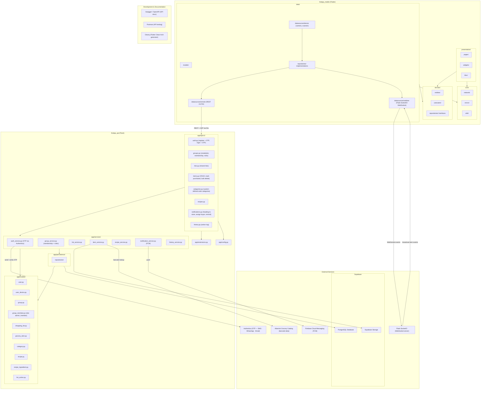

---

## 4. Sequence Diagrams

### 4.1 Register Account

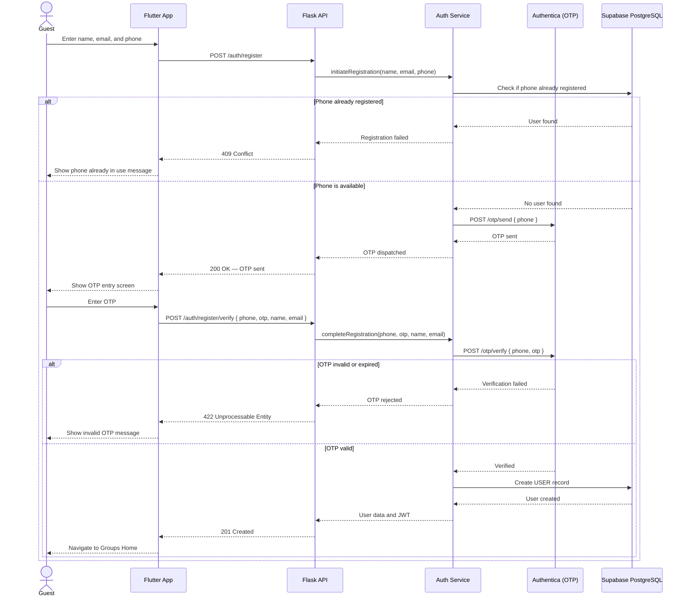

### 4.2 Sign In

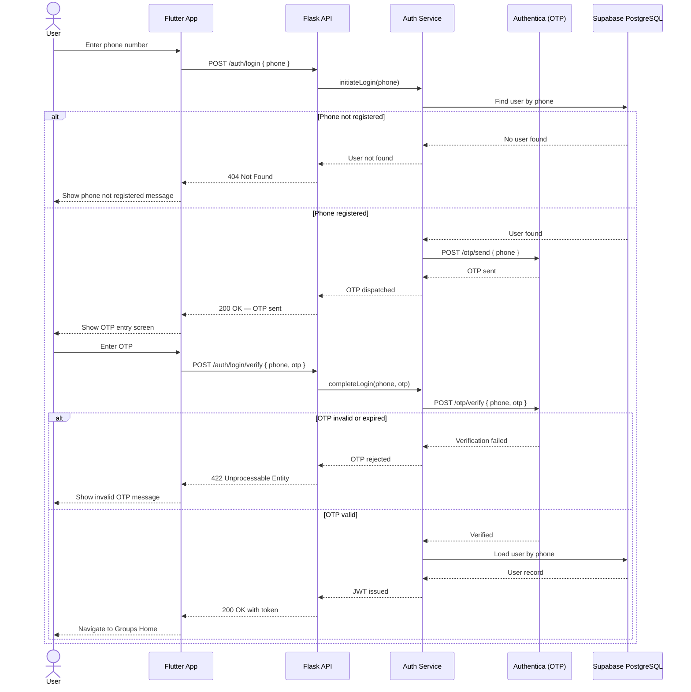

### 4.3 Account Recovery

With Authentica OTP authentication, account recovery is structurally identical to Sign In — the user re-verifies ownership of their registered phone number to receive a new JWT. Lost-phone recovery is out of scope for this phase and is handled by Authentica support procedures.

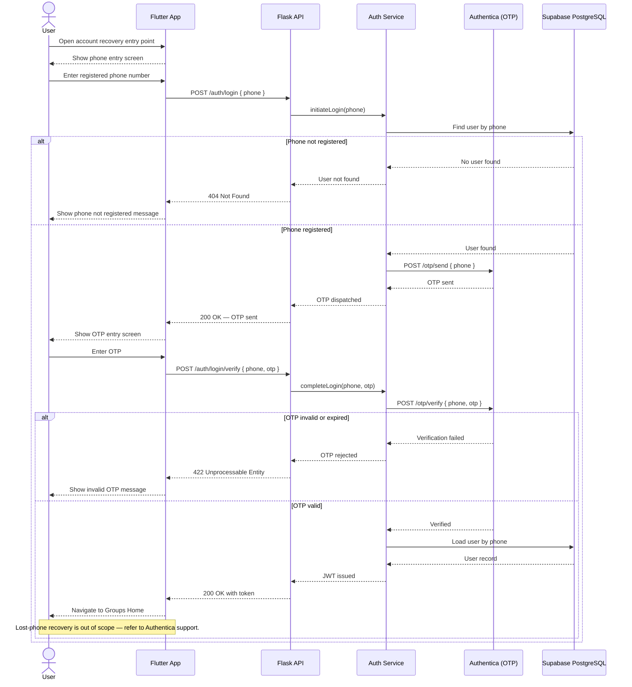

### 4.4 Create Group

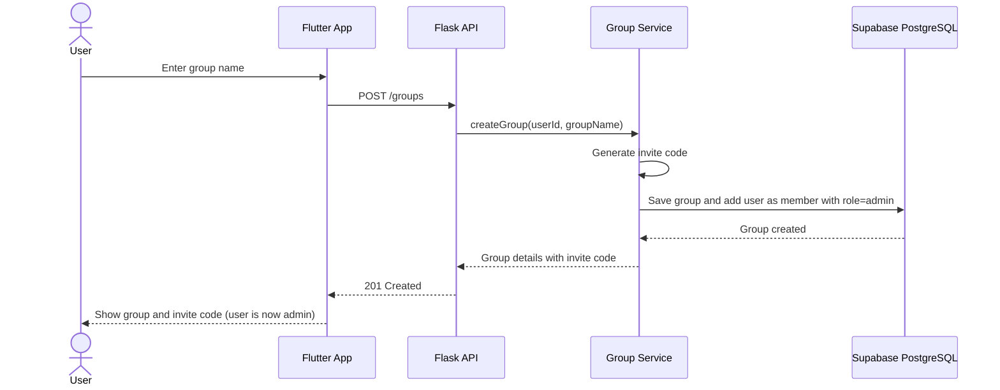

### 4.5 Join Group

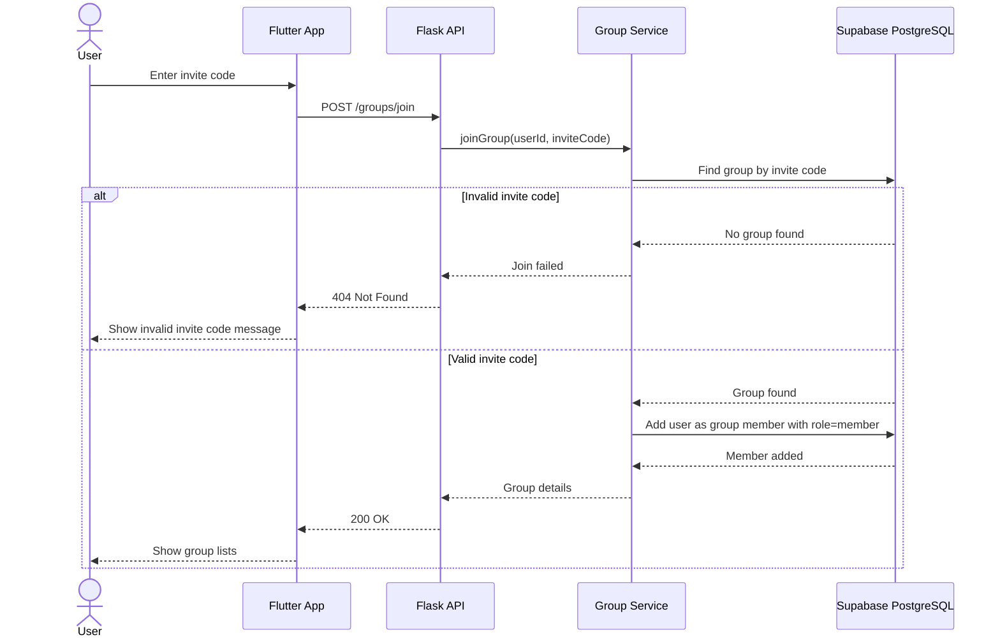

### 4.6 Create Shopping List

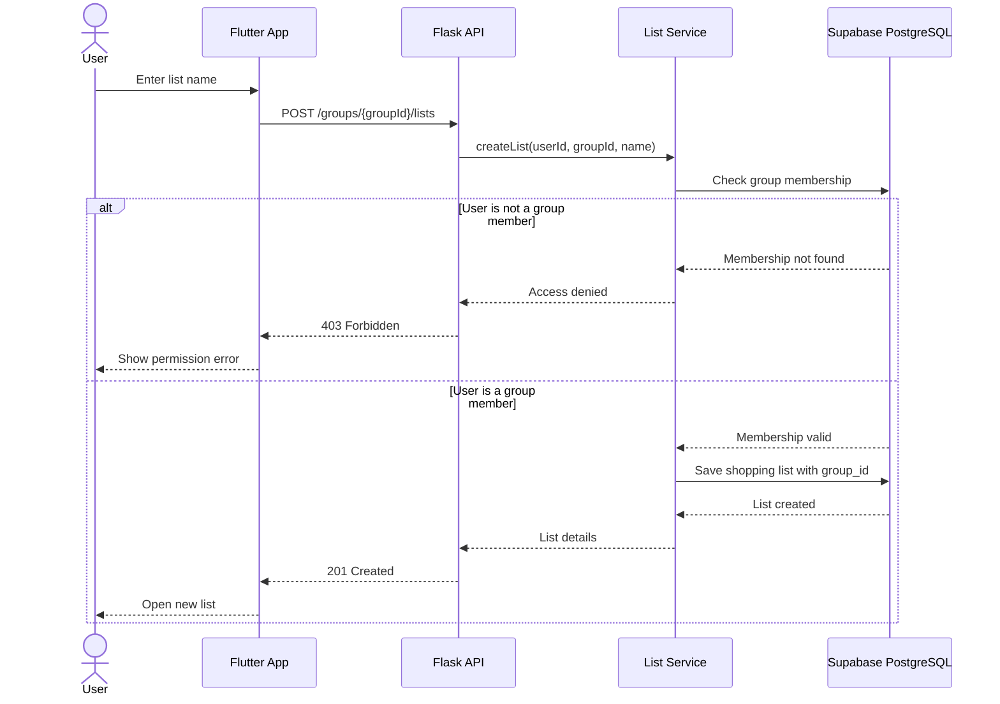

### 4.7 Add Item to List

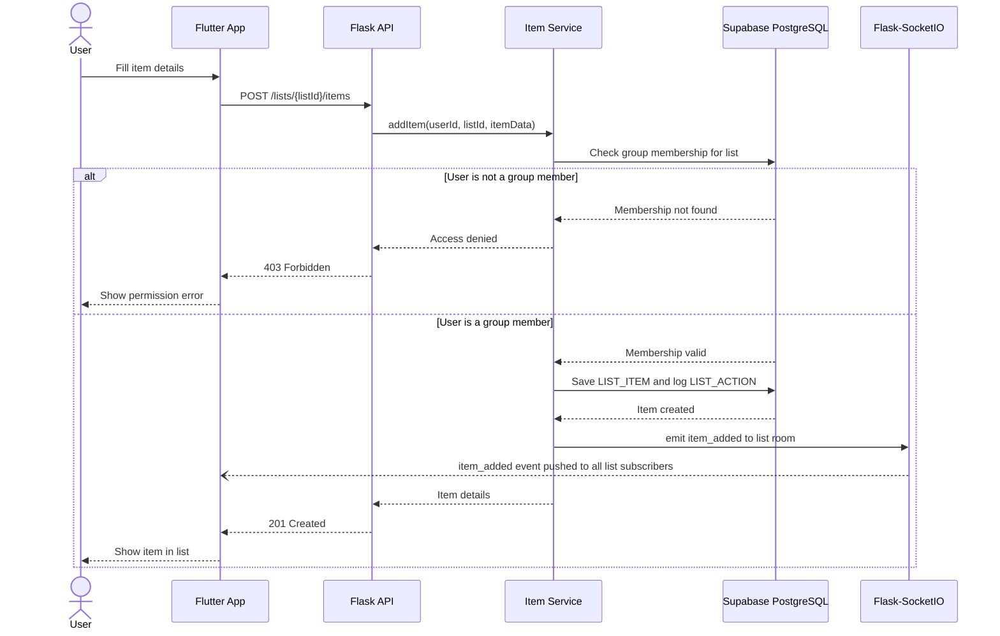

### 4.8 Mark Item as Purchased

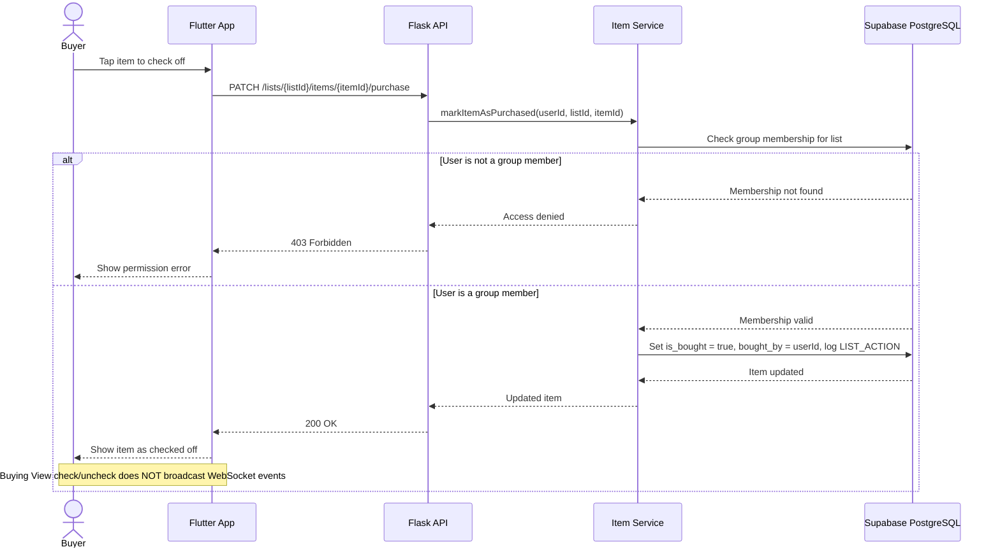

### 4.9 View Action Log

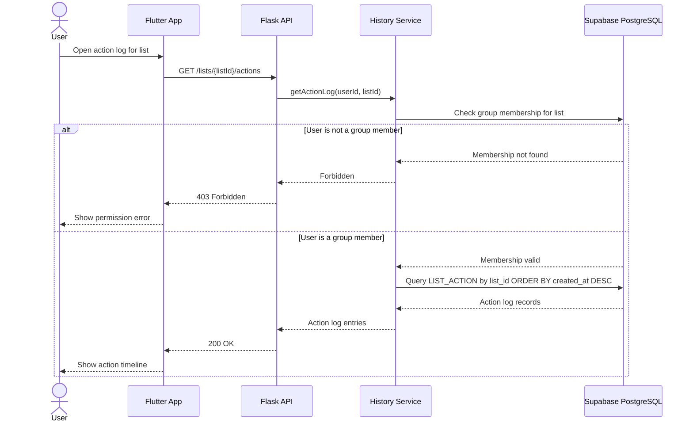
## External API Table

| Service | Call | Method | Purpose | Used By |
|---|---|---|---|---|
| Authentica | POST /otp/send | HTTP | Send OTP via SMS, WhatsApp, or email | auth_service — registration + login |
| Authentica | POST /otp/verify | HTTP | Verify submitted OTP code | auth_service — registration + login |
| Firebase FCM | POST /fcm/send (batch) | HTTP | Push notification to one or many device tokens | notification_service |
| Supabase PostgreSQL | TCP connection (SQLAlchemy) | — | All persistent read/write operations | all repositories |
| Supabase Storage | PUT /object/{bucket}/{path} | HTTP | Upload item or recipe images | item_service, recipe_service |
| Altamimi Catalog | GET /items/barcode/{code} | HTTP | Barcode-to-product lookup for item add | item_service |

---

## Internal API Table

| Module | API Name | Method | Endpoint | Auth | Related Story |
|---|---|---|---|---|---|
| Auth | Register — Send OTP | POST | /auth/register | No | US-01 |
| Auth | Register — Verify OTP | POST | /auth/register/verify | No | US-01 |
| Auth | Login — Send OTP | POST | /auth/login | No | US-02 |
| Auth | Login — Verify OTP | POST | /auth/login/verify | No | US-02 |
| User | Get Profile | GET | /users/me | Yes | US-03 |
| User | Update Profile | PATCH | /users/me | Yes | US-03 |
| User | Register Device Token | POST | /users/me/devices | Yes | US-30, US-31, US-32 |
| Group | Create Group | POST | /groups | Yes | US-04 |
| Group | Join Group | POST | /groups/join | Yes | US-05 |
| Group | List My Groups | GET | /groups | Yes | US-06 |
| Group | Get Group Members | GET | /groups/{groupId}/members | Yes | US-08, US-10 |
| Group | Update Group | PATCH | /groups/{groupId} | Yes (admin) | US-09 |
| Group | Remove Member | DELETE | /groups/{groupId}/members/{userId} | Yes (admin) | US-08 |
| Group | Transfer Admin | PATCH | /groups/{groupId}/admin | Yes (admin) | US-10 |
| List | Create List | POST | /groups/{groupId}/lists | Yes | US-13 |
| List | Get Group Lists | GET | /groups/{groupId}/lists | Yes | US-13 |
| List | Get List Detail | GET | /lists/{listId} | Yes | US-13 |
| List | Update List | PATCH | /lists/{listId} | Yes (admin) | US-14 |
| List | Remove List | DELETE | /lists/{listId} | Yes (admin) | US-11 |
| List | Complete Trip | PATCH | /lists/{listId}/complete | Yes | US-15 |
| List | Get Action Log | GET | /lists/{listId}/actions | Yes | US-28 |
| Item | Add Item | POST | /lists/{listId}/items | Yes | US-16 |
| Item | Update Item | PATCH | /lists/{listId}/items/{itemId} | Yes | US-16 |
| Item | Delete Item | DELETE | /lists/{listId}/items/{itemId} | Yes | US-16 |
| Item | Bulk Delete Items | DELETE | /lists/{listId}/items | Yes | US-23 |
| Item | Undo Bulk Delete | POST | /lists/{listId}/actions/{actionId}/undo | Yes | US-23 |
| Item | Mark Purchased | PATCH | /lists/{listId}/items/{itemId}/purchase | Yes | US-26 |
| Item | Upload Item Image | POST | /lists/{listId}/items/{itemId}/image | Yes | US-21 |
| Item | Lookup by Barcode | GET | /items/barcode/{code} | Yes | US-19 |
| Category | List Categories | GET | /categories | Yes | US-26 |
| Recipe | Create Recipe | POST | /groups/{groupId}/recipes | Yes | US-33 |
| Recipe | Get Group Recipes | GET | /groups/{groupId}/recipes | Yes | US-33, US-35 |
| Recipe | Get Recipe | GET | /recipes/{recipeId} | Yes | US-34 |
| Recipe | Update Recipe | PATCH | /recipes/{recipeId} | Yes (recipe_owner or admin) | US-37 |
| Recipe | Delete Recipe | DELETE | /recipes/{recipeId} | Yes (recipe_owner or admin) | US-12, US-37 |
| Recipe | Import to List | POST | /lists/{listId}/items/from-recipe/{recipeId} | Yes | US-34 |
| Trip | Start Trip | POST | /lists/{listId}/trips | Yes (buyer) | US-38, US-40 |
| Trip | Complete Trip | PATCH | /trips/{tripId}/complete | Yes (buyer) | US-38, US-42 |
| Trip | Get Active Trip | GET | /lists/{listId}/trips/active | Yes | US-38 |
| Notification | Heading to Store | POST | /lists/{listId}/notifications/heading-to-store | Yes | US-30 |
| Notification | Assign Buyer | POST | /lists/{listId}/notifications/assign-buyer | Yes | US-31 — sends FCM only, does not modify list |
| Notification | Remind Member | POST | /lists/{listId}/notifications/remind-member | Yes | US-32 |

## API Request and Response Examples

The following examples illustrate the input and output formats used by the Thalaja API. All request and response bodies use JSON.

---

### Register — Send OTP

**Endpoint**

```http
POST /auth/register
```

**Request**

```json
{
  "first_name": "Sara",
  "last_name": "test",
  "phone": "+966500000000",
  "email": "sara@example.com"
}
```

**Response**

```json
{
  "message": "OTP sent successfully"
}
```

---

### Register — Verify OTP

**Endpoint**

```http
POST /auth/register/verify
```

**Request**

```json
{
  "phone": "+966500000000",
  "otp": "123456",
  "first_name": "Sara",
  "last_name": "test",
  "email": "test@example.com"
}
```

**Response**

```json
{
  "token": "jwt_token",
  "user": {
    "user_id": "uuid",
    "first_name": "Sara",
    "last_name": "test",
    "phone": "+966500000000",
    "email": "sara@example.com"
  }
}
```

---

### Login — Send OTP

**Endpoint**

```http
POST /auth/login
```

**Request**

```json
{
  "phone": "+966500000000"
}
```

**Response**

```json
{
  "message": "OTP sent successfully"
}
```

---

### Login — Verify OTP

**Endpoint**

```http
POST /auth/login/verify
```

**Request**

```json
{
  "phone": "+966500000000",
  "otp": "123456"
}
```

**Response**

```json
{
  "token": "jwt_token",
  "user": {
    "user_id": "uuid",
    "first_name": "Sara",
    "last_name": "test"
  }
}
```

---

### Create Group

**Endpoint**

```http
POST /groups
```

**Request**

```json
{
  "name": "My Family",
  "type": "household"
}
```

**Response**

```json
{
  "group_id": "uuid",
  "name": "My Family",
  "type": "household",
  "invite_code": "ABCD123"
}
```

---

### Join Group

**Endpoint**

```http
POST /groups/join
```

**Request**

```json
{
  "invite_code": "ABCD123"
}
```

**Response**

```json
{
  "group_id": "uuid",
  "name": "My Family",
  "role": "member"
}
```

---

### Create Shopping List

**Endpoint**

```http
POST /groups/{groupId}/lists
```

**Request**

```json
{
  "name": "Weekly Groceries"
}
```

**Response**

```json
{
  "list_id": "uuid",
  "name": "Weekly Groceries",
  "status": "active"
}
```

---

### Add Item to List

**Endpoint**

```http
POST /lists/{listId}/items
```

**Request**

```json
{
  "name": "Milk",
  "quantity": 2,
  "unit": "L",
  "notes": "Low fat",
  "is_urgent": false
}
```

**Response**

```json
{
  "list_item_id": "uuid",
  "name": "Milk",
  "quantity": 2,
  "unit": "L",
  "is_bought": false,
  "is_urgent": false
}
```

---

### Mark Item as Purchased

**Endpoint**

```http
PATCH /lists/{listId}/items/{itemId}/purchase
```

**Request**

```json
{}
```

**Response**

```json
{
  "list_item_id": "uuid",
  "is_bought": true,
  "bought_by": "user_uuid"
}
```

---

### Create Recipe

**Endpoint**

```http
POST /groups/{groupId}/recipes
```

**Request**

```json
{
  "name": "Pancakes",
  "description": "Simple breakfast recipe",
  "ingredients": [
    {
      "item_id": "uuid",
      "quantity": 2,
      "unit": "cups"
    }
  ]
}
```

**Response**

```json
{
  "recipe_id": "uuid",
  "name": "Pancakes",
  "ingredients_count": 1
}
```

---

### Send Heading-to-Store Notification

**Endpoint**

```http
POST /lists/{listId}/notifications/heading-to-store
```

**Request**

```json
{}
```

**Response**

```json
{
  "message": "Notification sent successfully"
}
```


## Backend Operations Table

| Layer | Internal Operation | Purpose | Used By External API | Related Story |
|---|---|---|---|---|
| Service | send_registration_otp() | Call Authentica POST /otp/send with phone; reject if phone already registered | /auth/register | US-01 |
| Service | complete_registration() | Call Authentica POST /otp/verify; on success insert USER row | /auth/register/verify | US-01 |
| Service | send_login_otp() | Verify phone exists in USER, then call Authentica POST /otp/send | /auth/login | US-02 |
| Service | complete_login() | Call Authentica POST /otp/verify; on success load USER by phone, issue JWT | /auth/login/verify | US-02 |
| Service | register_device_token() | Upsert USER_DEVICE row with FCM token | /users/me/devices | US-30, US-31, US-32 |
| Service | create_group() | Insert GROUP, add creator as admin GROUP_MEMBER | /groups | US-04 |
| Service | join_group_by_code() | Validate invite code, insert GROUP_MEMBER with role=member | /groups/join | US-05 |
| Service | update_group() | Update name or image_url | /groups/{groupId} | US-09 |
| Service | remove_member() | Delete GROUP_MEMBER row, verify caller is admin | /groups/{groupId}/members/{userId} | US-08 |
| Service | transfer_admin() | Set target member role=admin, set caller role=member | /groups/{groupId}/admin | US-10 |
| Service | validate_group_membership() | Check USER is a GROUP_MEMBER before list or item operations | all list + item endpoints | US-13, US-16 |
| Service | create_list() | Insert SHOPPING_LIST with group_id (always required) | /groups/{groupId}/lists | US-13 |
| Service | complete_trip() | Set status=completed, completed_by, completed_at on SHOPPING_LIST | /lists/{listId}/complete | US-15 |
| Service | assign_buyer() | Query USER_DEVICE for target member, fire FCM push — does not modify SHOPPING_LIST | /lists/{listId}/notifications/assign-buyer | US-31 |
| Service | add_item_to_list() | Check membership, resolve or create ITEM catalog entry, insert LIST_ITEM, write LIST_ACTION, emit item_added via Flask-SocketIO | /lists/{listId}/items | US-16 |
| Service | update_item() | Edit LIST_ITEM fields, write LIST_ACTION, emit item_updated via Flask-SocketIO | /lists/{listId}/items/{itemId} | US-16 |
| Service | delete_item() | Delete LIST_ITEM, write LIST_ACTION, emit item_removed via Flask-SocketIO | /lists/{listId}/items/{itemId} | US-16 |
| Service | bulk_delete_items() | Delete all LIST_ITEM rows for list, write LIST_ACTION with full item snapshot in metadata, set undo_available_until | /lists/{listId}/items | US-23 |
| Service | undo_bulk_delete() | Read LIST_ACTION.metadata, re-insert LIST_ITEM rows, set is_undone=true | /lists/{listId}/actions/{actionId}/undo | US-23 |
| Service | mark_item_as_purchased() | Set is_bought=true, bought_by=user_id on LIST_ITEM, write LIST_ACTION — no SocketIO broadcast (buying view only) | /lists/{listId}/items/{itemId}/purchase | US-26 |
| Service | check_duplicate_item() | Fuzzy-match item name against active LIST_ITEM rows on same list; returns match candidates | called by add_item_to_list() before insert | US-25 |
| Service | upload_item_image() | Store file in Supabase Storage, update LIST_ITEM.image_url | /lists/{listId}/items/{itemId}/image | US-21 |
| Service | start_trip() | Insert TRIP row with status=is_shopping; SHOPPING_LIST becomes read-only for all members | /lists/{listId}/trips | US-38 |
| Service | complete_trip() | Set TRIP status=completed, completed_at; any LIST_ITEM with is_bought=false is retained in list for next run | /trips/{tripId}/complete | US-38 |
| Service | update_recipe() | Verify caller is recipe_owner or admin before updating RECIPE and INSTRUCTION rows | /recipes/{recipeId} | US-37 |
| Service | delete_recipe() | Verify caller is recipe_owner or admin before deleting RECIPE | /recipes/{recipeId} | US-12, US-37 |
| Service | get_action_log() | Query LIST_ACTION by list_id ORDER BY created_at DESC | /lists/{listId}/actions | US-28 |
| Service | create_recipe() | Insert RECIPE + RECIPE_INGREDIENT rows in one transaction | /groups/{groupId}/recipes | US-33 |
| Service | add_recipe_ingredients_to_list() | Bulk-insert GROCERY_ITEM rows from RECIPE_INGREDIENT | /lists/{listId}/items/from-recipe/{recipeId} | US-34 |
| Service | send_heading_to_store() | Query USER_DEVICE for all group members, fire FCM batch push | /lists/{listId}/notifications/heading-to-store | US-30 |
| Service | send_remind_member() | Query USER_DEVICE for target member, fire FCM push | /lists/{listId}/notifications/remind-member | US-32 |
| Repository | UserRepository.find_by_phone() | Lookup for OTP login flow | auth_service | US-01, US-02 |
| Repository | UserDeviceRepository.upsert() | Save or update FCM token per user+platform | auth_service | US-30, US-31, US-32 |
| Repository | GroupRepository.find_by_invite_code() | Lookup for join flow | group_service | US-05 |
| Repository | GroupMemberRepository.add_member() / get_role() | Membership inserts and role checks | group_service, list_service | US-04, US-05, US-08 |
| Repository | ListRepository.get_group_lists() | Fetch all SHOPPING_LIST rows for a group | list_service | US-13 |
| Repository | ItemRepository.resolve_or_create() | Find existing ITEM by name/barcode or create new catalog entry | item_service | US-16, US-18, US-19 |
| Repository | ListItemRepository.save() / delete() / bulk_delete() | CRUD for LIST_ITEM | item_service | US-16, US-23, US-26 |
| Repository | ActionRepository.save_event() / find_by_list() | LIST_ACTION insert and query | history_service, item_service | US-23, US-28 |
| Repository | CategoryRepository.list_all() | Return all system-defined CATEGORY rows | item_service | US-26 |
| Repository | RecipeRepository.save_with_ingredients_and_instructions() | RECIPE + RECIPE_INGREDIENT + INSTRUCTION rows in one transaction | recipe_service | US-33 |
| Repository | TripRepository.save() / complete() | TRIP insert and status update | trip_service | US-38 |
| Helper | generate_jwt() / decode_jwt() | Token issuing/verification | auth_service, require_auth | US-01, US-02 |
| Helper | require_auth() | Decorator validating JWT on protected routes | all protected routes | — |
| Helper | require_admin() | Decorator verifying caller has role=admin in the target group | group + list admin endpoints | US-08, US-09, US-10, US-11, US-12 |


---

## 5. User Flow Diagrams

### App User Flow — Registration to Logout

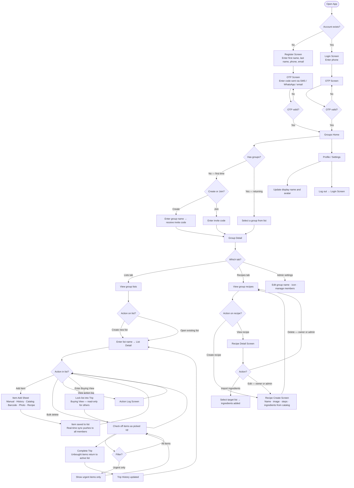

---

### Recipe Flow Detail

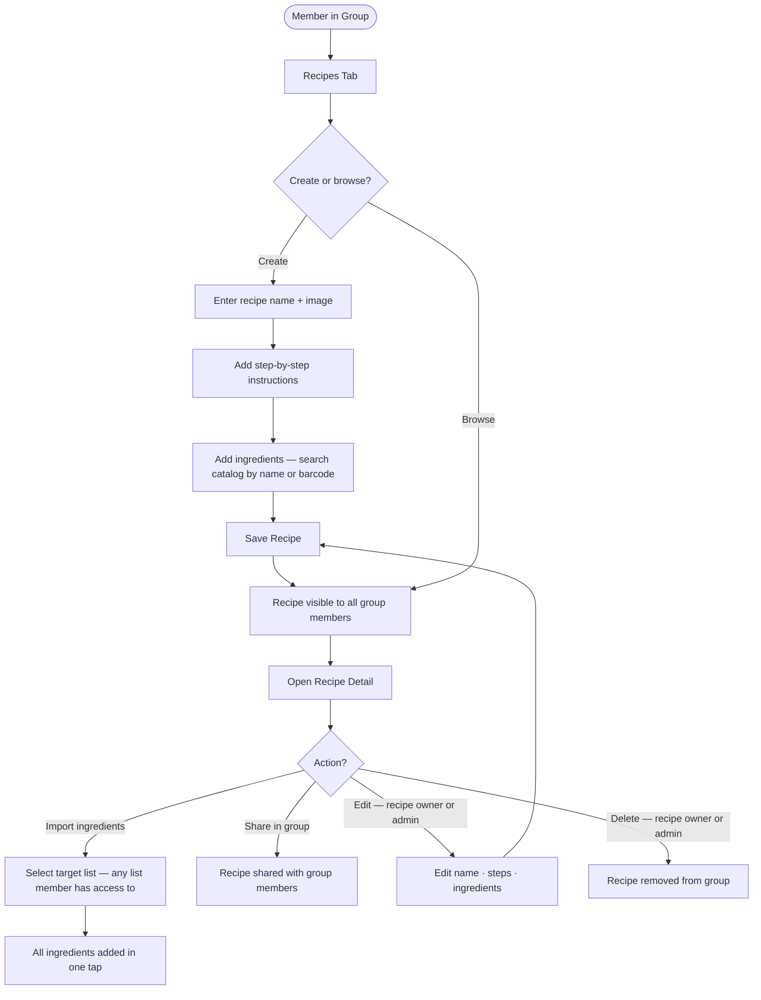

---

## 6. Backend Class Diagram

```mermaid
classDiagram
    class AuthService {
        +send_registration_otp(phone) void
        +complete_registration(phone, otp, first_name, last_name, email) User
        +send_login_otp(phone) void
        +complete_login(phone, otp) str
        -generate_jwt(user_id) str
        -verify_otp_with_authentica(phone, otp) bool
    }

    class GroupService {
        +create_group(user_id, name) Group
        +join_group_by_code(user_id, invite_code) GroupMember
        +update_group(group_id, caller_id, data) Group
        +remove_member(group_id, caller_id, target_id) void
        +transfer_admin(group_id, caller_id, new_admin_id) void
        -validate_admin(group_id, user_id) void
    }

    class ListService {
        +create_list(user_id, group_id, name) ShoppingList
        +get_group_lists(group_id, user_id) list
        -validate_membership(list_id, user_id) void
    }

    class ItemService {
        +add_item(user_id, list_id, data) ListItem
        +update_item(user_id, list_item_id, data) ListItem
        +delete_item(user_id, list_item_id) void
        +bulk_delete(user_id, list_id) void
        +undo_bulk_delete(action_id) void
        +mark_purchased(user_id, list_item_id) ListItem
        +upload_image(list_item_id, file) str
        -check_duplicate(list_id, name) list
        -emit_event(event, room, payload) void
    }

    class TripService {
        +start_trip(list_id, buyer_id) Trip
        +complete_trip(trip_id, buyer_id) Trip
        +get_active_trip(list_id) Trip
        -return_unbought_items(trip_id) void
    }

    class RecipeService {
        +create_recipe(user_id, group_id, data) Recipe
        +update_recipe(recipe_id, caller_id, data) Recipe
        +delete_recipe(recipe_id, caller_id) void
        +import_to_list(recipe_id, list_id, user_id) list
        -validate_owner_or_admin(recipe_id, user_id) void
    }

    class NotificationService {
        +heading_to_store(list_id, sender_id) void
        +assign_buyer(list_id, target_user_id) void
        +remind_member(list_id, target_user_id) void
        -send_fcm_push(device_tokens, title, body) void
    }

    class HistoryService {
        +get_action_log(list_id, user_id) list
        +log_action(list_id, user_id, action, metadata) void
    }

    AuthService --> UserRepository
    GroupService --> GroupRepository
    GroupService --> GroupMemberRepository
    ListService --> ListRepository
    ListService --> GroupMemberRepository
    ItemService --> ListItemRepository
    ItemService --> ItemRepository
    ItemService --> HistoryService
    TripService --> TripRepository
    TripService --> ListItemRepository
    RecipeService --> RecipeRepository
    NotificationService --> UserDeviceRepository
```

---

## 7. Project Repository Structure

```
thalaja-team/
├── mobile/                          # Flutter app
│   ├── lib/
│   │   ├── core/
│   │   │   ├── network/             # Dio client, interceptors
│   │   │   ├── errors/              # Failure types, exception handling
│   │   │   └── utils/               # Constants, extensions
│   │   └── features/
│   │       └── {feature}/           # auth, groups, lists, items, recipes, buying, history
│   │           ├── presentation/
│   │           │   ├── pages/
│   │           │   ├── widgets/
│   │           │   └── bloc/        # BLoC + events + states
│   │           ├── domain/
│   │           │   ├── entities/
│   │           │   ├── usecases/
│   │           │   └── repositories/  # interfaces only
│   │           └── data/
│   │               ├── models/        # JSON serialization
│   │               ├── datasources/
│   │               │   ├── remote/    # Dio REST calls
│   │               │   ├── realtime/  # Flask-SocketIO WebSocket
│   │               │   └── device/    # camera, barcode scanner
│   │               └── repositories/  # implementations
│   ├── test/
│   └── pubspec.yaml
│
├── backend/                         # Flask API
│   ├── app/
│   │   ├── api/
│   │   │   └── v1/
│   │   │       ├── auth.py
│   │   │       ├── groups.py
│   │   │       ├── lists.py
│   │   │       ├── items.py
│   │   │       ├── trips.py
│   │   │       ├── categories.py
│   │   │       ├── recipes.py
│   │   │       ├── notifications.py
│   │   │       └── history.py
│   │   ├── services/
│   │   ├── models/                  # SQLAlchemy ORM
│   │   ├── persistence/
│   │   │   └── repositories/
│   │   ├── config.py
│   │   └── extensions.py            # Flask-SocketIO, SQLAlchemy init
│   ├── tests/
│   ├── requirements.txt
│   └── run.py
│
├── documentation/
│   ├── STAGE1-ideation.md
│   ├── STAGE2-project-charter.md
│   ├── STAGE3technicaldocumentation.md
│   ├── thalaja-stage3-wireframes.md
│   └── docs/
│       ├── architecture.md
│       ├── domain.md
│       └── brand.md
│
├── README.md
└── CLAUDE.md
```

---

## 8. SCM Plan

### Branching Strategy

| Branch | Purpose |
| --- | --- |
| `main` | Production-ready code only. Protected — no direct pushes. |
| `dev` | Integration branch. All feature branches merge here first. |
| `feature/<name>` | One branch per Jira card (e.g. `feature/auth-otp-flow`) |
| `fix/<name>` | Bug fixes discovered during QA or beta |
| `docs/<name>` | Documentation-only changes |

### Workflow

1. Branch off `dev` for every Jira card
2. Open a Pull Request targeting `dev` when the card is done
3. At least 1 teammate approval required before merge
4. `dev` → `main` PR opened at the end of each sprint after integration QA passes

### Commit Convention

```
type: short description

Types: feat · fix · docs · refactor · test · chore
Example: feat: add OTP verification endpoint
```

### Rules

- Never commit directly to `main` or `dev`
- No `--no-verify` to bypass hooks
- API contract changes require both leads to approve the PR

---

## 9. QA Plan

### Testing Layers

| Layer | Tool | Scope |
| --- | --- | --- |
| Unit tests — Flutter | flutter_test | BLoC logic, use cases, data models |
| Unit tests — Backend | pytest | Service methods, repository queries |
| API integration tests | Postman collections | All external API endpoints |
| Manual smoke tests | Device (iOS + Android) | Full user flows each sprint |
| Beta testing | 5 household groups | Real-world usage with survey feedback |

### Definition of Done

A feature card is done when:
1. Unit tests pass for the affected service or BLoC
2. Postman collection test for the endpoint passes
3. Manual smoke test on a real device confirms the golden path
4. No open critical bugs linked to the card

### Bug Tracking

All bugs are filed as Jira issues tagged `bug` with severity (Critical / High / Medium / Low).
Critical and High bugs block the sprint from closing.

---

## 10. Technical Justifications

| Technology | Why Chosen |
| --- | --- |
| Flutter | The team built Thalaja v1 in Swift; Flutter lets us ship iOS and Android from one codebase for v2 without splitting the team |
| Flask | The team has prior experience with Flask, and it integrates directly with Flask-SocketIO — no separate real-time server needed |
| PostgreSQL via Supabase | Managed hosting removes infra overhead; relational model fits our entity structure with clear FKs and constraints |
| Flask-SocketIO | Architecture constraint: real-time events must flow through Flask only, not directly from a Supabase Realtime subscription on the client |
| Firebase FCM | Handles push delivery to both iOS and Android without running our own notification infrastructure |
| Authentica | Provides OTP over SMS, WhatsApp, and email with automatic fallback — gives users recovery options when one channel fails, with better UX than single-channel providers |
| BLoC | Keeps Flutter UI state predictable and testable when async WebSocket events arrive and modify list state |
| Dio | Chosen over Flutter's default http package for its interceptor support (JWT injection) and multipart upload needed for item images |
| Altamimi catalog | Saudi-localized grocery item data with barcodes — lets us seed a real catalog at launch instead of an empty database |
| Cleany | Generates the Flutter Clean Architecture folder scaffold so the team starts features consistently without manual boilerplate |
| Swagger / OpenAPI | API documentation served directly from Flask so frontend and backend stay in sync on contract during parallel development |
| Postman | API contract testing — each sprint's endpoints are covered by a Postman collection run before merge to dev |

---

*Thalaja Team · Stage 3 Technical Documentation*
