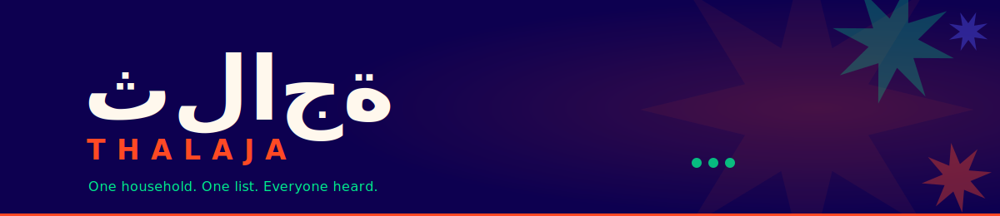

<div align="center">
  
  <br/><br/>

  
  
  
  
</div>

---

In most Saudi households, one person shops for the entire family — often monthly. But there's no shared space for everyone to say what they need before the buyer leaves. Thalaja fixes that: every member adds their requests to one shared list, and the buyer walks into the store with everything accounted for.

---

## Features

- 🛒 &nbsp;Shared group lists with item-level detail — brand, quantity, unit, notes, and image
- ⚡ &nbsp;Real-time sync — every addition or edit appears instantly for all members currently viewing the list
- 🔔 &nbsp;Buyer alert — one tap notifies the whole household you're heading to the store
- 🛍️ &nbsp;Buying view — checklist locked from edits, items organized by grocery aisle
- 📋 &nbsp;Full history — action log of every change and a record of past completed trips
- 🍳 &nbsp;Group recipes — save recipes and add all ingredients to the active list in one tap

---

## Built With

**Mobile**


**Backend**


**Design & Tooling**


---

## Getting Started

<details>
<summary><b>Prerequisites</b></summary>
<br/>

- Flutter SDK 3.x
- Dart 3.x
- Python 3.11+
- PostgreSQL (via Supabase project)
- Firebase project with FCM enabled

</details>

<details>
<summary><b>Installation</b></summary>
<br/>

**1. Clone the repository**
```bash
git clone https://github.com/your-org/thalaja.git
cd thalaja
```

**2. Backend setup**
```bash
cd backend
python -m venv venv && source venv/bin/activate
pip install -r requirements.txt
cp .env.example .env   # fill in DATABASE_URL, JWT_SECRET, FCM credentials
flask db upgrade
flask run
```

**3. Mobile setup**
```bash
cd mobile
flutter pub get
cp lib/core/config.example.dart lib/core/config.dart   # fill in API base URL
flutter run
```

</details>

---

## Team

<table>
  <tr>
    <td align="center">
      <a href="https://github.com/MIS-hero">
        
        <br/><sub><b>Aljawharah Alammar</b></sub>
      </a>
      <br/><sub>Project Manager</sub>
    </td>
    <td align="center">
      <a href="https://github.com/reemmalyamani">
        
        <br/><sub><b>Reem Alyamani</b></sub>
      </a>
      <br/><sub>Product Manager</sub>
    </td>
    <td align="center">
      <a href="https://github.com/0-Mousa-0">
        
        <br/><sub><b>Mousa Alrizqi</b></sub>
      </a>
      <br/><sub>Backend Lead</sub>
    </td>
    <td align="center">
      <a href="https://github.com/ahotb">
        
        <br/><sub><b>Abdullah Almouraibd</b></sub>
      </a>
      <br/><sub>Backend Developer</sub>
    </td>
    <td align="center">
      <a href="https://github.com/Randa-hb10">
        
        <br/><sub><b>Randa Baeshen</b></sub>
      </a>
      <br/><sub>Frontend Developer</sub>
    </td>
  </tr>
</table>

---

<div align="center">
  <sub>Built at Holberton / Tuwaiq Academy · Saudi Arabia · 2026</sub>
</div>
