# Thalaja — Technical Design Document (Part 1)

**Project:** Thalaja (ثلاجة) — Collaborative Shopping List App  
**Status:** Architecture & Design Phase (Graduation Project)  
**Team:** Holberton final project

---

## 1. Introduction

### 1.1 Purpose

This document is the high-level technical blueprint for **Thalaja**, a collaborative grocery and occasion shopping app. It defines architecture, domain entities, UML diagrams, and repository structure before implementation — following the same documentation rigor as the **HBnB Evolution** project, adapted for a **Flutter + Flask + Supabase** full-stack deployment.

### 1.2 Problem Statement

Families, roommates, and friend groups struggle with duplicate purchases, forgotten items, and poor coordination during shopping. Paper lists and chat messages do not sync in real time. **Thalaja** solves this with shared lists, categorized items, recipe-to-list import, and a per-list **activity history** so every member sees who changed what.

### 1.3 Scope (Part 1)

| In Scope | Out of Scope (Later Phases) |
| :--- | :--- |
| High-level architecture & UML diagrams | --- |
| Domain model & entity relationships | --- |
| API interaction flows (sequence diagrams) | --- |
| Flutter Clean Architecture structure | Offline-first sync engine |
| Flask layered backend structure | Supabase Realtime subscriptions |

### 1.4 Documentation Stages

| Stage | Document | Focus |
| :--- | :--- | :--- |
| **Stage 1** | [SharePoint — Stage 1](https://github.com/MIS-hero/Thalaja-team/blob/main/Documentation/STAGE1-ideation.md) | Vision, requirements, initial design |
| **Stage 2** | [SharePoint — Stage 2](https://github.com/MIS-hero/Thalaja-team/blob/main/Documentation/STAGE2-project-charter.md) | Implementation details, testing, deployment |
| **Miro Board** | [Thalaja Miro](https://miro.com/welcomeonboard/TGNsOHQ4SVpPN2l3VnFmQmpSMFVNVFdzbUFabGZvaW5MM1B0SE5BSG1nT0ZoOTFyWE5hZVNXWjBjMzhIeHNjZFR0N3JXUjBoRmc2cDlyTUJOSitsTm5CNmN6am1pT3JZZzVram40NXhscWQ5RHVqMVllcVlTbEp1Um4zM3hFcHF0R2lncW1vRmFBVnlLcVJzTmdFdlNRPT0hdjE=?share_link_id=514202759014) | Visual diagrams, wireframes, team collaboration |

---

## 2. Tech Stack

| Layer | Technology | Role |
| :--- | :--- | :--- |
| **Mobile Client** | Flutter (Dart) | Cross-platform iOS & Android UI |
| **Client Architecture** | Clean Architecture | Separation: Presentation → Domain → Data |
| **State Management** | BLoC / Riverpod / Cubet *(choose one)* | Predictable UI state |
| **Backend API** | Flask (Python) | REST API, business logic, authentication |
| **Database** | Supabase (PostgreSQL) | Persistent storage only — **no Supabase Auth on frontend** |
| **Authentication** | Flask JWT (access + refresh tokens) | Login/register handled entirely by backend |
| **ORM** | SQLAlchemy | Maps Python models to Supabase PostgreSQL |
| **API Communication** | HTTP / Dio (Flutter) | JSON REST between Flutter ↔ Flask |

> **Important:** Supabase is used purely as a managed PostgreSQL host. The Flutter app never calls Supabase Auth or Supabase client SDK directly. All data access goes through the Flask API.

---

## 3. User Stories

### Main User Story

As a family member or roommate,  
I want to create and share a synced shopping list with my household,  
so that we can avoid duplicate purchases, remember needed items, and reduce wasted money, time, and fuel.

---

### Problem Statement

Families and roommates often buy items separately without clear communication. This can lead to duplicate purchases, forgotten items, multiple store trips, wasted money, wasted time, and unnecessary fuel usage.

---

### Target Audience

- Families
- Roommates
- Shared households

---

### User Stories by Feature

#### User Management

| Role | User Story | Goal |
|---|---|---|
| User | As a user, I want to sign in to my account. | So that I can securely access my lists, groups, reminders, and saved addresses. |
| User | As a user, I want to create a family or household group. | So that I can share shopping lists with the people I live with. |
| User | As a user, I want to join one or more groups. | So that I can manage different shared lists, such as family, roommates, or event-based groups. |
| User | As a user, I want to create a private list. | So that I can keep personal shopping items separate from shared lists. |
| List Creator | As a list creator, I want to control who can contribute to my list. | So that only selected users can add, edit, or delete items. |

---

#### Shared Group Lists

| Role | User Story | Goal |
|---|---|---|
| Group Member | As a group member, I want to add items to a shared list. | So that everyone knows what needs to be bought. |
| Group Member | As a group member, I want to edit or delete items from a shared list. | So that the list stays accurate and updated. |
| Group Member | As a group member, I want the list to sync in real time. | So that other members do not buy duplicate items. |
| Group Member | As a group member, I want to mark items as purchased. | So that everyone can see what has already been bought. |

---

#### Item Management

| Role | User Story | Goal |
|---|---|---|
| User | As a user, I want to add item details such as name, brand, and volume. | So that the shopper knows exactly what to buy. |
| User | As a user, I want to add items using voice input. | So that I can add items quickly without typing. |
| User | As a user, I want to add items using barcode scanning. | So that I can quickly identify products. |
| User | As a user, I want to add items using photos. | So that I can save product information visually. |

---

#### Categories and Events

| Role | User Story | Goal |
|---|---|---|
| User | As a user, I want to organize items by category. | So that shopping lists are easier to browse and manage. |
| User | As a user, I want to create event categories such as camping, beach trips, and BBQs. | So that I can prepare shopping lists for specific occasions. |
| User | As a user, I want to create recipe-based categories. | So that I can group ingredients based on meals. |
| User | As a user, I want to create seasonal categories such as Winter or Ramadan. | So that I can plan shopping around seasonal needs. |
| User | As a user, I want to add new custom categories. | So that the app matches my household’s shopping habits. |

---

#### Reminders and Saved Address

| Role | User Story | Goal |
|---|---|---|
| User | As a user, I want to receive reminders for important or forgotten items. | So that I do not need to make multiple store trips. |
| User | As a user, I want to save my address. | So that the app can support location-based or delivery-related features in the future. |

---

### Expected Output

The application should provide a shared and private shopping list system that helps families and roommates reduce miscommunication, avoid duplicate purchases, prevent forgotten items, save money, save time, reduce unnecessary store trips, and organize shopping by groups, events, recipes, and seasons.

---
```

```md
```

## 3. High-Level Architecture

### 3.1 Architecture Overview

The system uses a **three-tier layered architecture** on the backend (mirroring HBnB) and **Clean Architecture** on the Flutter client. A **Facade** (`ThalajaFacade`) centralizes business rules on the server. Every mutating action on a shopping list writes a **History** record for the activity feed.

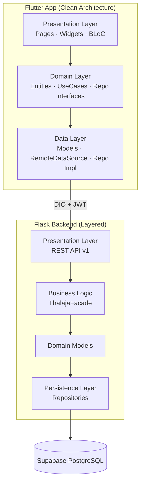

### 3.2 Package Diagram

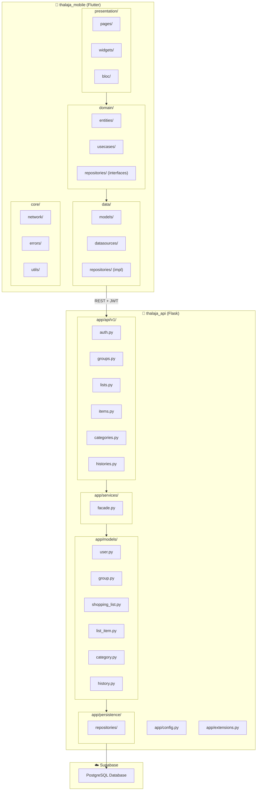

### 3.3 Explanatory Notes

| Layer | Responsibility |
| :--- | :--- |
| **Flutter Presentation** | Screens, widgets, navigation, BLoC/Provider. No business logic. |
| **Flutter Domain** | Pure Dart entities, use cases (`CreateList`, `ToggleItem`), repository contracts. |
| **Flutter Data** | DTOs, API client (Dio), maps JSON ↔ entities, implements domain repos. |
| **Flask API** | DIO routing, request validation, JWT middleware, JSON serialization. |
| **Flask Facade** | Orchestrates workflows: validates membership, writes History, calls repos. |
| **Flask Persistence** | SQLAlchemy repositories abstract Supabase PostgreSQL. |

---

## 4. Domain Model — Final Entities Table

> Redesigned from the initial sketch. **Family → Group**, **Occasion → Category**, plus **History**, **GroupMember**, and **Recipe** for Bring-like recipe support.

| Entity | Attributes | Relationships |
| :--- | :--- | :--- |
| **User** | `id` (UUID), `name`, `email`, `phone`, `avatar_url`, `password_hash`, `created_at`, `updated_at` | Belongs to many **Groups** via **GroupMember**. Creates **Lists**, performs **History** actions. |
| **Group** | `id`, `name`, `type` (`family` \| `friends`), `invite_code`, `admin_id`, `avatar_url`, `created_at` | Has many **GroupMembers**, many **Lists**. `admin_id` → **User**. |
| **GroupMember** | `id`, `group_id`, `user_id`, `role` (`admin` \| `member`), `joined_at` | Junction: **User** ↔ **Group**. |
| **Category** | `id`, `name`, `icon`, `type` (`occasion` \| `recipe` \| `grocery_aisle` \| `custom`), `is_system` (bool), `created_by` (nullable) | Has many **Recipes** (when type = recipe). Referenced by **Lists** and **ListItems**. |
| **Recipe** | `id`, `category_id`, `title`, `description`, `image_url`, `servings`, `created_by`, `created_at` | Belongs to **Category**. Has many **RecipeIngredients**. Can be imported into a **List**. |
| **RecipeIngredient** | `id`, `recipe_id`, `name`, `quantity`, `unit`, `grocery_category_id` | Belongs to **Recipe**. Maps to grocery aisle **Category**. |
| **ShoppingList** | `id`, `group_id`, `category_id`, `title`, `status` (`active` \| `completed` \| `archived`), `created_by`, `created_at`, `completed_at` | Belongs to **Group** and **Category**. Has many **ListItems** and **Histories**. |
| **ListItem** | `id`, `list_id`, `name`, `quantity`, `unit`, `grocery_category_id`, `notes`, `is_bought`, `added_by`, `bought_by`, `bought_at`, `created_at` | Belongs to **ShoppingList** and optional **Category** (aisle). |
| **History** | `id`, `list_id`, `user_id`, `action` (enum), `entity_type`, `entity_id`, `summary`, `metadata` (JSON), `created_at` | Belongs to **ShoppingList** and **User**. Immutable activity log. |

### 4.1 History Action Types

| Action | Trigger | Example Summary |
| :--- | :--- | :--- |
| `list_created` | New list in group | "Ahmed created Picnic list" |
| `item_added` | Item added | "Sara added Milk (2 L)" |
| `item_updated` | Qty/notes changed | "Omar updated Chicken quantity to 1 kg" |
| `item_removed` | Item deleted | "Layla removed Bread" |
| `item_checked` | Marked bought | "Khalid bought Eggs" |
| `item_unchecked` | Unmarked bought | "Nour unchecked Butter" |
| `list_completed` | All items bought / manual close | "Group completed Weekly Groceries" |
| `recipe_imported` | Recipe → list | "Fatima imported Shakshuka recipe (8 items)" |
| `member_joined` | User joined group | "Yousef joined Family Group" |

### 4.2 Entity Relationship Diagram

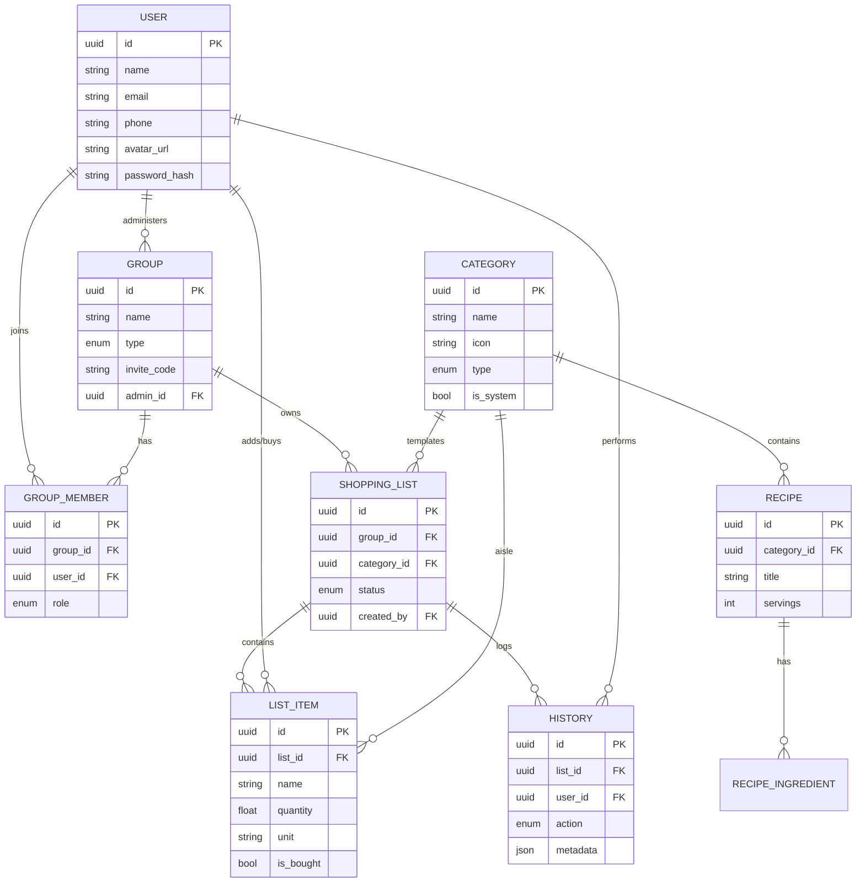

---

## 5. Class Diagram

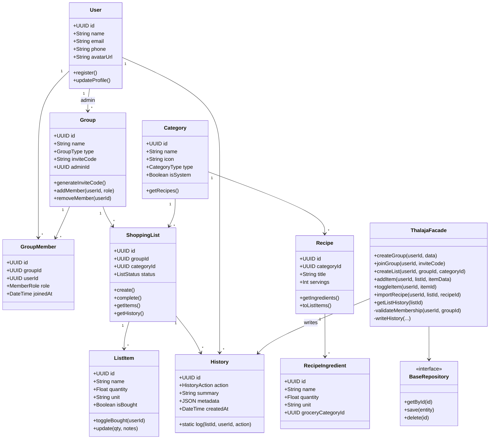

### 5.1 Explanatory Notes

- **Group** replaces Family — `type` distinguishes family households vs friend/roommate groups.
- **Category** replaces Occasion — doubles as occasion template (Picnic, BBQ), grocery aisle (Dairy, Produce), or recipe container.
- **History** is append-only; the Facade writes a record on every state-changing operation.
- **ThalajaFacade** mirrors HBnB's `HBnBFacade` — single entry point for all business workflows.

---

## 6. Use Case Diagram

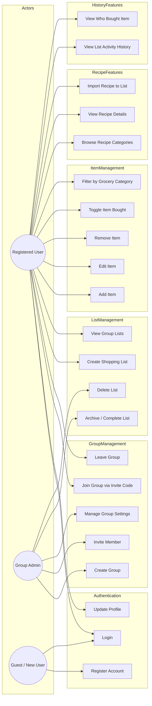

### 6.1 Primary Use Cases (MVP)

| ID | Use Case | Actor | Priority |
| :--- | :--- | :--- | :--- |
| UC-01 | Register / Login | Guest | Must |
| UC-02 | Create or Join Group | User | Must |
| UC-03 | Create List from Category | User | Must |
| UC-04 | Add / Check / Uncheck Items | User | Must |
| UC-05 | View List History | User | Must |
| UC-06 | Import Recipe to List | User | Should |
| UC-07 | Complete / Archive List | Admin | Should |

---

## 7. Sequence Diagrams

### 7.1 User Registration & Login

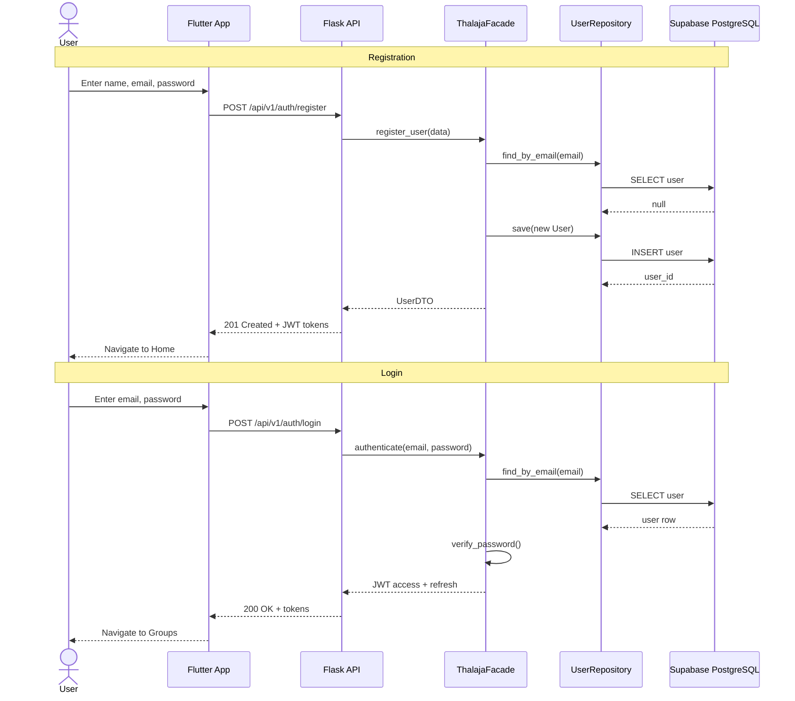

---

### 7.2 Create Group & Invite Member

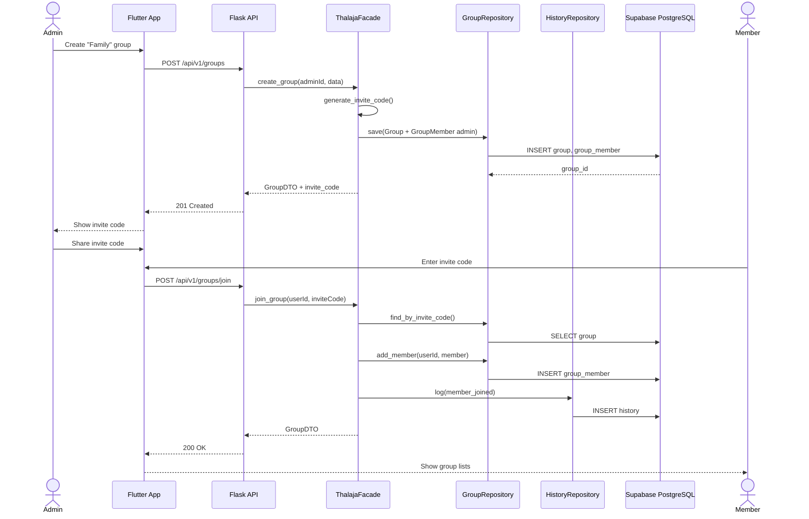

---

### 7.3 Create Shopping List

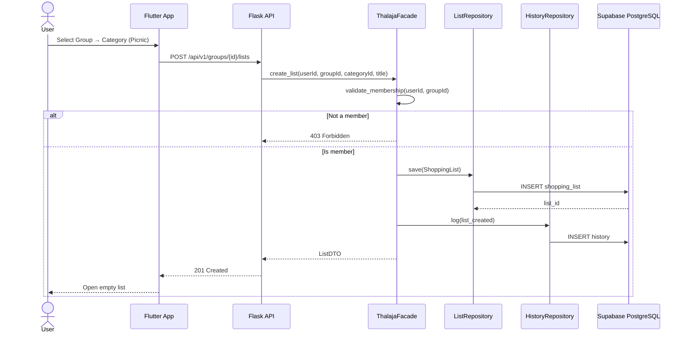

---

### 7.4 Add Item & Toggle Bought (with History)

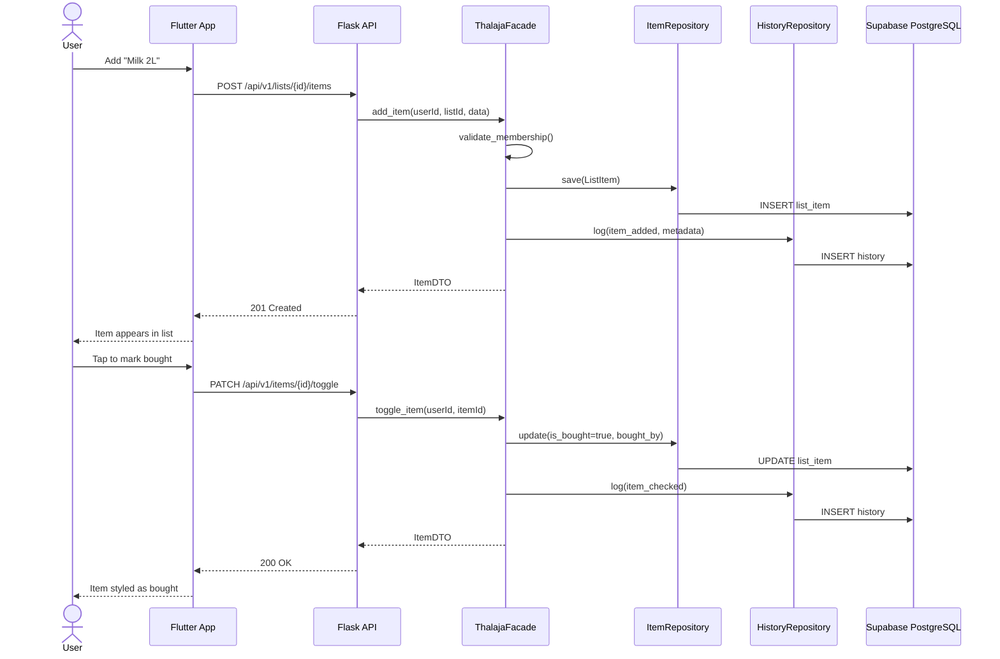

---

### 7.5 Import Recipe to Shopping List

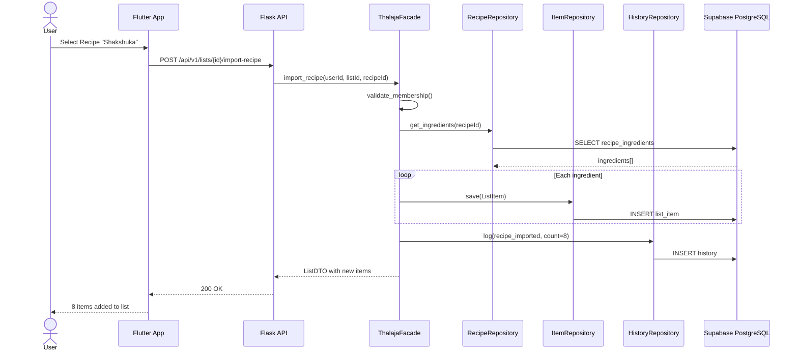

---

### 7.6 View List Activity History

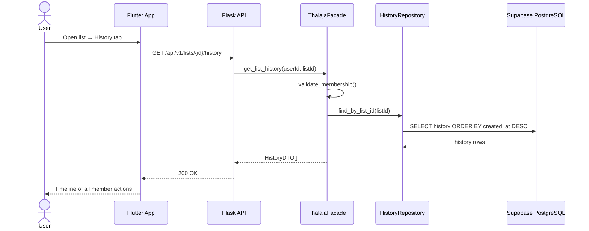

---

## 8. API Endpoints Overview

| Method | Endpoint | Description |
| :--- | :--- | :--- |
| `POST` | `/api/v1/auth/register` | Register new user |
| `POST` | `/api/v1/auth/login` | Login, receive JWT |
| `POST` | `/api/v1/auth/refresh` | Refresh access token |
| `GET` | `/api/v1/users/me` | Current user profile |
| `POST` | `/api/v1/groups` | Create group |
| `POST` | `/api/v1/groups/join` | Join via invite code |
| `GET` | `/api/v1/groups` | List user's groups |
| `GET` | `/api/v1/groups/{id}` | Group details + members |
| `POST` | `/api/v1/groups/{id}/lists` | Create shopping list |
| `GET` | `/api/v1/groups/{id}/lists` | Lists in group |
| `GET` | `/api/v1/lists/{id}` | List with items |
| `PATCH` | `/api/v1/lists/{id}/complete` | Mark list completed |
| `POST` | `/api/v1/lists/{id}/items` | Add item |
| `PATCH` | `/api/v1/items/{id}` | Update item |
| `PATCH` | `/api/v1/items/{id}/toggle` | Toggle bought status |
| `DELETE` | `/api/v1/items/{id}` | Remove item |
| `GET` | `/api/v1/categories` | All categories (system + custom) |
| `GET` | `/api/v1/categories/{id}/recipes` | Recipes in category |
| `POST` | `/api/v1/lists/{id}/import-recipe` | Import recipe ingredients |
| `GET` | `/api/v1/lists/{id}/history` | Activity history feed |

---

## 9. Project Repository Structure

```text
thalaja/
├── docs/                              # Graduation documentation
│   ├── part1/                         # Stage 1 — Design (this document)
│   │   ├── README.md
│   │   ├── diagrams/                  # Exported PNG/SVG from Miro
│   │   │   ├── package_diagram.png
│   │   │   ├── class_diagram.png
│   │   │   ├── use_case_diagram.png
│   │   │   └── sequence_*.png
│   │   └── resources/                 # PDFs, reference videos
│   └── part2/                         # Stage 2 — Implementation report
│
├── thalaja_mobile/                    # Flutter client (Clean Architecture)
│   ├── lib/
│   │   ├── main.dart
│   │   ├── app.dart
│   │   ├── core/
│   │   │   ├── constants/
│   │   │   ├── errors/
│   │   │   ├── network/
│   │   │   │   ├── api_client.dart
│   │   │   │   └── auth_interceptor.dart
│   │   │   └── utils/
│   │   ├── features/
│   │   │   ├── auth/
│   │   │   │   ├── data/
│   │   │   │   │   ├── datasources/
│   │   │   │   │   ├── models/
│   │   │   │   │   └── repositories/
│   │   │   │   ├── domain/
│   │   │   │   │   ├── entities/
│   │   │   │   │   ├── repositories/
│   │   │   │   │   └── usecases/
│   │   │   │   └── presentation/
│   │   │   │       ├── bloc/
│   │   │   │       ├── pages/
│   │   │   │       └── widgets/
│   │   │   ├── groups/
│   │   │   ├── lists/
│   │   │   ├── items/
│   │   │   ├── categories/
│   │   │   ├── recipes/
│   │   │   └── history/
│   │   └── injection_container.dart   # Dependency injection (get_it)
│   ├── test/
│   ├── pubspec.yaml
│   └── README.md
│
├── thalaja_api/                       # Flask backend (Layered + Facade)
│   ├── app/
│   │   ├── __init__.py                # App factory
│   │   ├── config.py                  # Supabase DB URL, JWT secret
│   │   ├── extensions.py              # SQLAlchemy, JWT, CORS
│   │   ├── api/
│   │   │   └── v1/
│   │   │       ├── __init__.py
│   │   │       ├── auth.py
│   │   │       ├── groups.py
│   │   │       ├── lists.py
│   │   │       ├── items.py
│   │   │       ├── categories.py
│   │   │       └── histories.py
│   │   ├── models/
│   │   │   ├── base_model.py
│   │   │   ├── user.py
│   │   │   ├── group.py
│   │   │   ├── group_member.py
│   │   │   ├── category.py
│   │   │   ├── recipe.py
│   │   │   ├── shopping_list.py
│   │   │   ├── list_item.py
│   │   │   └── history.py
│   │   ├── services/
│   │   │   └── facade.py              # ThalajaFacade
│   │   └── persistence/
│   │       └── repositories/
│   │           ├── user_repository.py
│   │           ├── group_repository.py
│   │           ├── list_repository.py
│   │           ├── item_repository.py
│   │           └── history_repository.py
│   ├── migrations/                    # Alembic DB migrations
│   ├── tests/
│   ├── requirements.txt
│   ├── run.py
│   └── README.md
│
├── supabase/
│   ├── seed.sql                       # System categories & sample recipes
│   └── schema.sql                     # Reference schema (managed by Alembic)
│
├── .env.example
└── README.md                          # Root project overview
```

---

## 10. Development Roadmap (Graduation Phases)

| Phase | Title | Deliverables | Status |
| :--- | :--- | :--- | :--- |
| **Part 1** | Technical Documentation & Design | UML diagrams, entity model, architecture doc, Miro board | 🔄 In Progress |
| **Part 2** | Backend — Business Logic & API | Flask models, Facade, REST endpoints, Supabase schema | ⏳ Upcoming |
| **Part 3** | Flutter Client | Clean Architecture features, JWT auth flow, list UI | ⏳ Upcoming |
| **Part 4** | Integration & Deployment | End-to-end testing, APK build, API deployment, Stage 2 report | ⏳ Upcoming |

---

## 11. Comparison: Thalaja vs Bring!

| Feature | Bring! | Thalaja |
| :--- | :--- | :--- |
| Shared lists | ✅ Family / friends | ✅ **Groups** (family or friends) |
| Real-time sync | ✅ | ✅ Via API polling → WebSockets later |
| Categories | ✅ Grocery aisles | ✅ **Categories** (aisle + occasion + recipe) |
| Recipes | ✅ Recipe book + import | ✅ **Recipe** entity with ingredient import |
| Activity log | ❌ Limited | ✅ **History** per list |
| Auth | Bring account | ✅ Flask JWT (no Supabase Auth) |
| Platform | iOS / Android | ✅ Flutter cross-platform |

---

## 12. Conclusion

Thalaja applies proven **layered backend architecture** (HBnB-style Facade + Repositories) with **Flutter Clean Architecture** on the client. Renaming **Family → Group** and **Occasion → Category** makes the domain flexible for households and friend circles, groceries and recipes. The **History** entity gives every shopping list a transparent audit trail — a differentiator over apps like [Bring!](https://www.getbring.com/en/features/collaborative) that focus on lists without detailed per-user activity feeds.

By keeping **Supabase as database-only** and routing all logic through **Flask**, authentication stays centralized, graduation requirements are easier to demonstrate, and the persistence layer can evolve without touching the Flutter domain layer.

---


---

## 14. References

- [Bring! — Collaborative Shopping Lists](https://www.getbring.com/en/features/collaborative)
- [HBnB Evolution — Part 1 Design Reference](https://github.com/holbertonschool/hbnb)
- [Stage 1 Documentation (SharePoint)](https://studentksuedu-my.sharepoint.com/:w:/g/personal/446202251_student_ksu_edu_sa/IQD6pDC0-m2jQaqCCHfWs8nsAckIfo9m3vAC1H3J-0wdCIc?e=f71gFo)
- [Stage 2 Documentation (SharePoint)](https://studentksuedu-my.sharepoint.com/:w:/g/personal/446202251_student_ksu_edu_sa/IQAl74pkVmisTp_nztUkk_9TAYOv3VAYCVgtzZNhhaxhp5U?rtime=oNSzrYbF3kg)
- [Thalaja Miro Board](https://miro.com/welcomeonboard/TGNsOHQ4SVpPN2l3VnFmQmpSMFVNVFdzbUFabGZvaW5MM1B0SE5BSG1nT0ZoOTFyWE5hZVNXWjBjMzhIeHNjZFR0N3JXUjBoRmc2cDlyTUJOSitsTm5CNmN6am1pT3JZZzVram40NXhscWQ5RHVqMVllcVlTbEp1Um4zM3hFcHF0R2lncW1vRmFBVnlLcVJzTmdFdlNRPT0hdjE=?share_link_id=514202759014)
- [Project Repository](https://github.com/0-Mousa-0/fe)
