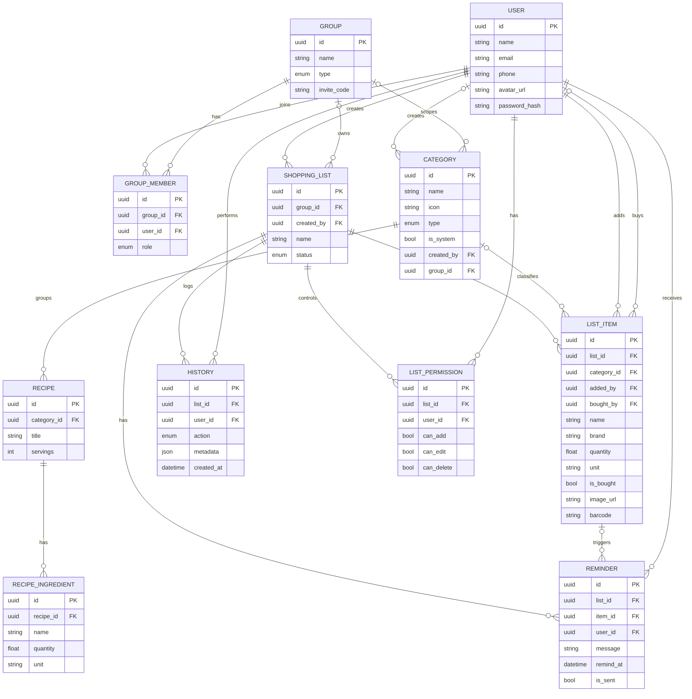

```mermaid
erDiagram
    USER ||--o{ GROUP_MEMBER : joins
    GROUP ||--o{ GROUP_MEMBER : has
    USER ||--o{ SHOPPING_LIST : creates
    GROUP |o--o{ SHOPPING_LIST : owns
    SHOPPING_LIST ||--o{ LIST_ITEM : contains
    CATEGORY |o--o{ LIST_ITEM : classifies
    CATEGORY ||--o{ RECIPE : groups
    RECIPE ||--o{ RECIPE_INGREDIENT : has
    SHOPPING_LIST ||--o{ HISTORY : logs
    USER ||--o{ HISTORY : performs
    USER ||--o{ LIST_ITEM : adds
    USER |o--o{ LIST_ITEM : buys
    SHOPPING_LIST ||--o{ REMINDER : has
    LIST_ITEM |o--o{ REMINDER : triggers
    USER ||--o{ REMINDER : receives
    SHOPPING_LIST ||--o{ LIST_PERMISSION : controls
    USER ||--o{ LIST_PERMISSION : has
    USER |o--o{ CATEGORY : creates
    GROUP |o--o{ CATEGORY : scopes

    USER {
        uuid id PK
        string name
        string email
        string phone
        string avatar_url
        string password_hash
    }
    GROUP {
        uuid id PK
        string name
        enum type
        string invite_code
    }
    GROUP_MEMBER {
        uuid id PK
        uuid group_id FK
        uuid user_id FK
        enum role
    }
    CATEGORY {
        uuid id PK
        string name
        string icon
        enum type
        bool is_system
        uuid created_by FK
        uuid group_id FK
    }
    RECIPE {
        uuid id PK
        uuid category_id FK
        string title
        int servings
    }
    RECIPE_INGREDIENT {
        uuid id PK
        uuid recipe_id FK
        string name
        float quantity
        string unit
    }
    SHOPPING_LIST {
        uuid id PK
        uuid group_id FK
        uuid created_by FK
        string name
        enum status
    }
    LIST_ITEM {
        uuid id PK
        uuid list_id FK
        uuid category_id FK
        uuid added_by FK
        uuid bought_by FK
        string name
        string brand
        float quantity
        string unit
        bool is_bought
        string image_url
        string barcode
    }
    REMINDER {
        uuid id PK
        uuid list_id FK
        uuid item_id FK
        uuid user_id FK
        string message
        datetime remind_at
        bool is_sent
    }
    LIST_PERMISSION {
        uuid id PK
        uuid list_id FK
        uuid user_id FK
        bool can_add
        bool can_edit
        bool can_delete
    }
    HISTORY {
        uuid id PK
        uuid list_id FK
        uuid user_id FK
        enum action
        json metadata
        datetime created_at
    }
```
