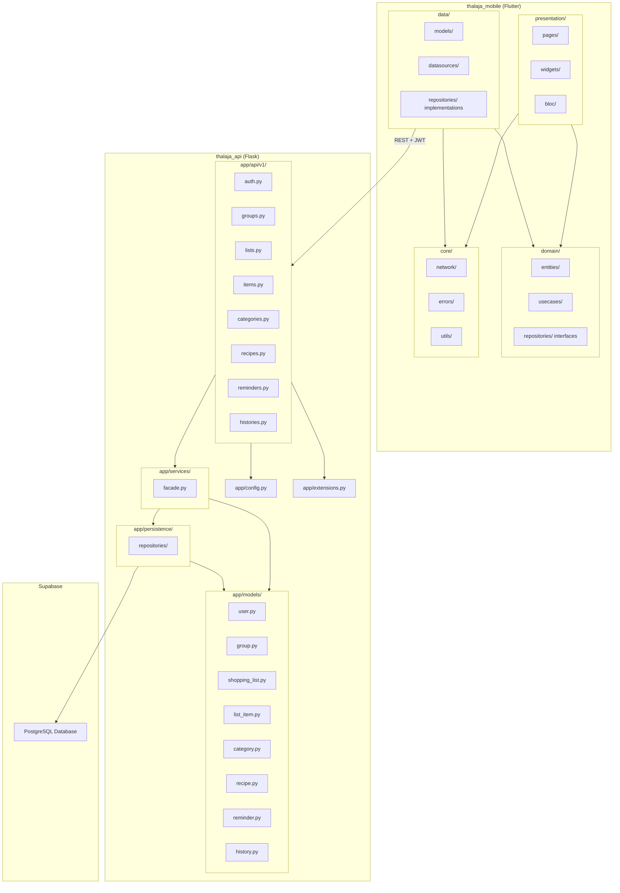

```mermaid
graph TB
    subgraph FlutterApp["thalaja_mobile (Flutter)"]
        subgraph presentation["presentation/"]
            pages["pages/"]
            widgets["widgets/"]
            bloc["bloc/"]
        end

        subgraph domain["domain/"]
            entities["entities/"]
            usecases["usecases/"]
            repo_iface["repositories/ interfaces"]
        end

        subgraph data["data/"]
            models["models/"]
            datasources["datasources/"]
            repo_impl["repositories/ implementations"]
        end

        subgraph core["core/"]
            network["network/"]
            errors["errors/"]
            utils["utils/"]
        end
    end

    subgraph FlaskAPI["thalaja_api (Flask)"]
        subgraph api_pkg["app/api/v1/"]
            auth_routes["auth.py"]
            group_routes["groups.py"]
            list_routes["lists.py"]
            item_routes["items.py"]
            category_routes["categories.py"]
            recipe_routes["recipes.py"]
            reminder_routes["reminders.py"]
            history_routes["histories.py"]
        end

        subgraph services_pkg["app/services/"]
            facade["facade.py"]
        end

        subgraph models_pkg["app/models/"]
            user_m["user.py"]
            group_m["group.py"]
            list_m["shopping_list.py"]
            item_m["list_item.py"]
            cat_m["category.py"]
            recipe_m["recipe.py"]
            reminder_m["reminder.py"]
            hist_m["history.py"]
        end

        subgraph persist_pkg["app/persistence/"]
            repos["repositories/"]
        end

        config["app/config.py"]
        extensions["app/extensions.py"]
    end

    subgraph Supabase["Supabase"]
        postgres["PostgreSQL Database"]
    end

    presentation --> domain
    presentation --> core

    data --> domain
    data --> core

    data -->|REST + JWT| api_pkg

    api_pkg --> services_pkg
    services_pkg --> models_pkg
    services_pkg --> persist_pkg
    persist_pkg --> models_pkg
    persist_pkg --> postgres

    api_pkg --> extensions
    api_pkg --> config
```
