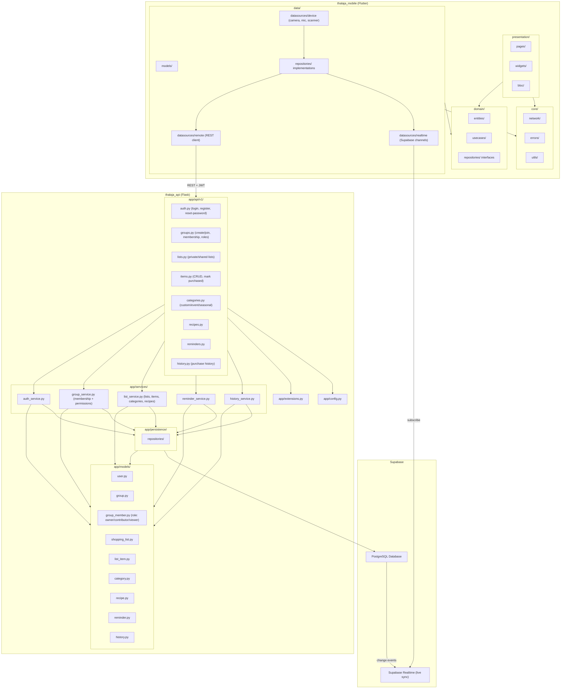

```mermaid
graph TB
    subgraph FlutterApp["thalaja_mobile (Flutter)"]
        subgraph presentation["presentation/"]
            pages["pages/"]
            widgets["widgets/"]
            bloc["bloc/"]
        end
        subgraph domain["domain/"]
            entities["entities/"]
            usecases["usecases/"]
            repo_iface["repositories/ interfaces"]
        end
        subgraph data["data/"]
            models["models/"]
            remote_ds["datasources/remote (REST client)"]
            realtime_ds["datasources/realtime (Supabase channels)"]
            device_ds["datasources/device (camera, mic, scanner)"]
            repo_impl["repositories/ implementations"]
        end
        subgraph core["core/"]
            network["network/"]
            errors["errors/"]
            utils["utils/"]
        end
    end

    subgraph FlaskAPI["thalaja_api (Flask)"]
        subgraph api_pkg["app/api/v1/"]
            auth_routes["auth.py (login, register, reset-password)"]
            group_routes["groups.py (create/join, membership, roles)"]
            list_routes["lists.py (private/shared lists)"]
            item_routes["items.py (CRUD, mark purchased)"]
            category_routes["categories.py (custom/event/seasonal)"]
            recipe_routes["recipes.py"]
            reminder_routes["reminders.py"]
            history_routes["history.py (purchase history)"]
        end
        subgraph services_pkg["app/services/"]
            auth_service["auth_service.py"]
            group_service["group_service.py (membership + permissions)"]
            list_service["list_service.py (lists, items, categories, recipes)"]
            reminder_service["reminder_service.py"]
            history_service["history_service.py"]
        end
        subgraph models_pkg["app/models/"]
            user_m["user.py"]
            group_m["group.py"]
            member_m["group_member.py (role: owner/contributor/viewer)"]
            list_m["shopping_list.py"]
            item_m["list_item.py"]
            cat_m["category.py"]
            recipe_m["recipe.py"]
            reminder_m["reminder.py"]
            hist_m["history.py"]
        end
        subgraph persist_pkg["app/persistence/"]
            repos["repositories/"]
        end
        config["app/config.py"]
        extensions["app/extensions.py"]
    end

    subgraph Supabase["Supabase"]
        postgres["PostgreSQL Database"]
        realtime["Supabase Realtime (live sync)"]
    end

    presentation --> domain
    presentation --> core
    data --> domain
    data --> core
    remote_ds -->|REST + JWT| api_pkg
    realtime_ds -->|subscribe| realtime
    device_ds --> repo_impl
    repo_impl --> remote_ds
    repo_impl --> realtime_ds

    api_pkg --> auth_service
    api_pkg --> group_service
    api_pkg --> list_service
    api_pkg --> reminder_service
    api_pkg --> history_service

    auth_service --> models_pkg
    group_service --> models_pkg
    list_service --> models_pkg
    reminder_service --> models_pkg
    history_service --> models_pkg

    auth_service --> persist_pkg
    group_service --> persist_pkg
    list_service --> persist_pkg
    reminder_service --> persist_pkg
    history_service --> persist_pkg

    persist_pkg --> models_pkg
    persist_pkg --> postgres
    postgres -->|change events| realtime

    api_pkg --> extensions
    api_pkg --> config
```
