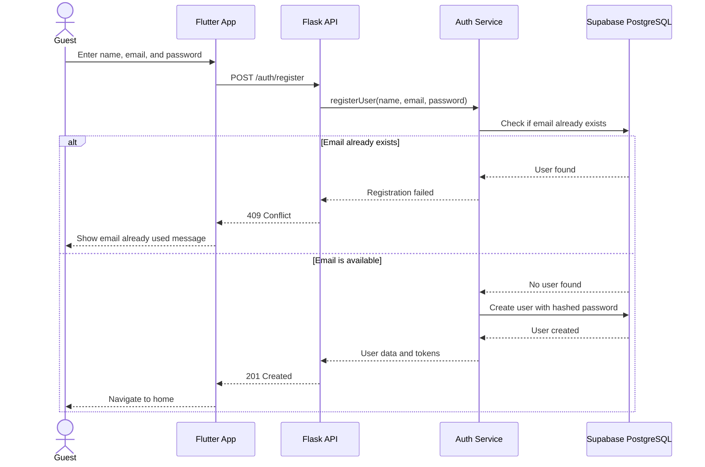
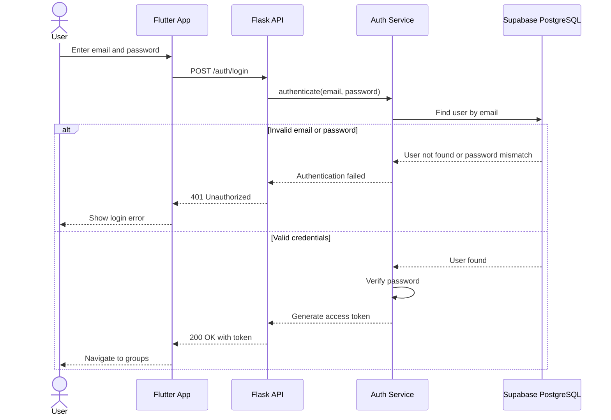
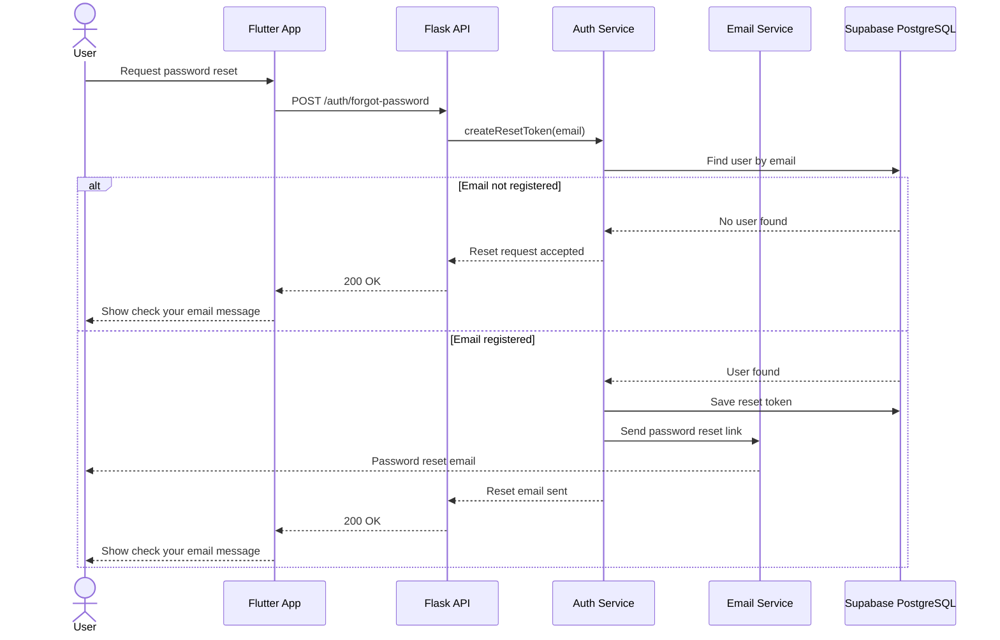
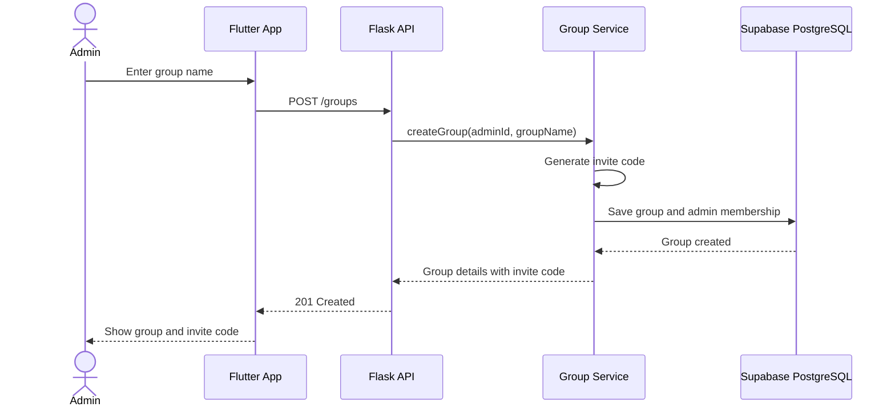
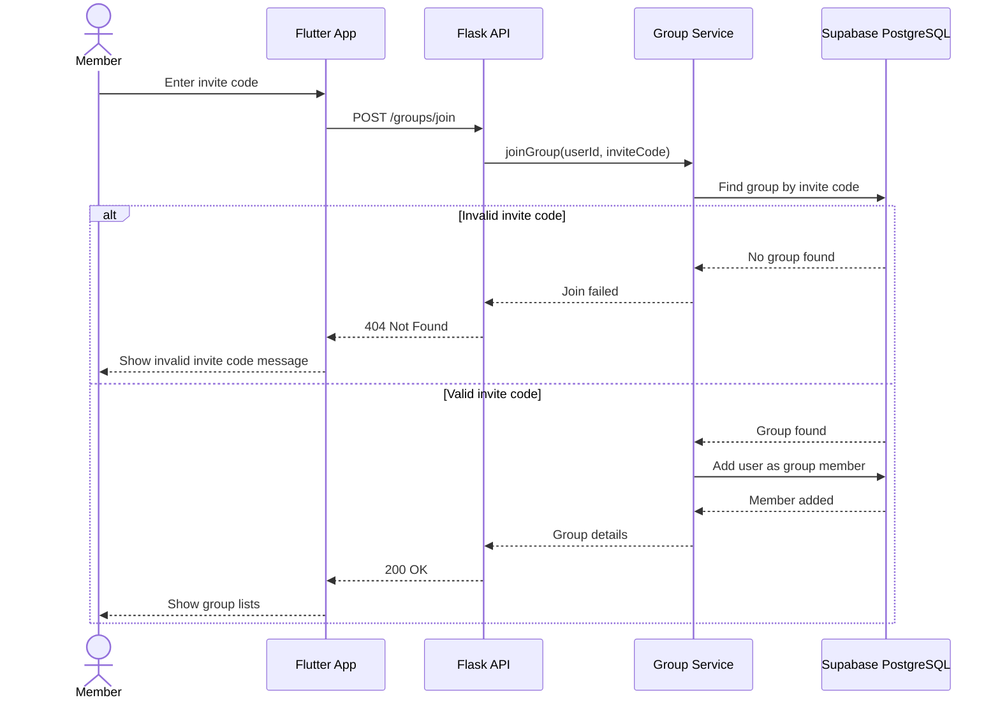
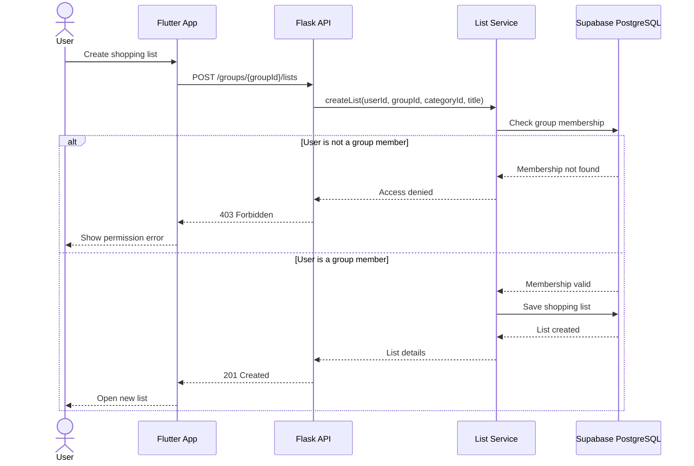
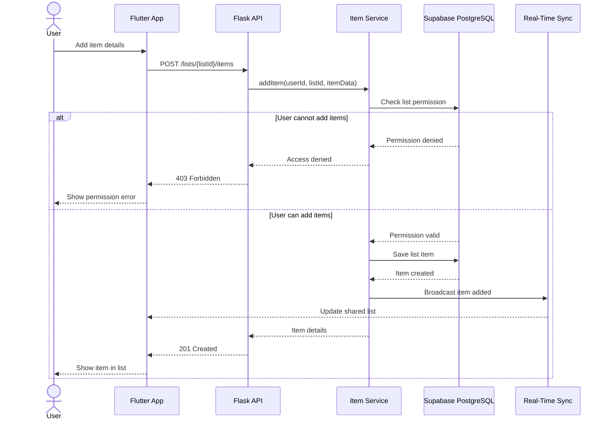
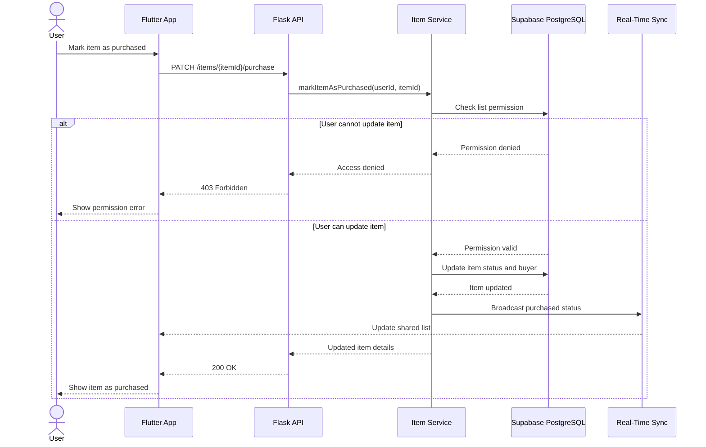
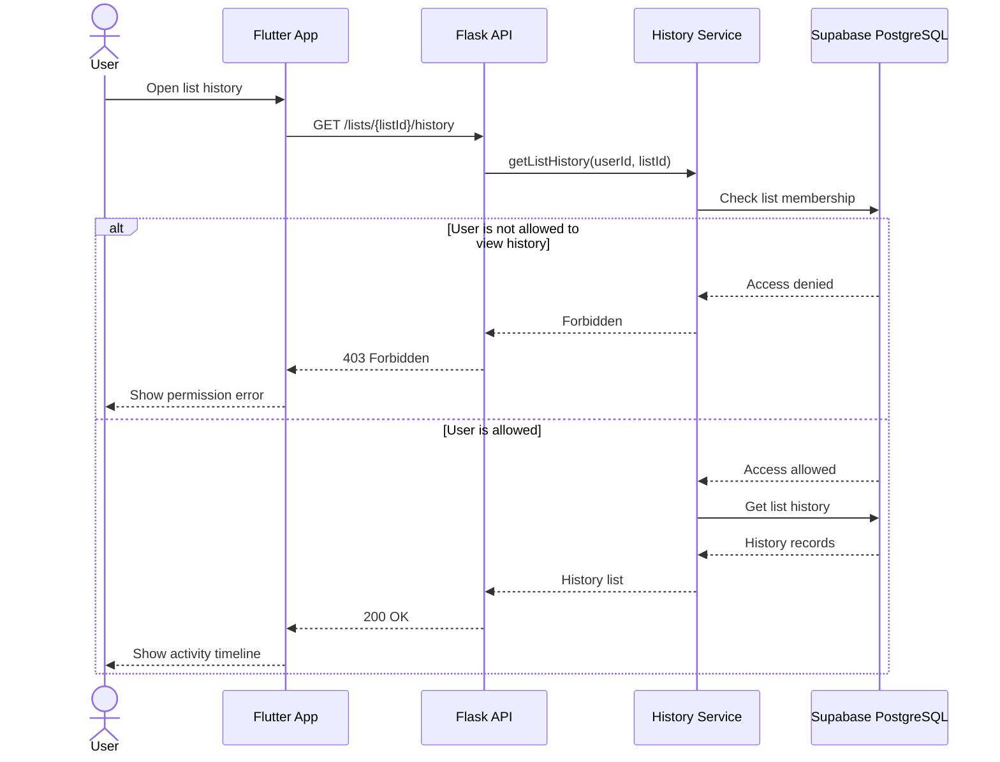

# Sequence Diagrams

## 1. Register Account

---

## 2. Sign In

---

## 3. Reset Forgotten Password

---

## 4. Create Group

---

## 5. Join Group

---

## 6. Create Shopping List

---

## 7. Add Item to List

---

## 8. Mark Item as Purchased

---

## 9. View List History

