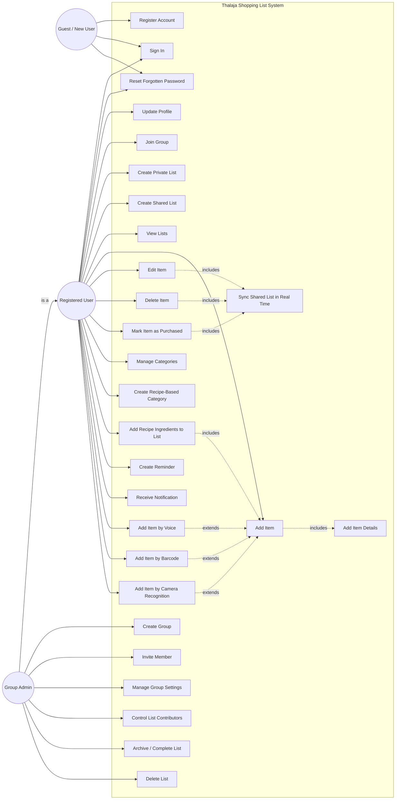

```mermaid
flowchart LR

    Guest((Guest / New User))
    User((Registered User))
    Admin((Group Admin))

    Admin -->|is a| User

    subgraph System["Thalaja Shopping List System"]
        Register["Register Account"]
        Login["Sign In"]
        ResetPassword["Reset Forgotten Password"]
        UpdateProfile["Update Profile"]

        CreateGroup["Create Group"]
        JoinGroup["Join Group"]
        InviteMember["Invite Member"]
        ManageGroup["Manage Group Settings"]

        CreatePrivateList["Create Private List"]
        CreateSharedList["Create Shared List"]
        ViewLists["View Lists"]
        ControlContributors["Control List Contributors"]
        ArchiveList["Archive / Complete List"]
        DeleteList["Delete List"]

        AddItem["Add Item"]
        AddItemDetails["Add Item Details"]
        EditItem["Edit Item"]
        RemoveItem["Delete Item"]
        MarkPurchased["Mark Item as Purchased"]
        SyncList["Sync Shared List in Real Time"]

        ManageCategories["Manage Categories"]
        CreateRecipeCategory["Create Recipe-Based Category"]
        AddRecipeIngredients["Add Recipe Ingredients to List"]

        CreateReminder["Create Reminder"]
        ReceiveReminder["Receive Notification"]

        AddByVoice["Add Item by Voice"]
        AddByBarcode["Add Item by Barcode"]
        AddByCamera["Add Item by Camera Recognition"]
    end

    Guest --> Register
    Guest --> Login
    Guest --> ResetPassword

    User --> Login
    User --> ResetPassword
    User --> UpdateProfile
    User --> JoinGroup
    User --> CreatePrivateList
    User --> CreateSharedList
    User --> ViewLists
    User --> AddItem
    User --> EditItem
    User --> RemoveItem
    User --> MarkPurchased
    User --> ManageCategories
    User --> CreateRecipeCategory
    User --> AddRecipeIngredients
    User --> CreateReminder
    User --> ReceiveReminder
    User --> AddByVoice
    User --> AddByBarcode
    User --> AddByCamera

    Admin --> CreateGroup
    Admin --> InviteMember
    Admin --> ManageGroup
    Admin --> ControlContributors
    Admin --> ArchiveList
    Admin --> DeleteList

    AddItem -.->|includes| AddItemDetails
    EditItem -.->|includes| SyncList
    RemoveItem -.->|includes| SyncList
    MarkPurchased -.->|includes| SyncList
    AddRecipeIngredients -.->|includes| AddItem

    AddByVoice -.->|extends| AddItem
    AddByBarcode -.->|extends| AddItem
    AddByCamera -.->|extends| AddItem
```
